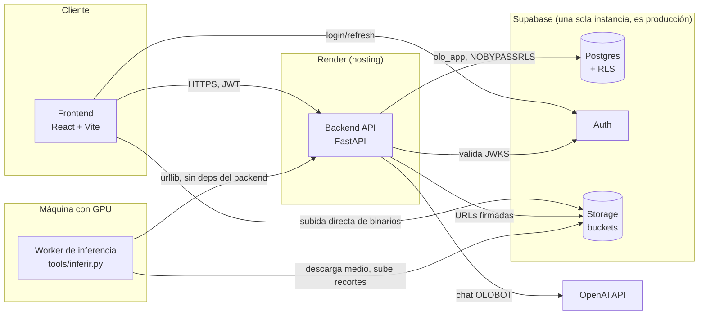
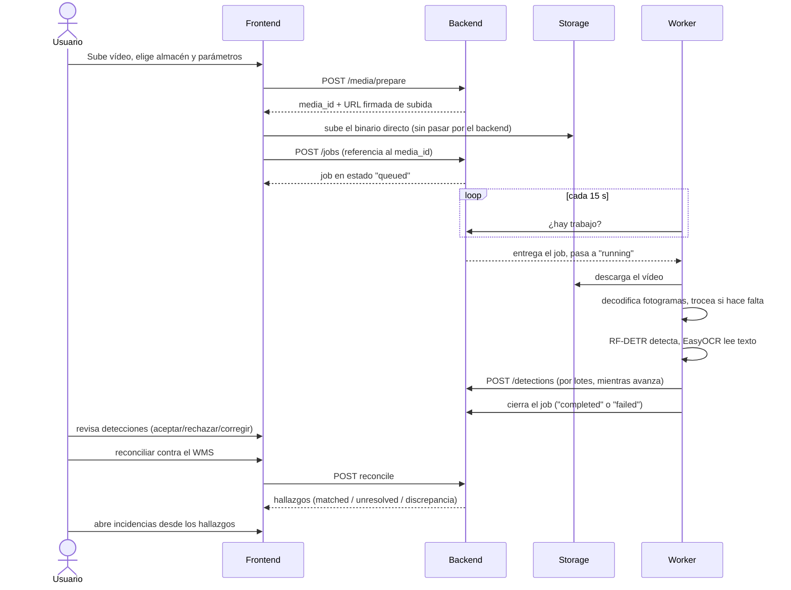

# Diccionario técnico — OLO_IA

> Notas para cualquier desarrollador que continúe el proyecto. Nivel **por encima**, no
> exhaustivo: cada término se explica en una o dos líneas, no en su forma completa. Para
> el detalle real, la fuente de verdad es el código y `ONBOARDING.md` (umbrales medidos,
> trampas ya pagadas, vocabulario de clases).
>
> **Aviso sobre `docs/`**: esa carpeta tiene documentos de diseño escritos ANTES o
> durante la implementación (`TERMINOLOGY.md`, `MODULES.md`, los `BLOCK_*_PLAN.md`,
> etc.). Varios usan vocabulario que ya no coincide con lo implementado —por ejemplo,
> hablan de "PaddleOCR" o "SAM" cuando el proyecto usa RF-DETR + EasyOCR—. Sirven como
> historia de las decisiones, no como referencia del estado actual. Este documento sí
> describe lo que hay hoy, verificado contra el código y la base de datos.

---

## 1. Qué es esto, en una frase

Una plataforma SaaS multi-tenant de inventario de almacén con visión artificial: un dron
graba un pasillo, el sistema detecta pallets y etiquetas, lee los códigos, los compara
con lo que declara el WMS del cliente, y lo pinta sobre un rack en 3D.

---

## 2. Arquitectura, de un vistazo

Puntos que no son obvios mirando solo el diagrama:

- El **worker no recibe conexiones, las hace**: pregunta a la API cada 15 s si hay
  trabajo. Así cualquier máquina con GPU en cualquier red puede unirse sin abrir un
  puerto.
- El **binario del vídeo nunca atraviesa el backend**: el frontend lo sube directo a
  Storage con una URL firmada, y el worker lo descarga directo también. El backend solo
  coordina metadatos.
- Hay **una sola base de datos y es la de producción** — no existe un entorno de
  pruebas separado (ONBOARDING §3, "La base de datos").

---

## 3. El flujo de una inspección, de punta a punta

Detalles que cuestan tiempo si no se saben:

- Un job puede quedarse **registrado sin modelo** (todavía no hay ninguno publicado) o
  **sin worker vivo**: se guarda igual y espera en cola, no es un error.
- El troceado (`--trozos auto`) se decide SOLO, sondeando 6 fotogramas — no depende de la
  resolución del vídeo, depende de cuánto ocupa la etiqueta en el encuadre (ONBOARDING
  §4.1).
- La reconciliación **no es idempotente**: cada llamada crea un recorrido (`scan`) nuevo,
  así que no lleva reintento automático.

---

## 4. Vocabulario por módulo

### 4.1 Percepción (visión artificial) — schema `perception`, módulo frontend `perception`

| Término | Qué es |
|---|---|
| **Inference job** | Una inspección: un medio (vídeo/imagen) + configuración + su cola de estado. |
| **Estado del job** | `draft → uploading → uploaded → queued → running → completed/failed/cancelled`. |
| **Pipeline** | Qué hace el worker: `object-detection` (solo cajas), `ocr` (solo texto), `detection-ocr` (las dos). |
| **Detection** | Un resultado unitario: clase + caja (bbox) + confianza + texto leído (si aplica). |
| **Clase (class_name)** | Es una CLAVE, se compara con `==` en el worker — no una etiqueta cosmética. Ver ONBOARDING §5. |
| **Las 7 clases** | `qr_ubicacion`, `qr_pallet`, `pallet`, `hueco_vacio`, `etiqueta_ilegible`, `larguero`, `paral`. |
| **Troceado (tiling)** | Partir el fotograma en regiones para que las etiquetas lejanas lleguen más grandes al modelo. Cuesta tiempo (hasta ×28-31). |
| **RF-DETR** | El detector (Apache 2.0). YOLO/Ultralytics está prohibido por licencia (AGPL-3.0, ADR-014). |
| **EasyOCR** | Lee el texto impreso cuando el QR no decodifica. Se antepone siempre el QR: es exacto, el OCR hay que adivinarlo. |
| **Review status** | `pending / accepted / rejected / corrected` — el veredicto de una persona sobre una detección. |
| **Worker / heartbeat** | El proceso que analiza. Late cada 30 s; si dos laten a la vez es un bug (debe haber uno). |

### 4.2 Espacial (mapa 3D del almacén) — schema `spatial`, módulo frontend `spatial`

| Término | Qué es |
|---|---|
| **Rack** | Una estantería física, con su código (`RCLxx`). |
| **Hueco / Location** | Una posición concreta dentro de un rack: rack + cuerpo + nivel + posición (4 segmentos). Un código con menos segmentos no ubica, solo señala una columna. |
| **Larguero / Paral** | Piezas estructurales del rack que delimitan un hueco. Se detectan para DEDUCIR huecos vacíos por diferencia de movimiento entre fotogramas, no para verlos directamente (ONBOARDING §4.5). |
| **Digital Twin** | La representación 3D del almacén en el navegador (WebGL). |
| **rack_node_id** | El nodo del árbol espacial al que se resolvió un código leído. |

### 4.3 Inventario y WMS — schemas `inventory`, `wms`

| Término | Qué es |
|---|---|
| **WMS** | El sistema externo de inventario del cliente. OLO_IA es de solo lectura sobre él: espejo, no dueño. |
| **Stock Snapshot / Position** | Foto de "qué declara el WMS que hay, y dónde" en un momento dado. |
| **Observado (perception)** vs **Esperado (WMS)** | Los dos lados que se comparan al reconciliar. |
| **Reconciliación / scan** | El proceso que cruza las detecciones de un job contra el catálogo del WMS y produce hallazgos. |

### 4.4 Incidencias — schema `incidents`

| Término | Qué es |
|---|---|
| **Incidencia** | Trabajo asignado a una persona a partir de un hallazgo de reconciliación. Es una decisión humana, no automática: revisar no abre incidencias solo. |

### 4.5 Auditoría — schema `audit`

| Término | Qué es |
|---|---|
| **Evento de auditoría** | Registro append-only (solo `INSERT`, nunca `UPDATE`/`DELETE`) de qué pasó. |

### 4.6 Plataforma y multi-tenencia — schemas `core`, `platform`

| Término | Qué es |
|---|---|
| **Tenant** | Organización cliente. Unidad de aislamiento: nada cruza de un tenant a otro salvo que el rol lo permita explícitamente. |
| **Warehouse** | Un almacén físico del tenant. Toda inspección pertenece a uno. |
| **RLS (Row Level Security)** | Postgres decide fila por fila qué puede ver/tocar cada rol — es la barrera real entre tenants, no el código del backend. |
| **`olo_app`** | El rol con el que el backend se conecta a Postgres. `NOBYPASSRLS`: a propósito no salta la seguridad de filas. |
| **`service_role`** | Rol de Supabase con `BYPASSRLS`. El backend NO lo usa para operar (anularía el aislamiento); solo aparece en operaciones de plataforma explícitas. |
| **Platform Owner** | El rol con más alcance, cruza tenants. Existe para operación interna de OLO_IA, no para clientes. |
| **`tenant_admin`** | El rol con más permisos DENTRO de un tenant (p. ej. `arojas@ologistics.com` en el tenant de pruebas). |

### 4.7 IA / entrenamiento — schema `ai`, módulo frontend `features/ai`

| Término | Qué es |
|---|---|
| **Dataset** | Conjunto de imágenes anotadas para (re)entrenar un modelo. |
| **Proyecto de IA (aiProjectId)** | Agrupa un dataset con el modelo que se entrena sobre él. Sin proyecto, no hay a dónde mandar fotogramas para anotar. |
| **Modelo publicado (model_version_id)** | La versión de pesos que el worker ejecuta. `class_index` es inmutable: una clase nueva va al final o los modelos ya entrenados devuelven la etiqueta equivocada. |
| **Entrenador (`tools/entrenar.py`)** | El script que reentrena RF-DETR con el dataset anotado. Vive en `.venv-train`, igual que el worker. |

### 4.8 OLOBOT — schema `olobot`, módulo frontend `features/olobot`

| Término | Qué es |
|---|---|
| **OLOBOT** | Asistente conversacional sobre el estado del almacén, respaldado por la API de OpenAI (`backend/src/olo/llm/openai.py`). |

---

## 5. Los agentes del proyecto

Con "agente" nos referimos a cada programa o servicio independiente que compone el
sistema — no a personas. Mención leve de qué hace cada uno; el detalle está en su propio
código.

| Agente | Se encarga de |
|---|---|
| **Frontend** (`frontend/`, React + Vite) | La interfaz web: formularios, visor de detecciones, mapa 3D, revisión, reconciliación. |
| **Backend API** (`backend/src/olo`, FastAPI) | Expone `/v1/*`, aplica reglas de negocio y permisos, es el único que escribe en Postgres como `olo_app`. |
| **Worker de inferencia** (`backend/tools/inferir.py`) | Coge trabajos de la cola, descarga el medio, corre RF-DETR + EasyOCR, sube las detecciones. Corre en la máquina con GPU. |
| **Entrenador** (`backend/tools/entrenar.py`) | Reentrena RF-DETR con el dataset anotado. Mismo entorno que el worker (`.venv-train`), por lo mismo (necesita las mismas librerías de visión). |
| **`admin_sql.py`** | Aplica migraciones y permite consultas directas a Postgres con el rol `postgres` — el único camino con privilegios de esquema. |
| **`sesion.py`** | La sesión HTTP renovable que comparten `inferir.py` y `entrenar.py`: los dos corren más de una hora y el token dura menos. |
| **`worker_servicio.ps1`** | Instala/gestiona el worker como tarea programada de Windows, para que sobreviva a cierres de sesión y se reinicie solo si falla. |
| **Supabase** | Plataforma gestionada fuera del repo: Postgres, Auth (GoTrue), Storage. Una sola instancia, es la de producción. |
| **Render** | Hosting del backend (`olo-ia-api.onrender.com`) y del frontend (`olo-ia.onrender.com`) en producción. |
| **OpenAI** | Motor de lenguaje detrás de OLOBOT. Externo, se llama solo si `OLOBOT_API_KEY` está configurada. |

---

## 6. Dónde mirar según lo que haga falta

| Necesito... | Voy a... |
|---|---|
| Montar el proyecto en una máquina nueva | `ONBOARDING.md` (raíz) |
| Saber qué máquina hace falta como mínimo | `docs/REQUISITOS_MAQUINA.md` |
| Uso diario del worker/entrenador | `docs/MANUAL.md`, `docs/PROMPT-MANUAL.md` |
| Entender un término o el mapa general | Este documento |
| El detalle exacto de una tabla o migración | `supabase/migrations/`, y su nota en `docs/migrations/` si existe |
| Por qué algo se decidió así (histórico, puede estar desactualizado) | `docs/` — con el aviso de la cabecera de este documento |
