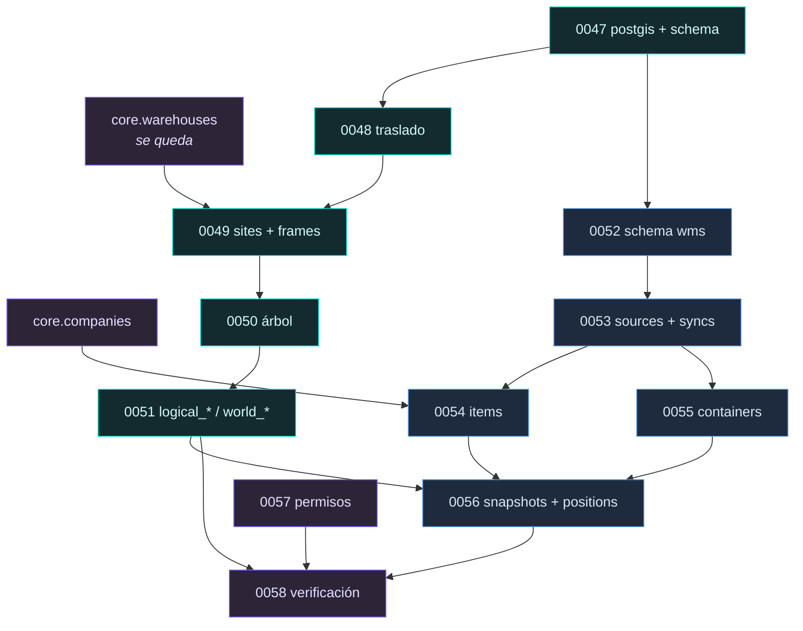

# Bloque 3 · Plan técnico de migraciones · **revisión 3**

| | |
|---|---|
| **Estado** | **Propuesto. Nada ejecutado.** Último documento antes de implementar. |
| **Fecha** | 2026-07-30 |
| **Última migración aplicada** | `0046_platform_owner_self_diagnosis` |
| **Rango** | `0047` … `0058` (**12** migraciones, 3 fases) |
| **Decisiones incorporadas** | D1 `wms` · D2 traslado a `spatial` · D3 `IdSucursal` sin asumir edificio · D4 `containers` · D5 catálogo de ubicaciones |
| **Ajustes r2** | A1 `Preámbulo` como `external_site_code` · A2 `logical_*` / `world_*` · A3 PostGIS desde el Bloque 3 · A4 reserva de elementos físicos |
| **Ajustes r3** | A5 `spatial.devices` · A6 vocabulario `node_type` · A7 **Opción A**: `areas → nodes` sin tabla legacy · A8 verificación como prueba, no como migración |
| **Base** | ADR-009, ADR-010 (rev. 2026-07-30), ADR-011, ADR-012 |

> **Qué cambió en la revisión 3.** Cuatro análisis pedidos, y dos cambian la
> estructura del bloque:
>
> - **A7 · Opción A** (§24): `spatial.areas` **no** sobrevive a la fase 3.A. Añade la
>   migración `0051`. El argumento decisivo no es el recuento de filas, es que los
>   vocabularios heredados hay que remapear en cualquier caso y que el importador
>   pobla el árbol con 347 áreas en semanas.
> - **A8 · verificación** (§25): `0058 verify_domain_boundaries` **deja de ser una
>   migración** y pasa a `backend/tests/architecture/`. Una migración no puede
>   detectar la FK mala que alguien añada en la migración 0071, y ese es el modo de
>   fallo real.
> - **A6 · vocabulario** (ADR-010 §6): `node_type` queda en **6 valores
>   estructurales**; `dock`, `buffer`, `bulk_area`, `inspection` y `staging` pasan a
>   `node_function`. Un vocabulario plano haría crecer la matriz de aristas
>   multiplicativamente.
> - **A5 · `spatial.devices`** (ADR-010 §7): reservado, no implementado.
>
> El recuento se mantiene en 12: `0051` entra, `0058 verify` sale.

---

## 1. Mediciones que sostienen el plan

Todo lo de esta sección es medición sobre los archivos completos, no inferencia.

```
ReporteInventario.xlsx    41.055 filas · 77 col · sha256 6ff243fc…36172d23
ReporteUbicaciones.xlsx   29.310 filas · 20 col · sha256 1622d416…54271b
```

| # | Hallazgo | Consecuencia |
|---|---|---|
| M1 | **`IdSucursal` no es espacial.** 23 pares (Preámbulo, IdSucursal); `Preámbulo=60` convive con 12 `IdSucursal` | Va en la existencia, no en el espacio. **Refuta mi inferencia de la ronda anterior** |
| M2 | `Referencia → Preámbulo` funcional, 0 violaciones en 29.310. 5 valores: 50, 60, 70, 80, 90 | Es una agrupación **real** del espacio, pero **A1 impide llamarla Site** (§3.1) |
| M3 | `Ubicación = Referencia-C{Col:03d}-N{Niv:02d}-{Pos}` acierta en **29.310 de 29.310 (100 %)** | La descomposición es exacta |
| M4 | `Id Ubicación` solo cuadra en 12,44 % porque **`Referencia` va rellenada a 6 con espacios**: `'60RCL01 0010101'` | Ignorarlo crearía ubicaciones nuevas en vez de encontrarlas, en el 87,56 % de las filas |
| M5 | `Referencia` ↔ `IdAlmacenamiento` 1:1 (347↔347, 0 violaciones). Intersección entre archivos: 251 | Mismo espacio de identificadores |
| M6 | **4 ubicaciones del inventario NO están en el catálogo**: `LAYOUT`, `PISO1`, `RETIRA` (560 pallets), `SOBRA` | §13.1 |
| M7 | Catálogo 29.310 · con inventario 15.595 · vacías 13.715 → **ocupación conocida 53,2 %** | D5 satisfecha |
| M8 | **`Eje X/Y/Z` no son metros.** `Eje Z` tiene 9 valores = los de `Nivel`; `Eje X` tiene 254 = los `IdAlmacenamiento`; máximos 1.000.006 / 1.000.007 (centinelas); 5 ternas repetidas | **A2**: `logical_*`, nunca `world_*` (§2) |
| M9 | `Peso Máximo`: 999999999 en 25.806 filas y 0 en 725 → centinelas, no capacidades | Normalizar a `NULL` |
| M10 | `Situación`: 8 valores en el catálogo frente a 5 en el inventario | No cerrar vocabularios con CHECK en la v1 |
| M11 | 5 clasificaciones de zona ortogonales: Almacenaje 33 · Picking 28 · Trab. Recurso 33 · Trab. Preparación 12 · Cola Prep. **1** (constante) | Zona no es padre del área |
| M12 | Clave de existencia `(ubicación, container, artículo)`: **0 duplicados en 41.055** | Clave natural confirmada |
| M13 | Container: 28.558, **todos de 13 caracteres**, alfanuméricos, sin espacios. `Palet Master` 97, ninguno presente como pallet | QR sin transformar; master `inferred` |

---

## 2. A2 · `logical_*` frente a `world_*`

Ajuste aprobado, y es el que más protege al gemelo digital de un error irreversible.

**Dos sistemas de coordenadas coexisten y nunca deben mezclarse:**

| Familia | Origen | Tipo | Unidad | Estado en el Bloque 3 |
|---|---|---|---|---|
| `logical_*` | WMS | `integer` | **ninguna** — son índices | **Poblado** desde el catálogo |
| `world_*` | CAD, escaneo, medición | PostGIS | metros | **Vacío**, con la estructura lista |

```
logical_column      ← Columna        39 valores
logical_level       ← Nivel           9 valores
logical_position    ← Posición        2 valores
logical_x           ← Eje X         254 valores, máx 1.000.006 (centinela)
logical_y           ← Eje Y         417 valores, máx 1.000.007 (centinela)
logical_z           ← Eje Z           9 valores  = los de Nivel

world_position      geometry(PointZ)    NULL
world_footprint     geometry(PolygonZ)  NULL
world_bbox          geometry(PolygonZ)  NULL
world_frame_id      → spatial.reference_frames   NULL
```

**El prefijo es la defensa.** Un desarrollador que vea `logical_x = 1000006` no lo
sumará a una distancia; uno que viera `x` sí podría. M8 demuestra que ese error está
al alcance: son índices con aspecto de coordenadas.

**Ninguna vista ni endpoint mezcla las dos familias**, y la separación se verifica en
una prueba: ninguna columna `world_*` puede recibir valor durante la importación del
catálogo.

`logical_x/y/z` **no se normalizan** aunque contengan centinelas: son el dato del
WMS tal como llega, y su interpretación es del consumidor. `Peso Máximo` sí se
normaliza (M9) porque sí pretende ser una capacidad.

---

## 3. A1 · `Preámbulo` como identificador externo, no como Site

Ajuste aprobado, y **abre una pregunta que la revisión 1 no tenía que responder:**
si `Preámbulo` no es un Site, ¿de qué cuelgan los 347 nodos de área?

### 3.1 La respuesta: un sitio único no validado por almacén

```
core.warehouses
   └── spatial.sites          1 fila por almacén, external_site_code = NULL
         └── spatial.nodes    347 áreas · external_site_code = '60', '80', …
               └── spatial.locations   29.310
```

- **`spatial.sites` existe estructuralmente** desde 0050, como exige D3
  (`warehouse → site → node → location`, y un almacén admite varios sitios).
- El importador crea **un sitio por almacén**, con `external_site_code = NULL` y
  `is_validated = false`. No afirma nada sobre el espacio físico.
- **`Preámbulo` se guarda como `external_site_code` en el nodo de área**, que es
  donde el dato lo determina (M2: funcional, 0 violaciones).

### 3.2 La ruta de promoción es de datos, no de esquema

Cuando el negocio confirme que los 5 preámbulos son 5 sitios:

```
1. INSERT de 4 sitios más, con external_site_code = '50','70','80','90'
2. UPDATE spatial.nodes SET site_id = … según su external_site_code
3. UPDATE spatial.sites SET external_site_code, is_validated = true
```

**Ni una sola `ALTER TABLE`.** Es exactamente lo que A3 busca para PostGIS y lo que
A1 busca aquí: que validar una hipótesis del negocio no cueste una migración
estructural.

Y si la respuesta fuera otra —que los preámbulos son zonas aduaneras, o tipos de
almacenaje, y no lugares— el `external_site_code` del nodo **se queda donde está** y
se le cambia el nombre a lo que sea. No hay nada que deshacer.

### 3.3 Lo que este diseño renuncia a saber

Con un solo sitio por almacén, durante el Bloque 3 **el árbol tiene un nivel menos
del que el dato podría sostener**. Es deliberado: M2 mide una regularidad, no una
semántica. Una jerarquía construida sobre una regularidad no interpretada es una
jerarquía que habrá que deshacer si la interpretación falla.

---

## 4. A3 · PostGIS desde el Bloque 3

Ajuste aprobado. Dos constataciones que cambian **cómo** se instala.

### 4.1 `postgis` no es reubicable

```
postgis         v3.3.7   relocatable = FALSE
postgis_sfcgal  v3.3.7   relocatable = TRUE
```

**El schema que se elija al instalar `postgis` es permanente**: no hay
`ALTER EXTENSION … SET SCHEMA`. Esto refuerza el ajuste —decidirlo ahora evita un
problema sin salida después— y obliga a acertar de una vez.

**Decisión: `CREATE EXTENSION postgis WITH SCHEMA extensions`**, que es donde ya
viven las tres extensiones instaladas (`pgcrypto`, `uuid-ossp`,
`pg_stat_statements`) y la convención de Supabase.

### 4.2 El problema del `search_path`, medido

```
postgres        search_path = "$user", public, extensions
authenticated   (sin configurar)  → por defecto: "$user", public
olo_app         (sin configurar)  → por defecto: "$user", public
```

**`extensions` no está en el `search_path` de los dos roles que ejecutan la
aplicación.** Consecuencias concretas:

| Quién | Efecto |
|---|---|
| Migraciones (`postgres`) | Funcionan sin cualificar |
| `olo_app` leyendo una columna geometry | **Funciona**: el tipo lo resuelve la columna |
| `olo_app` llamando `ST_AsGeoJSON(...)` | **Falla**: la función no se resuelve |
| Política RLS con un operador geométrico (`&&`) | **Falla** en tiempo de ejecución |
| Función `SECURITY DEFINER` con `SET search_path = ''` | **Falla**: y **todas** las de este proyecto lo llevan |

**Regla que este plan fija:** toda referencia a PostGIS desde código de la aplicación
o desde una función se escribe **cualificada** — `extensions.geometry`,
`extensions.ST_AsGeoJSON(...)` —, y 0047 concede `USAGE ON SCHEMA extensions` a
`olo_app`.

**No se modifica el `search_path` de `authenticated`.** Es un rol gestionado por
Supabase; cambiarlo afectaría a todo PostgREST y podría revertirse en una
actualización de la plataforma. Cualificar es más verboso y es nuestro.

### 4.3 Qué se instala y qué no

| Extensión | Bloque 3 | Razón |
|---|---|---|
| `postgis` | **Sí** | No reubicable: la decisión no puede posponerse |
| `postgis_sfcgal` | **No** | **Es reubicable** y solo añade funciones, no tipos. Instalarlo después no cuesta migración estructural, y nada necesita volumen 3D todavía |
| `ltree` | No | Con 347 nodos, `parent_id` recursivo basta. Reubicable |
| `vector` | No | Sin decisión sobre embeddings (ADR-011 §3.3) |
| `pgrouting` | No | Depende de PostGIS y de un grafo de pasillos que no existe |

### 4.4 El coste, dicho en voz alta

`postgis` añade ~1.000 funciones, varios tipos y `spatial_ref_sys` con ~8.500 filas.
Aparecerá en cada volcado de esquema y en cada introspección. **Es un coste real y el
ajuste lo acepta a cambio de no tener que instalarlo sobre una base grande**, que es
la operación caduca. Estoy de acuerdo con ese intercambio; lo registro para que la
decisión sea consciente y no una sorpresa al leer el primer `pg_dump`.

---

## 5. A4 · Reserva de activos físicos · **con una objeción de nombre**

Ajuste aprobado en su intención: reservar el dominio de cámaras, sensores, robots,
muelles y demás elementos físicos, sin implementarlo.

### 5.1 La colisión con `ai.assets`

**`ai.assets` ya existe** y guarda **archivos**: imágenes, vídeos, pesos, artefactos.
`spatial.assets` guardaría **objetos físicos**. Dos tablas llamadas `assets` con
significados incompatibles en el mismo esquema.

Y hay un agravante: **ADR-008 existe precisamente para impedir que alguien confunda
`ai.assets` con cosas del espacio físico.** Crear `spatial.assets` sería colocar la
confusión que ese ADR previene directamente en el nombre.

Ambos usos son legítimos por separado —«asset» es archivo en ML y es activo físico
en gestión de instalaciones— y juntos son ambiguos.

### 5.2 Y una distinción que el ajuste mezcla

De la lista propuesta, **los muelles no son de la misma naturaleza que los demás**:

| Elemento | Qué es | Dónde va |
|---|---|---|
| Cámara, sensor, robot, AGV | una **cosa** situada en el espacio, que se mueve o se reubica | tabla de dispositivos |
| **Muelle (dock)** | un **lugar** donde ocurren operaciones | **`node_type = 'dock'` en el árbol** |

Un muelle tiene ubicación, capacidad y estado exactamente como un área: es un nodo.
Una cámara **está en** un nodo. Modelar el muelle como dispositivo obligaría a
darle coordenadas y padre y estado, que es lo que el árbol ya hace.

### 5.3 Recomendación

- **`spatial.devices`** para cámaras, sensores, robots y AGV — el conjunto que queda
  tras sacar los muelles es homogéneo: dispositivos con identidad, ubicación y
  estado operativo.
- **`dock` como `node_type`** en el vocabulario de 0051, junto a `storage_area`,
  `aisle`, `rack`, etc.
- **Nada se crea en el Bloque 3.** La reserva es documental, en ADR-010, más el
  valor `dock` en el vocabulario de nodos, que sí entra porque cuesta una fila.

**Es tu decisión.** Si prefieres `spatial.assets`, entra tal cual y la ambigüedad se
gestiona con comentarios de tabla; solo quería que la colisión con `ai.assets` fuera
una elección y no un descubrimiento posterior.

### 5.4 Por qué la reserva importa aunque no se implemente

Una cámara es el puente hacia `perception`: una captura la produce **un dispositivo
situado en el espacio**. Sin ese concepto, `perception.captures` acabaría con un
`camera_id` de texto libre, y la trazabilidad «qué cámara vio esto y desde dónde»
—que es la que permite auditar un conteo— se perdería. Reservarlo ahora es lo que
evita ese texto libre.

---

## 6. Orden exacto de migraciones

```
FASE 3.A · FUNDACIÓN ESPACIAL
  0047  install_postgis_and_create_spatial_schema
  0048  move_areas_locations_to_spatial            ← la crítica: SET SCHEMA, canario
  0049  spatial_sites_and_reference_frames
  0050  spatial_node_tree                          ← node_type (6) + node_function
  0051  spatial_areas_to_nodes                     ← convierte y DROPEA spatial.areas
  0052  spatial_location_attributes                ← logical_* y world_*

FASE 3.B · FUNDACIÓN WMS
  0053  create_wms_schema
  0054  wms_sources_and_sync_runs
  0055  wms_items
  0056  wms_containers
  0057  wms_snapshots_and_positions

FASE 3.C · AUTORIZACIÓN
  0058  inventory_permissions
```

**12 migraciones. Dos cambios respecto de la revisión 2:**

- **`0051` es nueva** — la conversión `spatial.areas → spatial.nodes` (Opción A,
  §24). **La fase 3.A termina con un único modelo espacial.**
- **`0058 verify_domain_boundaries` desaparece como migración** y se convierte en
  pruebas de arquitectura (§25).

0047 fusiona la instalación de PostGIS con la creación del schema porque las dos son
preparación de terreno y las dos son triviales de revertir por separado.

Cada fase se aplica, se verifica y se revierte por completo antes de la siguiente.

---

## 7. Schemas y entidades

### 7.A `spatial`

| Mig. | Entidad | Contenido |
|---|---|---|
| 0047 | — | `CREATE EXTENSION postgis WITH SCHEMA extensions`; schema `spatial`; `GRANT USAGE ON SCHEMA extensions TO olo_app`; `ALTER DEFAULT PRIVILEGES FOR ROLE postgres` |
| 0048 | `spatial.areas`, `spatial.locations` | trasladadas desde `core` |
| 0049 | `spatial.sites` | `warehouse_id`, `external_site_code` (**NULL**), `is_validated` (**false**) |
| 0049 | `spatial.reference_frames` | `site_id`, `code`, `kind`, **`unit`**, **`axis_convention`**, **`parent_frame_id`**, `transform`. **0 filas** — ADR-010 §10 |
| 0050 | `spatial.node_types` | **6 valores estructurales**, cerrado por migración: `building, floor, zone, aisle, rack, storage_area` |
| 0050 | `spatial.node_edges` | matriz `(padre, hijo)` legal |
| 0050 | `spatial.node_functions` | **catálogo global gobernado por el owner** (ADR-010 §9): `dock, buffer, bulk, staging, inspection, storage, picking, receiving, shipping, quarantine, returns` + `wms_type_code`, `implies_bulk`, `is_active` |
| 0050 | `spatial.nodes` | árbol recursivo; `node_type` + `node_function`; `external_site_code` ← `Preámbulo` |
| 0051 | `spatial.locations` +cols | `logical_*` (poblado) · `world_*` (vacío) · capacidad · `is_bulk_area` · `origin` |

### 7.B `wms`

| Mig. | Entidad | Notas |
|---|---|---|
| 0052 | — | schema + grants |
| 0053 | `wms.sources` | sistema externo concreto por tenant |
| 0053 | `wms.sync_runs` | modo, transporte, `file_sha256`, recuentos, estado |
| 0053 | `wms.sync_row_errors` | un rechazo por fila, solo-añadir |
| 0054 | `wms.items` | `UNIQUE (company_id, external_item_id)` |
| 0055 | `wms.containers` | `UNIQUE (external_container_id)`, `parent_container_id`, `origin` |
| 0056 | `wms.stock_snapshots` | estado del corte + `scope_note` |
| 0056 | `wms.stock_positions` | `(snapshot_id, location_id, container_id, item_id)` |

**No entran:** `movements`, `orders`, `receipts`, `shipments`, `tasks`, `counts`,
`adjustments`, `spatial.devices`. Nombradas en ADR-009 §7.2 con su modelo para que
nadie las meta en `stock_positions`.

---

## 8. Dependencias



### 8.1 Dependencias del traslado · medidas

```
FK que APUNTAN a core.locations   : ninguna
FK que APUNTAN a core.areas       : solo fk_loc_area, interna
core.areas → core.warehouses      : fk_area_warehouse, válida entre schemas
Políticas RLS                     : 2 + 2 (mig. 0015), viajan con la tabla
Funciones que las citen           : ninguna
Código backend                    : repositories/warehouse.py:252-254 (2 líneas)
Filas                             : areas = 1 · locations = 2
```

---

## 9. Estrategia de traslado (D2)

**Mecanismo:** `ALTER TABLE core.areas SET SCHEMA spatial;` — el mismo de la
migración **0033**, donde se verificó que políticas, triggers, índices, constraints y
ACL viajan con la tabla. Los IDs **no cambian**: `SET SCHEMA` no reescribe filas.

**Canario:** huella determinista sobre el JOIN `warehouses × areas × locations` con
todos los IDs ordenados, comparada en **cuatro** puntos —antes, después, tras
rollback, tras reaplicar—, las cuatro idénticas. Con 3 filas es trivial; su valor es
dejar el procedimiento probado para cuando haya 29.310.

**Compatibilidad temporal: no**, y es la única desviación de lo autorizado. La
justificación está en §20.1.

**Orden dentro de 0048:** huella antes → `areas` → `locations` → verificar las 4
políticas y `FORCE RLS` → verificar `fk_area_warehouse` → huella después → `GRANT` a
`olo_app` (con la lección de 0019: `ALTER DEFAULT PRIVILEGES` **necesita**
`FOR ROLE postgres`).

---

## 10. Estrategia de rollback

| Mig. | Rollback | Nota |
|---|---|---|
| 0047 | `DROP SCHEMA spatial` + **`DROP EXTENSION postgis`** | Sin `CASCADE`. Falla si algo depende: es la señal deseada |
| 0048 | `SET SCHEMA core` de vuelta | **Con verificación de huella idéntica** |
| 0049–0051 | `DROP TABLE` / `DROP COLUMN` | Sin datos que preservar |
| 0052 | `DROP SCHEMA wms` | igual que 0047 |
| 0053–0056 | `DROP TABLE` en orden inverso de FK | — |
| 0057 | `DELETE FROM core.permissions WHERE code LIKE 'inventory:%'` | Con guarda: falla si algún rol los tiene mapeados |
| 0058 | vacío | No crea nada |

**`DROP EXTENSION postgis` merece cuidado:** si 0051 dejó columnas `geometry`, el
`DROP` sin `CASCADE` fallará. El rollback de 0047 exige por tanto que 0051 esté
revertida antes, y lo comprueba.

**Nunca `DROP SCHEMA … CASCADE`.** La lección la dio 0045: Supabase **prohíbe**
`DELETE FROM storage.buckets` y ese rechazo abortaba la transacción entera; el
rollback hubo que reescribirlo. Todo rollback que toque objetos gestionados por
Supabase se prueba antes de darse por bueno.

**0048 es el único rollback con riesgo real de pérdida**, porque mueve datos en vez
de crearlos. De ahí las cuatro huellas.

---

## 11. Políticas RLS

Patrón de las 46 anteriores: `ENABLE` + `FORCE ROW LEVEL SECURITY`, una
`RESTRICTIVE` que fija el régimen y `PERMISSIVE` por operación.

### 11.1 `spatial` — tenant con alcance de almacén

```
RESTRICTIVE  tenant_id = core.current_tenant_id()
PERMISSIVE   SELECT                  core.can_access_warehouse(warehouse_id)
PERMISSIVE   INSERT/UPDATE/DELETE    exige inventory:manage
```

Se reutiliza `core.can_access_warehouse()`, **no** una consulta propia: es la razón
por la que `authorization.py` la usa en lugar de duplicar el criterio — el backend y
el motor no pueden divergir si comparten la función.

`spatial.node_types` y `spatial.node_edges` son **catálogo sin tenant**: legibles por
`authenticated`, escribibles solo por migración. Igual que `ai.frameworks`.

**Ninguna política usa operadores geométricos**, por §4.2. Si alguna vez hiciera
falta filtrar por geometría, se cualifica o se encapsula en una función `SECURITY
DEFINER` propiedad de `postgres`.

### 11.2 `wms` — tenant y **de solo lectura para el usuario**

```
RESTRICTIVE  tenant_id = core.current_tenant_id()
PERMISSIVE   SELECT   inventory:read
PERMISSIVE   INSERT   solo el importador, con inventory:import
NINGUNA política de UPDATE ni DELETE
```

**La ausencia de política de UPDATE es el mecanismo, no un olvido.** Un espejo
editable deja de ser un espejo.

Pero con una trampa ya medida en este proyecto: **sin política de UPDATE, un UPDATE
afecta a 0 filas en silencio.** Se descubrió construyendo la inmutabilidad del
contrato de modelos, y llevó a la conclusión de que la inmutabilidad necesita un
*trigger*, no una política ausente. Aquí igual: un trigger `BEFORE UPDATE` sobre
`stock_positions` lanza `P0001` con `DETAIL = 'WMS_MIRROR_READ_ONLY'`.

Ese código entra en `_REGISTRO` de `services/ai/errors.py`, cuya prueba de
exhaustividad lee las migraciones y falla si aparece un `DETAIL` sin traducir: **la
prueba existente lo detectará automáticamente.**

---

## 12. Permisos

| Código | Scope | Concede |
|---|---|---|
| `inventory:read` | `tenant` | Ver stock, ubicaciones, containers, artículos, resumen |
| `inventory:import` | `tenant` | Crear y procesar una sincronización |
| `inventory:manage` | `tenant` | Publicar y revertir snapshots; editar el catálogo espacial |

**Scope `tenant`, no `platform`.** Con scope `platform` solo el Platform Owner los
tendría y **ningún administrador de tenant podría concederlos**, porque el trigger de
0022 impide mapear un permiso de plataforma a un rol de tenant. Sería el mismo error
que dejó al owner con 403 en las ocho rutas de escritura del módulo de IA.

No se reutiliza ningún `ai_*`. El catálogo espacial queda bajo `inventory:manage` en
la v1: tres permisos que siempre se conceden juntos no son tres permisos.

---

## 13. Índices

### `spatial.locations`

| Índice | Para |
|---|---|
| `UNIQUE (site_id, location_code)` WHERE vivo | Clave natural. **Sin compañía** (ADR-010 §5) |
| `UNIQUE (external_location_id)` WHERE vivo | `Id Ubicación`, con el relleno de M4 |
| `(node_id)` WHERE vivo | Ubicaciones de un área |
| `(warehouse_id, location_status)` WHERE vivo | KPI de ocupación |
| `(logical_x, logical_y, logical_z)` | Vecindad en la rejilla |
| `(is_bulk_area)` WHERE `is_bulk_area` | Parcial: son pocas |
| **`GIST (world_position)`** | **No se crea todavía**: un índice GIST sobre una columna 100 % NULL es coste sin uso. Entra con el importador CAD |

### `spatial.nodes`

`UNIQUE (site_id, node_code)`, `(parent_id)`, `(external_site_code)`. Sin `ltree`
mientras 347 nodos hagan innecesario el camino materializado.

### `wms.stock_positions`

| Índice | Para |
|---|---|
| `UNIQUE (snapshot_id, location_id, container_id, item_id)` | **Clave natural. M12: 0 duplicados en 41.055** |
| `(snapshot_id, location_id)` | Contenido de una ubicación |
| `(snapshot_id, container_id)` | Contenido de un container |
| `(snapshot_id, item_id)` | Dónde está un artículo |
| `(container_id)` | Historial entre snapshots |

Sin particionado: 41.055 filas por snapshot y ~12 al año no lo justifican. Anotado
con el recordatorio medido en su día: **PostgreSQL rechaza cualquier UNIQUE que no
incluya la clave de partición**, así que particionar obligaría a revisar la clave
natural.

---

## 14. Pruebas SQL

Cada migración lleva su bloque `DO $$ … $$`. Además, por fase, en
`backend/tests/`:

### Fase 3.A

| # | Prueba |
|---|---|
| A1 | Huella del canario idéntica en los 4 puntos |
| A2 | Los UUID de las 3 filas son los mismos antes y después |
| A3 | `core.areas` y `core.locations` **ya no existen** |
| A4 | Las 4 políticas RLS siguen presentes tras el traslado |
| A5 | Un usuario sin acceso al almacén no ve la ubicación |
| A6 | `node_edges` rechaza colgar un `floor` de un `rack` |
| A7 | Una `location` no puede tener hijos |
| A8 | El código se reconstruye desde sus componentes en las 29.310 (M3) |
| **A9** | **`Id Ubicación` se reconstruye con `ljust(6)` en las 29.310** (M4) |
| **A10** | **`postgis` está en `extensions` y `olo_app` tiene `USAGE`** |
| **A11** | **Toda columna `world_*` es NULL tras importar el catálogo** (A2) |
| **A12** | **`spatial.sites` tiene 1 fila por almacén con `is_validated = false`** (A1) |

### Fase 3.B

| # | Prueba |
|---|---|
| B1 | `UPDATE` sobre `stock_positions` lanza `WMS_MIRROR_READ_ONLY` |
| B2 | Dos snapshots `current` a la vez son imposibles |
| B3 | Un artículo con el mismo código en dos compañías **se acepta** (caso `5140011`) |
| B4 | El mismo código en la misma compañía **se rechaza** |
| B5 | `stock_positions` a una ubicación de otro tenant se rechaza |
| B6 | Un container puede anidar; un ciclo se rechaza |

### Fase 3.D

| # | Prueba |
|---|---|
| D1 | Ninguna FK `spatial`→`wms`, `wms`→`perception`, `ai`→tenant (ADR-009 §5) |
| D2 | Toda tabla nueva tiene `relforcerowsecurity` y al menos una `RESTRICTIVE` |
| D3 | Ninguna vista nueva sin `security_invoker` (lección de 0042) |

---

## 15. Pruebas de concurrencia

| # | Carrera | Resultado exigido |
|---|---|---|
| K1 | Dos publicaciones simultáneas de snapshots distintos | Una gana; la otra viola el índice único parcial. **Nunca dos current** |
| K2 | Dos sincronizaciones del mismo `file_sha256` en paralelo | La segunda se rechaza o se une a la primera |
| K3 | Upsert concurrente de la misma ubicación | Sin duplicado y sin error visible (`ON CONFLICT`) |
| K4 | Lectura del estado actual durante una publicación | Ve el viejo o el nuevo, **nunca ninguno ni los dos** |

K1 y K4 son las que importan: sin ellas, publicar podría dejar el inventario
invisible unos milisegundos, y una pantalla consultando en ese instante mostraría un
almacén vacío.

K3 usará el patrón del `class_index`, donde se prohibió `max(...) + 1` sin bloqueo.
Aquí la clave natural la impone el índice único y basta `ON CONFLICT`; la prueba se
escribe igual, porque la única forma de saber que basta es medirlo.

---

## 16. Contrato de importación

**No se implementa en este bloque.** Se fija para que las migraciones lo soporten.

### 16.1 Dos fuentes, dos contratos

| | Catálogo espacial | Inventario |
|---|---|---|
| Archivo | `ReporteUbicaciones.xlsx` | `ReporteInventario.xlsx` |
| Filas / columnas | 29.310 / 20 | 41.055 / 77 |
| Destino | `spatial` | `wms` |
| Naturaleza | **catálogo**: upsert, sin snapshot | **estado**: snapshot versionado |

**El catálogo no se versiona por snapshot.** Versionar el espacio al ritmo del stock
daría 12 versiones al año sin que se mueva un tornillo. Es la regla R3 de ADR-009
aplicada al importador.

### 16.2 Orden obligatorio

```
1. catálogo espacial  →  spatial.sites, nodes, locations
2. inventario         →  wms.items, containers, stock_positions
```

Al revés, las 15.599 ubicaciones del inventario se crearían como inferidas y el
catálogo tendría que reconciliarlas. **Y el catálogo es el que trae `logical_x/y/z`**:
importarlo segundo perdería la rejilla.

### 16.3 Validación de encabezados

Los 20 (o 77) nombres esperados, **presentes y en la posición esperada**. Un archivo
con columnas reordenadas se rechaza entero.

La razón es concreta: al analizar construí un índice de columnas desplazado un puesto
y el resultado fue plausible y falso —«0 ubicaciones en común entre los dos
archivos»—, detectado solo porque los valores de ejemplo delataron la columna
equivocada. Un importador con ese fallo cargaría `IdSucursal` en `Ubicación` sin
protestar.

### 16.4 Normalización, medida

| Campo | Regla | Por qué |
|---|---|---|
| Texto | `trim`; `''` → `NULL` | Sin esto «filas sin Ubicación» cuenta 0 |
| `Referencia` en `Id Ubicación` | **`ljust(6)`** | M4: el 87,56 % falla sin el relleno |
| `Cantidad Unidades` | entero; única fuente numérica | `Cantidad Almacenaje` es derivada (`"54 UD"`) |
| `Peso Máximo` | 999999999 y 0 → `NULL` | M9: centinelas |
| `Eje X/Y/Z` | → `logical_*` entero **sin normalizar** | M8 + A2. Nunca a `world_*` |
| `Preámbulo` | → `external_site_code` **del nodo** | A1 |
| Compañía | resolver contra `core.companies`; **fallar la fila** | 19 nombres con variantes: `'COFERSA'`, `'COFERSA  ADMINISTRATIVO'` |
| `Palet Master` | crear con `origin='inferred'` | M13: 97 masters ausentes |

---

## 17. Filas inválidas

**Una fila mala nunca tumba el lote, y ninguna desaparece en silencio.** Cada rechazo
va a `wms.sync_row_errors` con número de fila, contenido crudo, código de motivo y
campo. El resumen es un recuento por motivo, y la publicación se decide mirándolo.

### 17.1 Las cuatro ubicaciones huérfanas (M6)

`RETIRA` tiene **560 pallets**.

| Opción | Efecto |
|---|---|
| Rechazar la fila | Se perderían 560 pallets reales. **No** |
| Crearla en silencio | Contamina el catálogo sin que nadie lo sepa. **No** |
| **`origin='inferred'` + contarlo en el resumen** | **Sí** |

`spatial.locations.origin ∈ (catalog, inferred, manual)` distingue «lo publicó el
WMS» de «existe porque el inventario lo mencionó». `inferred` es una anomalía
**visible**: aparece en el resumen y en un KPI.

### 17.2 Vocabularios abiertos

`Situación` tiene 5 valores en un archivo y 8 en el otro (M10). **Un valor
desconocido se guarda y se avisa; no se rechaza la fila.** Cerrar el vocabulario con
CHECK haría que un valor nuevo del WMS tumbara la importación entera, y el WMS no
avisa cuando añade uno.

---

## 18. Idempotencia

1. **Archivo.** `UNIQUE (source_id, file_sha256)` parcial sobre ejecuciones logradas.
   Reimportar el mismo archivo se detecta **antes de leer una fila**.
2. **Fila.** `ON CONFLICT` sobre la clave natural. Reprocesar una sincronización
   interrumpida converge al mismo estado.
3. **Snapshot.** Publicar el ya publicado no hace nada.

**Salvedad honesta:** si el WMS exporta dos veces el mismo corte, los bytes serán
idénticos y el hash lo atrapará; si añade una marca de tiempo interna, no. Por eso el
hash es la primera defensa y no la única: la clave natural del nivel 2 hace que
reimportar sea inofensivo aunque el hash falle.

---

## 19. Publicación y estado actual

```
draft → validated → published → superseded
   ↘ failed
```

Transiciones validadas por trigger, como el ciclo de vida de versiones de modelo de
la migración 0043 — reutilizo ese diseño porque está probado, incluida la lección de
que **la transición se valida en el motor**, no en el servicio.

**Publicar es una sola transacción:** verificar `validated` → `superseded` al actual
→ `current` al nuevo.

```sql
CREATE UNIQUE INDEX uq_snapshot_vigente
    ON wms.stock_snapshots (source_id, domain)
    WHERE status = 'current';
```

**El estado actual es un predicado, no una copia.** Es la lección de 0043, donde se
**eliminó** `models.current_version_id` porque un puntero al valor vigente es un
derivado duplicado que acaba contradiciendo su origen.

**Lo que este índice descarta:** una tabla `wms.stock_actual` paralela (dos
verdades); una columna `is_current` sin índice (dos current en una carrera); un
puntero `current_snapshot_id` en `wms.sources` (el derivado que 0043 quitó).

**Nunca se borra el snapshot anterior**: es lo que permite comparar contra un momento
pasado, que es justo lo que necesita un conteo con cámara hecho ayer. **Revertir es
publicar otra vez**, no una operación distinta. Publicaciones y reversiones se
registran en `platform.privileged_operation_log`.

---

## 20. Integración futura con perception

Nada de `perception` se toca. Lo que queda preparado:

| Puente | Cómo queda listo |
|---|---|
| Ubicación esperada ↔ observada | `spatial.locations.id` UUID estable, independiente del código y de la geometría |
| Container ↔ lectura de QR | `qr_value`: 13 caracteres **sin transformar** (M13) |
| Artículo ↔ clase de IA | Tabla puente **no** aquí. `wms.items.id` existe para referenciarla desde el lado tenant (regla R1) |
| Cantidad esperada ↔ estimada | `quantity_units` numérico, comparable con tolerancia |
| Cobertura de una sesión | `spatial.locations` enumerable **completo** gracias al catálogo: es lo que hace afirmable un «faltante» |
| Áreas de suelo | `is_bulk_area` desde 0051: **cambia el algoritmo de comparación**, no solo el dibujo |
| **Cámara que produjo la captura** | **A4**: reservado. Sin él, `perception.captures` acabaría con un `camera_id` de texto libre |

---

## 21. Riesgos abiertos

| # | Riesgo | Estado |
|---|---|---|
| R1 | `Preámbulo` **no** se asume Site | **Resuelto por A1** (§3): sitio único no validado + promoción por datos |
| R2 | `Eje X/Y/Z` son índices, no metros | **Resuelto por A2** (§2): `logical_*` frente a `world_*` |
| R3 | El relleno de `Id Ubicación` rompe el 87,56 % de emparejamientos | Mitigado en §16.4. **Prueba A9 obligatoria** |
| R4 | `spatial.areas` trasladada coexiste con `spatial.nodes` una fase | Deuda declarada, revisión al poblar el árbol |
| R5 | La compañía se resuelve por **nombre** (19 valores con variantes) | Mitigado: fallar la fila. **Puede rechazar filas legítimas** hasta sembrar `core.companies` |
| R6 | Los archivos son de fechas distintas | Es el caso de §17.1, tratado como `inferred` |
| **R7** | **`postgis` no reubicable**: el schema es permanente | **Decidido**: `extensions`, por convención (§4.1) |
| **R8** | **`extensions` no está en el `search_path` de `authenticated` ni `olo_app`** | Mitigado: cualificar siempre + `GRANT USAGE`. **No** se toca el rol de Supabase (§4.2) |
| **R9** | **`spatial.assets` colisiona con `ai.assets`** | **Abierto: decisión tuya** (§5.3). Recomiendo `spatial.devices` + `dock` como `node_type` |

---

## 22. Qué NO entra en el Bloque 3

Importador · `movements`/`orders`/`receipts`/`shipments`/`tasks`/`counts`/`adjustments`
· endpoints · frontend · `postgis_sfcgal`, `ltree`, `pgvector`, `pgrouting` · tabla
puente artículo↔clase · YOLO · retirar `spatial.areas` (R4) · `spatial.devices` (solo
reserva documental) · índice GIST sobre `world_position`.

---

## 24. `spatial.areas` frente a `spatial.nodes` · comparación

> Análisis pedido en la revisión del 2026-07-30. Comparación técnica, no intuición.

### 24.1 Los hechos, medidos

```
core.areas       1 fila:  code=ALM  name='Almacenamiento principal'
                          type=storage  max_locations=500  status=active  metadata={}
core.locations   2 filas: ALM-01-01 y ALM-01-02, ambas area_id → esa única área
                          type=rack  level=1  status=available
FK entrantes a core.areas   : solo fk_loc_area, interna
```

**Y un hallazgo que decide más que el recuento de filas.** Los vocabularios
existentes no son reutilizables:

```
core.areas.type      receiving, storage, picking, shipping, staging, quarantine, returns
                     → SON FUNCIONES. Colisiona con node_type, que es estructural
core.locations.type  rack, shelf, bin, floor, dock, pallet, bulk
                     → mezcla estructura, función y tipo de contenedor
core.locations.status available, occupied, blocked, reserved, maintenance
                     → `occupied` y `reserved` contradicen ADR-010 §3.2
```

Es decir: **el remapeo de vocabularios hay que hacerlo en cualquiera de las dos
opciones.** La Opción B no lo evita; lo aplaza y lo duplica.

### 24.2 La reformulación necesaria

La Opción A no significa «sin tabla intermedia». `spatial.nodes` no existe hasta 0050,
así que `core.areas` tiene que llegar a `spatial` antes de poder convertirse. La
diferencia real es **cuándo muere la tabla**:

| | Opción A | Opción B |
|---|---|---|
| `spatial.areas` existe | **transitoriamente**, entre 0048 y 0051 | **indefinidamente**, con plan de retirada |
| Al terminar la fase 3.A | un modelo | dos modelos |

### 24.3 Comparación

| Dimensión | Opción A · convertir a nodes | Opción B · legacy con plan |
|---|---|---|
| **Complejidad ahora** | **Peor.** Una migración más (0051): copiar 1 fila, repuntar 2 FK, dropear | **Mejor.** Cero trabajo extra |
| **Complejidad total** | **Mejor.** El trabajo se hace una vez | **Peor.** El mismo trabajo, más tarde, más el coste de convivir |
| **Riesgo** | **Concentrado y medible**: 1 fila, 2 ubicaciones, dentro de una fase, con canario. Si falla, se revierte la fase entera y nada depende de ella | **Diferido y creciente.** Si el importador puebla `nodes` con 347 áreas y `spatial.areas` sigue existiendo, **¿cuál es la verdad?** Y no es hipotético: el importador corre en el bloque siguiente |
| **Deuda técnica** | **Ninguna** | Una tabla con plan de retirada. Los planes de retirada se posponen — y este repositorio ya tiene un `DOCUMENT_CONFLICT_MATRIX.md` y una colisión documentada de numeración de ADR. El historial no respalda el optimismo |
| **Rollback** | **Peor, y es su único punto débil real.** El rollback de 0051 tiene que **recrear** `spatial.areas` y repoblarla desde el nodo. No es un `SET SCHEMA` inverso | **Mejor.** `SET SCHEMA core` de vuelta: probado en 0033 y trivial |
| **Impacto futuro** | El importador, el explorador de ubicaciones y las políticas RLS apuntan a **un** sitio | Cada pieza futura debe saber cuál usar. Dos juegos de políticas RLS sobre el mismo concepto |
| **Simplicidad del modelo** | **Mejor, sin discusión** | Dos modelos parciales del mismo concepto — lo que se quiere evitar |

### 24.4 El punto débil de A, y cómo se acota

El rollback es el único argumento sólido a favor de B, y se acota **separando el
movimiento de la conversión**:

```
0048  SET SCHEMA de ambas tablas        rollback: SET SCHEMA inverso  → trivial, probado
0051  convertir areas→nodes y dropear   rollback: recrear 1 fila      → acotado
```

Así el paso con riesgo de pérdida de datos (mover) conserva el rollback probado de
0033, y el paso con rollback más complejo (convertir) no mueve datos: solo transforma
1 fila cuya DDL original está versionada en la migración 0012 y es recuperable
literalmente.

**Sin esa separación, A sería peor.** Con ella, el punto débil queda en «recrear una
tabla de 15 columnas y una fila», que es escribible y probable con el mismo ciclo
aplicar → revertir → reaplicar de las 46 migraciones anteriores.

### 24.5 Recomendación: **Opción A**

Tres razones, en orden de peso:

1. **El coste de B no es cero, es diferido y crece.** El importador puebla el árbol
   con 347 áreas en el bloque siguiente. En ese momento existirían `spatial.areas`
   con 1 fila legacy y `spatial.nodes` con 347 reales, ambas con RLS, ambas
   describiendo áreas de almacenamiento. Eso es precisamente los dos modelos
   parciales que se quiere evitar, y llegaría en semanas, no en años.
2. **El remapeo de vocabularios es inevitable** (§24.1). B no lo ahorra: lo obliga a
   hacerse dos veces, y mientras tanto convive un `type` funcional con un `node_type`
   estructural bajo el mismo schema.
3. **La ventana es ahora.** 1 fila y 2 ubicaciones. Cada semana que pase con el
   importador en marcha la encarece, y la Opción B garantiza que no se aproveche.

El precio aceptado: **una migración más y un rollback más elaborado en 0051**, con
riesgo acotado a 1 fila.

---

## 25. `verify_domain_boundaries`: migración o prueba de arquitectura

> Análisis pedido en la revisión del 2026-07-30.

### 25.1 La pregunta correcta es cuál es el modo de fallo

No es «¿están bien las fronteras hoy?» — eso lo verifico al escribir 0047-0058.
Es:

> **Alguien añade una FK que cruza una frontera en la migración 0071, dentro de dos
> meses.**

Con ese modo de fallo delante, la comparación se resuelve sola.

### 25.2 Comparación

| | Migración `0058` | Pruebas de arquitectura |
|---|---|---|
| **Cuándo corre** | **Una vez.** Después queda como no-op en el historial | **En cada ejecución de la suite**, en cada CI, en cada máquina |
| **Detecta la FK mala de 0071** | **No.** 0058 ya pasó y no vuelve a ejecutarse | **Sí.** Es exactamente su trabajo |
| **Bloquea un despliegue** | Sí, el suyo | Sí, vía CI |
| **Corre contra producción** | Sí | Solo contra la base a la que apunte la suite |
| **Poder expresivo** | SQL | SQL **más** lectura de los archivos de migración |
| **Coste** | Una migración permanente que no crea nada | Un archivo de pruebas |

**El punto decisivo es la primera fila.** Una migración es una afirmación sobre un
instante; una invariante que debe cumplirse siempre necesita comprobarse siempre. Una
migración de verificación da una falsa sensación de garantía justamente porque pasa —
y sigue apareciendo como «verde» en el historial mientras la invariante ya está rota.

### 25.3 El precedente existe en este repositorio y funciona

`backend/tests/test_pg_error_extraction.py` **lee los archivos de
`supabase/migrations/`**, extrae cada literal `DETAIL = '...'` y falla si alguno no
está registrado en `_REGISTRO`. Es una prueba de arquitectura que guarda una
invariante **frente a migraciones futuras**, y ya ha demostrado su valor: es lo que
garantiza que un trigger nuevo no emita un código que nadie traduce.

Lo que se propone aquí es el mismo patrón aplicado a las fronteras de dominio.

### 25.4 Recomendación: **pruebas de arquitectura**, y se elimina 0058

```
backend/tests/architecture/test_domain_boundaries.py
    ninguna FK spatial→wms · wms→perception · ai→(core|spatial|wms)
    y se lee el directorio de migraciones para detectar una FK nueva que las cruce

backend/tests/architecture/test_rls_coverage.py
    toda tabla de core/platform/ai/perception/spatial/wms tiene FORCE ROW LEVEL
    SECURITY y al menos una política RESTRICTIVE
    toda vista tiene security_invoker = true          ← la lección de 0042

backend/tests/architecture/test_spatial_invariants.py
    toda columna world_* es NULL                       ← A2
    location es siempre hoja: ningún nodo tiene padre de tipo location
    node_edges no admite ciclos
```

**En Python y no en `.sql`**, aunque la propuesta mencionaba archivos SQL: la suite
ya tiene `admin_tx()` y `admin_commit()`, y un runner nuevo para `.sql` sería
infraestructura sin ningún otro usuario. El directorio `architecture/` sí se adopta:
la organización propuesta es buena, solo cambia la extensión.

### 25.5 Qué se queda en las migraciones

**Los bloques `DO $$ … $$` de cada migración se mantienen**, y no son lo mismo: esos
verifican que *esa* migración hizo lo que dijo —el bucket es privado, hay 4
políticas, la función es `SECURITY DEFINER`—. Es una comprobación de un acto puntual,
y ahí una migración es el lugar correcto.

La distinción que este plan fija:

> **En la migración: «esto que acabo de hacer, quedó hecho».
> En la prueba de arquitectura: «esto sigue siendo cierto».**

---

## 23. Para aprobar

**12 migraciones, 4 fases, cada una verificable y reversible por separado.**

Puntos que pido revisar:

1. **§20.1 → §9 · no crear vistas de compatibilidad.** Única desviación de lo
   autorizado. La dependencia es de 2 líneas en 1 archivo; una vista `core.locations`
   seguiría en el esquema invitando al código nuevo a usarla, que es el segundo
   camino a la misma verdad que D2 prohíbe.
2. **§5.3 · `spatial.devices` en lugar de `spatial.assets`, y `dock` como
   `node_type`.** Es la única contrapropuesta de esta revisión. `ai.assets` ya existe
   con otro significado, y ADR-008 existe para prevenir justo esa confusión.
3. **§4.2 · cualificar `extensions.geometry` en todo el código de aplicación**, sin
   tocar el `search_path` de `authenticated`.
4. **§4.3 · `postgis` sí, `postgis_sfcgal` no todavía** — el segundo es reubicable, así
   que posponerlo no cuesta migración estructural.
5. **§11.2 · el espejo de solo lectura necesita trigger**, no solo ausencia de
   política.
6. **§3.3 · el árbol tendrá un nivel menos del que el dato sostiene**, a propósito,
   hasta que el negocio valide los preámbulos.
