# Manual de OLO_IA

Guía de uso del sistema, pantalla por pantalla, con capturas tomadas de la aplicación
funcionando contra la base de datos real.

**Fecha:** 6 de agosto de 2026 · **Operador:** OLO Logistics Demo · **Almacén:** OLO-CR —
Centro de Distribución San José (29.312 ubicaciones importadas)

> Todas las cifras de este manual salen de la pantalla o de una consulta a la base. Donde
> el sistema no hace algo, se dice. El apartado final —[Qué no hace el sistema
> todavía](#qué-no-hace-el-sistema-todavía)— es tan importante como el resto: describe
> límites medidos, no sospechas.

---

## Índice

1. [Entrar](#1-entrar)
2. [Panel de inicio](#2-panel-de-inicio)
3. [Configuración del sistema](#3-configuración-del-sistema)
   - [Dar de alta a alguien](#dar-de-alta-a-alguien)
   - [La matriz de permisos](#la-matriz-de-permisos)
4. [Catálogo espacial](#4-catálogo-espacial)
5. [Percepción: el flujo del drone](#5-percepción-el-flujo-del-drone)
   - [5.1 Nueva inspección](#51-nueva-inspección)
   - [5.2 Analizar: el worker](#52-analizar-el-worker)
   - [5.3 Qué está pasando, y cómo hacer que avance](#53-qué-está-pasando-y-cómo-hacer-que-avance)
   - [5.4 Ver el material, y quitar lo que no sirvió](#54-ver-el-material-y-quitar-lo-que-no-sirvió)
   - [5.5 Revisar las detecciones](#55-revisar-las-detecciones)
   - [5.6 Reconciliar con el WMS](#56-reconciliar-con-el-wms)
   - [5.7 Un análisis en directo](#57-un-análisis-en-directo)
6. [OLOBOT](#6-olobot)
7. [Temas](#7-temas)
8. [Módulos todavía no implementados](#8-módulos-todavía-no-implementados)
9. [Inventario](#9-inventario)
10. [Incidencias](#10-incidencias)
11. [Qué no hace el sistema todavía](#qué-no-hace-el-sistema-todavía)

---

## 1. Entrar

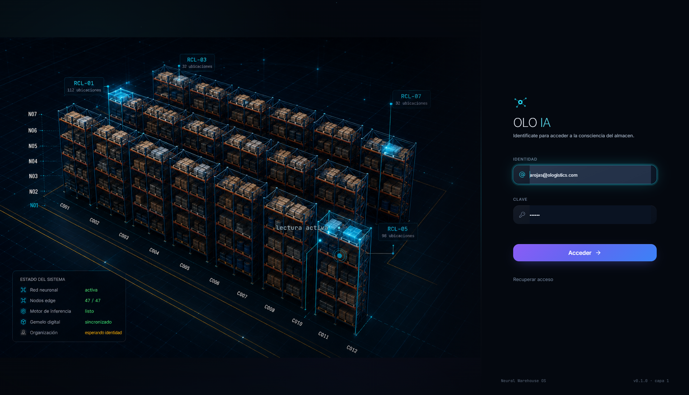

Identidad y clave. El sistema resuelve a qué operador (*tenant*) perteneces y qué
almacenes puedes ver: **todo lo que aparece después está filtrado por eso**, no por un
menú de preferencias.

Eso tiene una consecuencia práctica que conviene entender desde el principio: dos personas
del mismo operador pueden ver cifras distintas en la misma pantalla, y ninguna está mal.
Cada una ve sus almacenes.

---

## 2. Panel de inicio

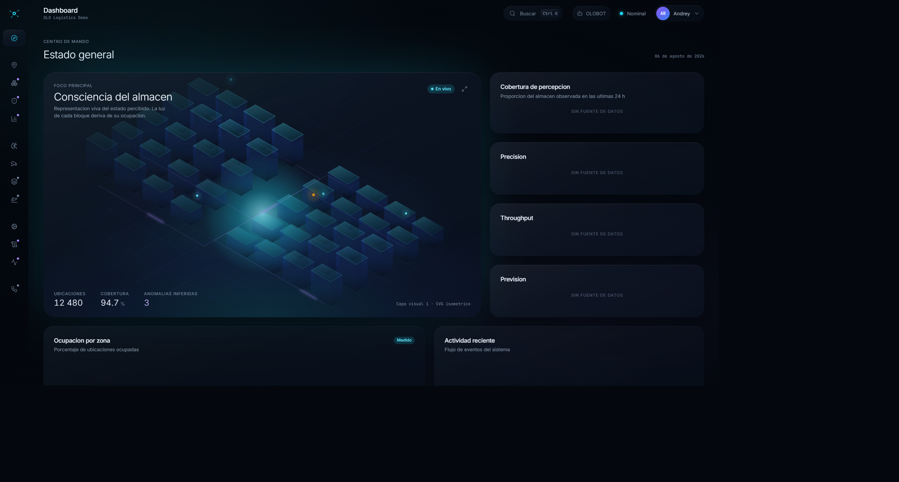

Vista de conjunto con la representación isométrica del almacén.

Las tres cifras de arriba —**ubicaciones, racks y posiciones**— salen del catálogo real,
sumadas sobre los almacenes que tú puedes ver. Si todavía no han llegado, se pinta un guion
en lugar de un número.

> Aquí hubo un defecto que conviene recordar: eran literales escritos a mano —«12 480
> ubicaciones», «94,7 % de cobertura»— y encima marcados como *medidos*. El catálogo real
> tiene 29.312. Era lo primero que veía alguien al entrar, y era falso.
>
> No se muestra la **ocupación**, aunque sería más interesante: el único dato disponible es
> la foto del WMS, y ponerlo junto al distintivo «En vivo» sería el mismo engaño en versión
> más difícil de detectar. La ocupación está en [Inventario](#9-inventario), con su fecha.

Cuatro paneles inferiores —Cobertura de percepción, Precisión, Throughput, Previsión— dicen
**SIN FUENTE DE DATOS**. Eso sí es honesto: esas métricas no están conectadas todavía.

---

## 3. Configuración del sistema

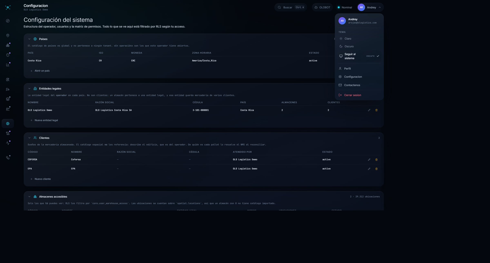

La estructura del operador y quién puede hacer qué. Seis bloques desplegables.

### El vocabulario, que es donde más se confunde la gente

| Término | Qué es |
|---|---|
| **Operador** (*tenant*) | Tu empresa de logística. Es «nosotros». |
| **Entidad legal** | Una sociedad del operador en un país. Un almacén le pertenece. |
| **Cliente** | El **dueño de la mercancía**. NO es un usuario de la aplicación. |
| **Usuario** | Una persona con acceso. Tiene roles, y los roles dan permisos. |
| **Almacén** | El edificio. Tiene un catálogo espacial. |

La confusión más común es *cliente*: en este sistema Cofersa y EPA son clientes —dueños de
pallets—, no gente que entra a la aplicación.

### Qué se puede hacer

Cada fila de países, entidades legales, clientes, almacenes y usuarios tiene **editar** y
**dar de baja**. Se edita en la propia fila, sin salir de la tabla, para poder comparar con
las vecinas mientras corriges.

Dos comportamientos deliberados:

- **Dar de baja pide confirmación con el nombre delante.** El segundo clic cae a dos
  centímetros del primero y dice qué se va a perder.
- **Una baja imposible se explica con cifras.** Al intentar dar de baja una entidad legal
  que tiene almacenes dentro, responde: *«No se puede dar de baja: la entidad legal todavía
  tiene 2 almacen(es) y 2 cliente(s). Reasígnalos o dalos de baja primero.»* La cifra es la
  mitad de la información.

Los **usuarios no tienen papelera**, y es a propósito: un usuario no se borra, se
**suspende**, y eso es el campo `estado` de su propia fila. El correo no se edita porque es
la llave con su identidad de acceso.

### Dar de alta a alguien

En la carpeta **Usuarios**, el botón **«Invitar a una persona»**.

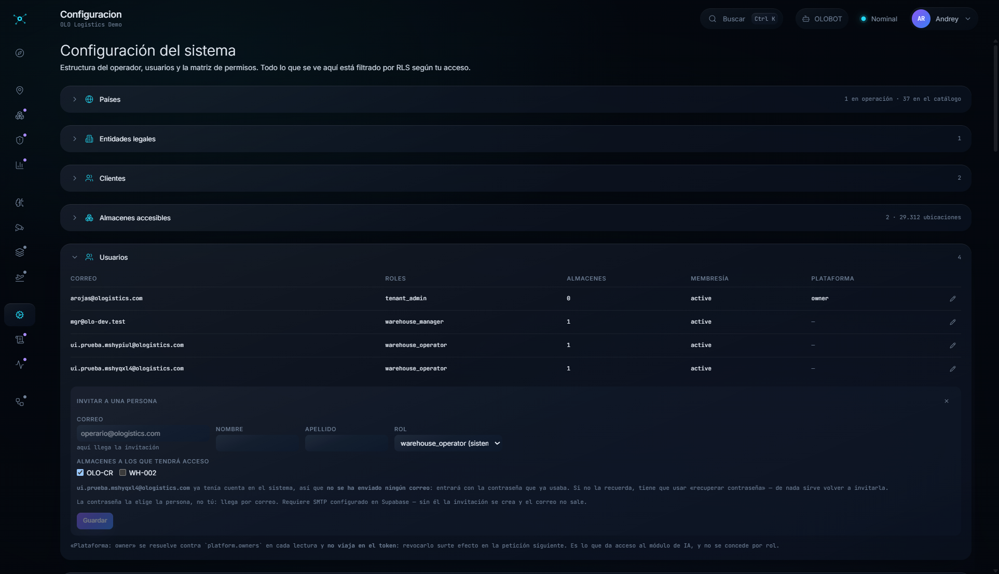

Pide correo, nombre, apellido, un **rol** y los **almacenes** a los que tendrá acceso. La
persona recibe un correo, abre el enlace y **elige su propia contraseña**: no se la pones
tú, y eso es deliberado. Una contraseña que inventa el administrador viaja por WhatsApp o
por un papel, la saben dos personas —así que «quién hizo esto» deja de tener respuesta— y
casi nadie la cambia después.

**El rol y los almacenes no son opcionales en la práctica**, y el formulario lo avisa
mientras los dejas en blanco:

- **sin rol** entra sin un solo permiso, y cada botón le responde «no autorizado»;
- **sin almacenes** ve el explorador espacial, las inspecciones y el inventario **en
  blanco**, sin ningún mensaje que lo explique. Es el síntoma más difícil de diagnosticar
  del sistema, porque no parece un error.

Se pueden añadir después desde su fila, pero es un paso que ninguna pantalla te va a
recordar.

#### Dos mensajes que hay que leer

**«Ya tenía cuenta en el sistema, así que no se ha enviado ningún correo.»** Pasa cuando esa
dirección ya existía —porque se le dio de baja y vuelve, o porque se le invitó antes—. Se le
añade al operador y entrará con la contraseña que ya usaba. Si no la recuerda, la salida es
**recuperar contraseña**: volver a invitarla no manda nada.

**«Esa persona ya tiene una cuenta activa en otro operador.»** Una cuenta pertenece a un solo
operador a la vez. El sistema **no la mueve**, porque eso le quitaría el acceso al operador
actual sin que nadie lo haya pedido: primero tiene que darse de baja allí.

> ### ⚠ Hace falta configurar el SMTP en Supabase
>
> Sin un servidor de correo propio, Supabase usa su remitente integrado, que permite **solo
> unos pocos correos por hora**. Para dar de alta a un grupo de operarios hay que configurar
> el SMTP en *Authentication → Emails* del panel de Supabase.
>
> Si el envío falla, la invitación **no se crea a medias**: el mensaje dice que es el límite
> de correos y quién lo resuelve. Y las personas que ya tienen cuenta se pueden añadir
> igualmente, porque ese caso no gasta ningún envío.

### La matriz de permisos

Al final del todo, roles en columnas y permisos en filas. Dos cosas que sorprenden:

- **Las casillas con un guion son imposibles, no vacías.** Son permisos de plataforma, y un
  rol del operador no los puede tener nunca. Se pintan así para que no gastes 135 clics
  descubriéndolo.
- **La matriz es de solo lectura hasta que crees un rol propio.** Los cinco roles del
  sistema los comparten todos los operadores, así que sus permisos no se pueden cambiar
  desde aquí. La salida es crear un rol del tenant, que puede heredar de uno del sistema.

### OLOBOT: el nivel de cada usuario

Un bloque propio con una tabla de usuario → nivel (`Usuario`, `Supervisor`,
`Administrador`, `Owner`).

> **El nivel NO concede permisos.** Recorta lo que el asistente puede hacer, y OLOBOT actúa
> siempre con los permisos del usuario. Alguien con nivel «Owner» y un rol de solo lectura
> sigue sin poder cambiar nada.

Y **nadie puede cambiar su propio nivel**: su fila dice «tu propio nivel» en lugar del
desplegable. Así el registro de quién lo concedió significa algo.

---

## 4. Catálogo espacial

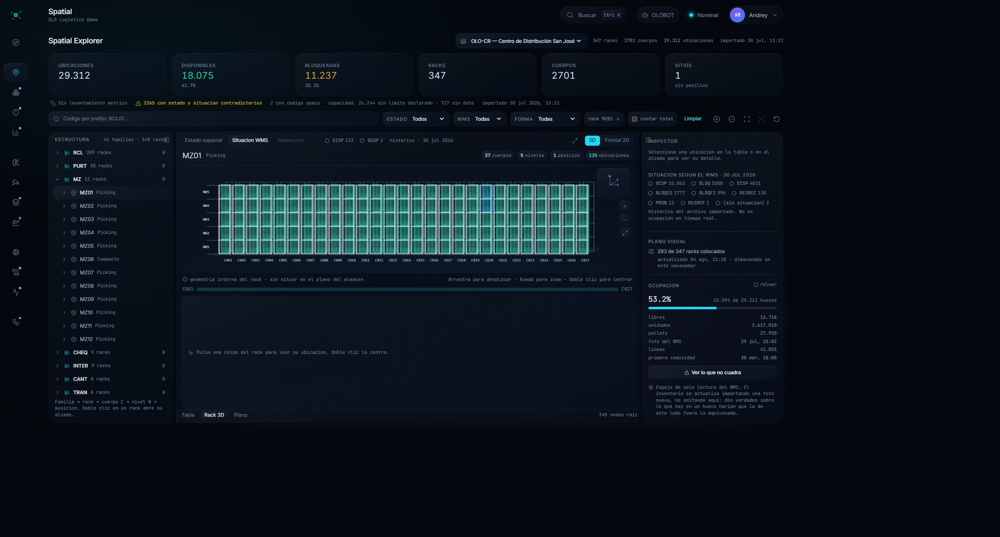

**Aquí están los datos reales del almacén.** Del catálogo importado el 30 de julio:

| | |
|---|---|
| Ubicaciones | **29.312** |
| Disponibles | 18.075 (61,7 %) |
| Bloqueadas | 11.237 (38,3 %) |
| Racks | 347 |
| Cuerpos | 2.701 |

La pantalla declara además tres cosas que no esconde:

- **2.365 ubicaciones con estado y situación contradictorios.** El catálogo espacial dice
  una cosa y el WMS otra. Es un dato valioso, no un error: significa que uno de los dos
  está desactualizado, y saber cuál es trabajo de la reconciliación.
- **2 con código opaco** — no se pueden interpretar.
- **Sin levantamiento métrico** y **sin pasillos**: el catálogo tiene la estructura lógica
  (rack, cuerpo, nivel) pero no las medidas en metros. Por eso todavía no se dibujan rutas
  sobre un plano a escala.

El almacén **WH-002 — Bodega Alajuela** aparece marcado *(sin catálogo)*: existe como
almacén y no tiene ubicaciones importadas.

---

## 5. Percepción: el flujo del drone

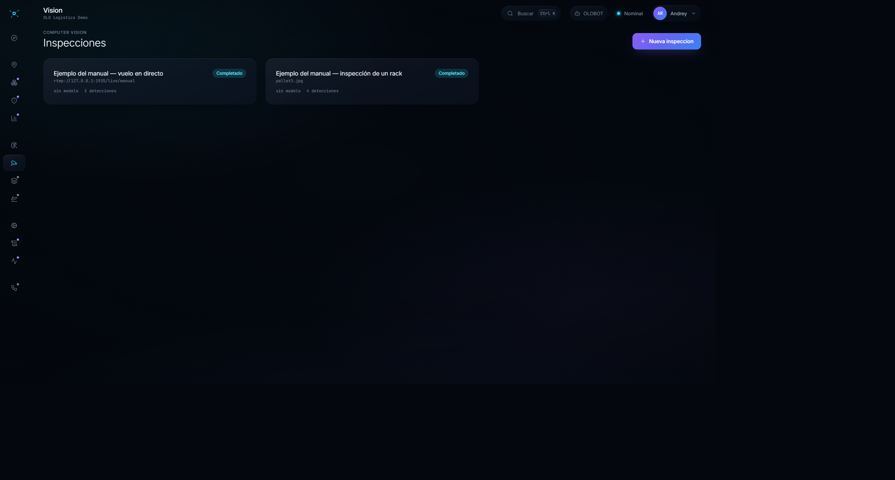

El módulo que analiza vídeo o imágenes del almacén con un modelo de visión. La lista
muestra las inspecciones con su estado y cuántas detecciones produjo cada una.

Fíjate en que las dos entradas se identifican distinto: la de archivo por su nombre
(`pallet3.jpg`) y la de directo por su URL (`rtmp://...`). No es decoración — en un directo
no hay archivo que nombrar.

### 5.1 Nueva inspección

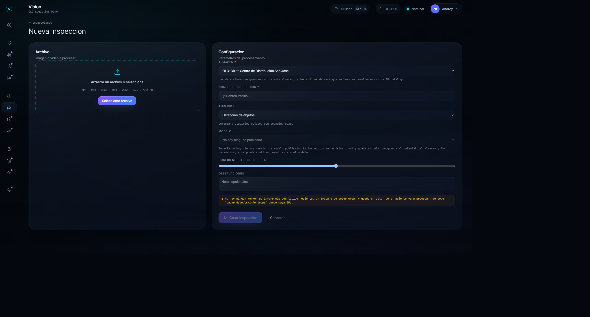

Cuatro decisiones:

1. **El archivo.** JPG, PNG, WebP, MP4 o WebM, hasta 500 MB. Se sube directo al
   almacenamiento, no a través del servidor.
2. **El almacén.** Importa más de lo que parece: *«las detecciones se guardan contra este
   almacén, y los códigos de rack que se lean se resolverán contra SU catálogo»*. Elegir el
   equivocado hace que ningún código case.
3. **El pipeline:**
   - *Detección de objetos* — encuentra y clasifica, con sus cajas.
   - *OCR* — lee texto.
   - *Detección + OCR* — las dos. **Es el que hace falta** si quieres identificar huecos o
     pallets por su etiqueta.
4. **El umbral de confianza y el muestreo.** El muestreo (fotogramas por segundo) solo
   aplica a vídeo: analizar los 25 fps de un vídeo de diez minutos son 15.000 fotogramas
   para ver lo mismo que en 600.

Al guardar, la inspección queda en **Subido**. No se encola sola: encolar consume máquina y
es una decisión aparte, para que puedas revisar el modelo y el umbral antes.

### 5.2 Analizar: el worker

Lo que analiza **no es un botón de la aplicación**: es un proceso que corre donde haya
máquina. Decodificar un vídeo de 1 GB y pasarlo por un modelo tarda minutos y quiere GPU;
dentro del servidor web sería un proceso bloqueado sin forma de repartir el trabajo.

```bash
# Qué hay en cola y quién está vivo
python backend/tools/inferir.py --listar

# Coger el siguiente trabajo, o quedarse esperando
python backend/tools/inferir.py
python backend/tools/inferir.py --bucle
```

**Con el modelo entrenado que hay hoy, las dos opciones siguientes son obligatorias:**

```bash
python backend/tools/inferir.py --bucle \
  --pesos "C:/Users/arojast/olo-entrenamientos/<ejecución>/salida/checkpoint_best_ema.pth" \
  --clases "qr_ubicacion,qr_pallet,pallet,hueco_vacio,etiqueta_ilegible"
```

- **`--pesos`** — los pesos del modelo no se pueden publicar (ver [límites](#qué-no-hace-el-sistema-todavía)),
  así que el worker los lee del disco. Sin esto usa un detector genérico y **lo avisa**: lo
  que salga no es de tu modelo.
- **`--clases`** — sin el vocabulario, las detecciones salen como `clase_3` y **la
  reconciliación las rechaza**, porque no puede saber si lo que vio es un hueco vacío o un
  pallet.

> **El intérprete es `C:\OLO_IA\.venv-train\Scripts\python.exe`** (Python 3.13), no el del
> backend. Una de las dependencias de entrenamiento no tiene versión compilada para 3.14.
> Es el fallo que más tiempo hace perder.

Si no hay ningún worker vivo, la pantalla de percepción **lo avisa**: los trabajos se
quedan en cola y no avanzan solos. Eso no es un fallo, es información — y el aviso es real,
sale de un latido que el worker manda cada 30 segundos.

### 5.3 Qué está pasando, y cómo hacer que avance

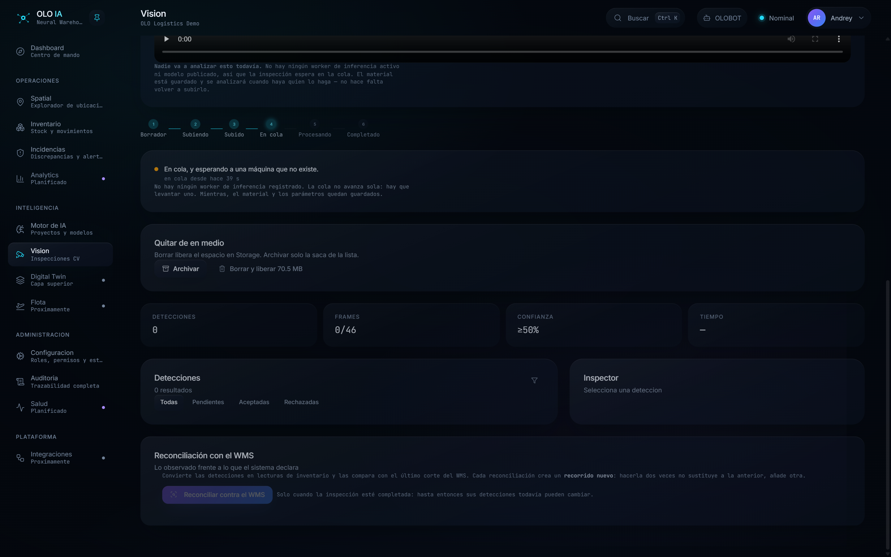

La línea de etapas —*Borrador · Subiendo · Subido · En cola · Procesando · Completado*—
dice **dónde está**, no **qué ocurre**. Una bolita encendida se ve igual estando a medio
analizar que llevando tres horas parada.

Debajo de la línea hay ahora un panel que responde siempre a tres preguntas:

| | |
|---|---|
| **¿Qué pasa?** | El estado en una frase. *«El material está guardado. Ahora mismo NO se está analizando nada.»* |
| **¿Qué falta?** | La acción concreta que desbloquea, y de quién es. |
| **¿Desde cuándo?** | *«en cola desde hace 39 s»* — porque en cola treinta segundos y en cola dos días son problemas distintos. |

#### El análisis NO arranca solo, y antes no se podía arrancar

Subir el archivo deja la inspección en **Subido** y ahí se queda. Es a propósito: encolar
gasta el worker, y hacerlo automáticamente te quitaría el paso donde revisas el umbral y
el modelo antes de gastar máquina.

Lo que **faltaba** era el botón. La aplicación no tenía forma de encolar, así que la
respuesta a *«¿cuándo pasa a En cola?»* era **nunca**, y nada lo decía. Ahora en «Subido»
sale **Analizar ahora** (pide `perception:write`), y en «Falló» o «Cancelada» sale
**Reintentar** — sin volver a subir el archivo, que sigue guardado.

#### Se distingue esperar a una persona de esperar a una máquina

No es lo mismo y no se arregla igual:

- **«Falta ponerla en cola»** → lo resuelve quien está mirando la pantalla, con el botón.
- **«En cola, y esperando a una máquina que no existe»** → no hay ningún worker de
  inferencia registrado. La cola no avanza sola: hay que levantar uno. El material y los
  parámetros quedan guardados.

#### Mientras procesa, se ve avanzar

En **Procesando** sale una barra con el avance real: *«N de M fotogramas · X detecciones
hasta ahora»*. Si el número no se mueve durante minutos, el worker se colgó y conviene
cancelar y reintentar — eso es algo que la bolita encendida no podía decirte.

Cuando el total de fotogramas no se conoce, **no se inventa un porcentaje**: se dice
cuántos van y que no hay total.

#### Y si falla, sale lo que dijo el sistema

El `error_message` del motor, tal cual, sin resumir. Si no explica nada, hay que mirar los
registros del worker — pero al menos se sabe que falló y con qué mensaje.

> **La vista previa del vídeo ya funciona.** Al seleccionar un vídeo en el formulario no
> se veía nada, sin mensaje alguno: la función que leía el ancho, alto y duración
> **destruía la URL del archivo** justo después de leerla, y esa era la misma URL que
> usaba la vista previa. El archivo siempre estuvo bien —subía y luego se reproducía—;
> lo único roto era la miniatura. Las imágenes no lo sufrían.

### 5.4 Ver el material, y quitar lo que no sirvió

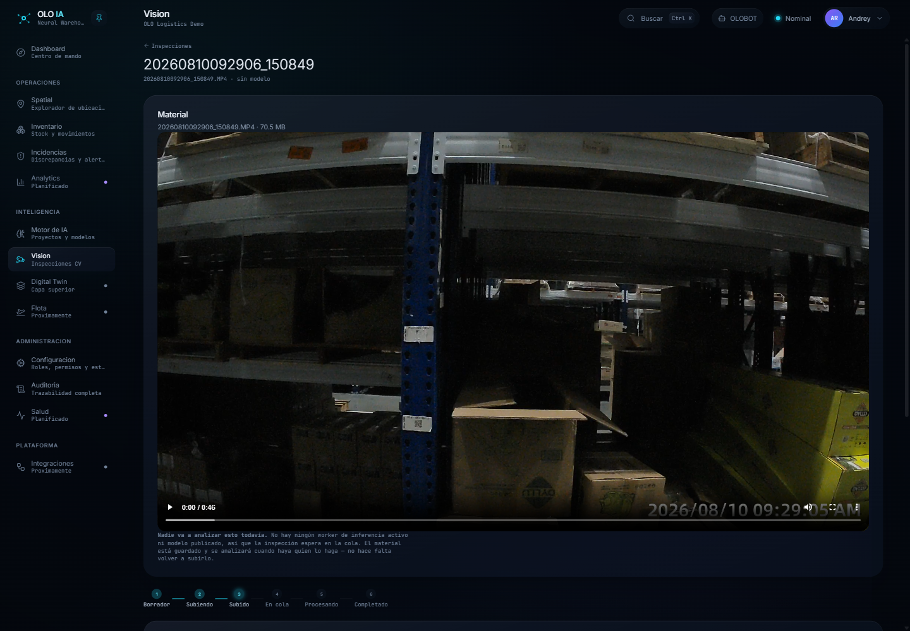

**La inspección enseña su vídeo o su foto.** Antes no: la pantalla del trabajo no tenía
ni un reproductor, así que subías un vídeo, lo veías en el formulario —de la memoria del
navegador— y al crear la inspección desaparecía. Los bytes **siempre estuvieron en
Storage**; lo que faltaba era pedirlos.

Los buckets son privados, así que la aplicación pide al servidor una **URL firmada de una
hora**. Eso significa que el vídeo se ve también tras recargar y desde otro equipo, que
es justo lo que la vista previa del formulario nunca podía dar. El reproductor no
autoarranca y solo carga los metadatos: quien abre una inspección de 70 MB por la red del
almacén decide cuándo gastar ese ancho de banda.

Ver el material pide `perception:read`, el mismo permiso que ver la inspección. Antes
pedía `perception:ingest` —la credencial de máquina— y con eso un operario, un auditor o
un lector abrían la inspección y no veían nada.

#### Cuando no hay nada que ver, lo dice

Tres casos, tres mensajes distintos, porque piden cosas distintas:

| Situación | Qué dice |
|---|---|
| **La subida se cortó** | *El archivo no llegó a Storage.* Hay que volver a crear la inspección; esta se puede borrar. |
| **Es un directo** | No hay archivo: el vídeo no se guarda, quedan las detecciones de lo que pasó por delante. |
| **No hay worker ni modelo** | *Nadie va a analizar esto todavía.* El material está guardado y se analizará cuando haya quien lo haga — **no hace falta volver a subirlo**. |

Ese último es el que explica el «no hace lectura»: el vídeo está perfecto, lo que falta es
quién lo procese.

#### Borrar libera espacio. Archivar no.

Un vídeo de 70 MB que nunca se analizó ocupa igual, y las inspecciones se acumulan. Con
el permiso **`perception:delete`** —que tienen el administrador del tenant y el jefe de
almacén— aparece un panel al pie con las dos operaciones, y **no son lo mismo**:

- **Borrar** se lleva la inspección, sus detecciones, sus eventos y **el archivo**. El
  botón dice cuánto va a liberar (*«Borrar y liberar 70,5 MB»*) y al terminar dice cuánto
  liberó de verdad. Pide confirmación y no se puede deshacer.
- **Archivar** solo la saca de la lista. **No libera nada** — y está escrito en la
  pantalla, porque alguien que archive para hacer sitio no lo va a conseguir.

**Cuál toca no lo decide quien pulsa: lo decide el dato.** Si de la inspección cuelga
trabajo que nadie puede reconstruir, el borrado se rechaza diciendo qué y cuánto:

| Lo que la protege | Por qué |
|---|---|
| Incidencias abiertas desde ella | Alguien fue al pasillo por esto. |
| Detecciones **promovidas** a observaciones de rack | Las observaciones no guardan el id de la inspección, así que borrarla las dejaría afirmando venir de algo que ya no existe. |
| Detecciones **revisadas** por una persona | Aceptadas, rechazadas o corregidas: son horas de trabajo. |

En esos casos el único botón que sale es archivar. La lista dice cuántas archivadas está
ocultando, con una casilla para verlas: *«3 archivada(s) fuera de la lista. Siguen
guardadas y siguen ocupando su espacio.»*

> **Un archivo compartido no se borra.** Si subes dos veces el mismo vídeo, el sistema
> reutiliza el archivo (se deduplica por hash). Al borrar una de las dos inspecciones los
> bytes **no** se tocan, porque la otra los necesita — y la respuesta lo dice en vez de
> callarlo: *«El archivo lo usaba otra inspección: no se borró.»*

### 5.5 Revisar las detecciones

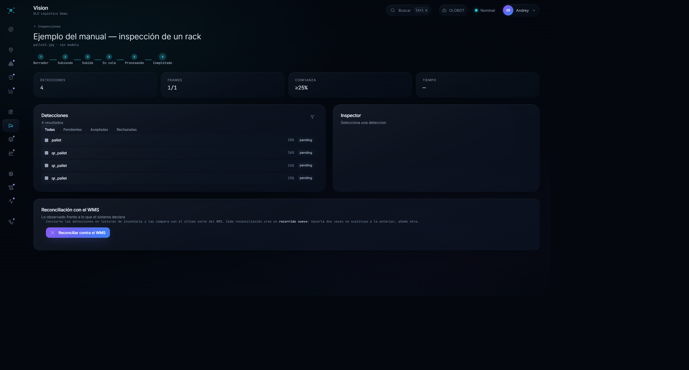

La inspección de ejemplo: **4 detecciones**, umbral ≥25 %, un fotograma (`FRAMES 1/1`).

Arriba, la línea de estados: `Borrador → Subiendo → Subido → En cola → Procesando →
Completado`. Si algo falla, marca **en qué etapa** se rompió — y si el historial no lo
registra, lo dice en vez de culpar a una etapa al azar.

Cada detección trae su clase y su confianza (`pallet 28 %`, `qr_pallet 36 %`). Se pueden
aceptar o rechazar; el filtro de arriba las separa en Todas / Pendientes / Aceptadas /
Rechazadas.

### 5.6 Reconciliar con el WMS

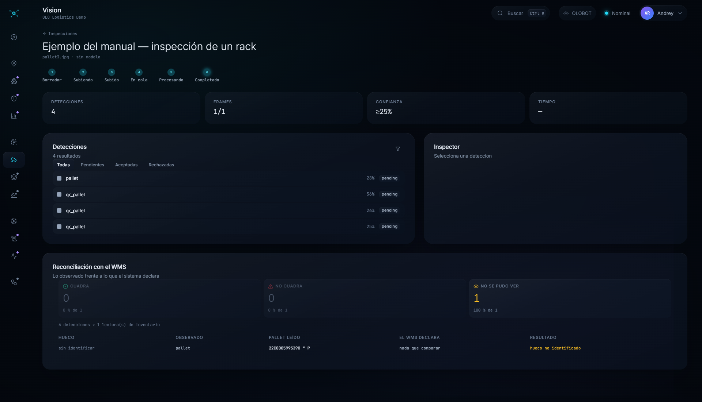

**Esta es la pantalla que convierte un análisis en trabajo.** Las detecciones dicen «vi un
pallet con confianza 0,86»; esto dice:

> «hay un pallet en A-01-02 y el WMS declara ese hueco vacío»

Se pulsa *Reconciliar contra el WMS* y el sistema convierte las detecciones en lecturas de
inventario, comparándolas con el último corte importado del WMS.

Los nueve estados posibles se agrupan en **tres**, que son las tres preguntas reales:

| | Significa | Qué haces |
|---|---|---|
| **Cuadra** | El WMS y lo observado coinciden | Nada |
| **No cuadra** | Se contradicen | Aquí hay trabajo |
| **No se pudo ver** | QR ilegible, hueco tapado | Repetir la captura |

> **«No se pudo ver» no dice que el almacén esté bien.** Dice que hay que volver a
> capturar. Si el 60 % de un vuelo cae en ese grupo, el resultado no vale — y esa es la
> lectura que se pierde si se agrupa con «Cuadra».

Cada recuento **es un filtro**: se pulsa y la tabla se acota a ese grupo.

En el ejemplo, la única lectura sale como **«hueco no identificado»**: se detectó el pallet
y se leyó su código (`22C0005993390`), pero **no se leyó el código del hueco**. Sin saber de
qué ubicación es, el sistema no afirma nada sobre ninguna — y eso es correcto. Aproximar
«RCL104» a «RCL1O4» convertiría un error de lectura en un dato del inventario.

La columna del WMS distingue dos cosas que parecen la misma:

- **«sin corte del WMS»** — no hay ningún corte importado con el que comparar.
- **«nada que comparar»** — sí lo hay, pero esta lectura no se pudo atribuir a un hueco.

Dos avisos sobre el botón:

- Está **apagado hasta que la inspección esté completada**: antes, sus detecciones todavía
  pueden cambiar.
- **Cada reconciliación crea un recorrido nuevo**, no sustituye al anterior. Es
  deliberado —quizá con otro corte del WMS de por medio— pero significa que pulsar dos veces
  no es inocuo.

### 5.7 Un análisis en directo

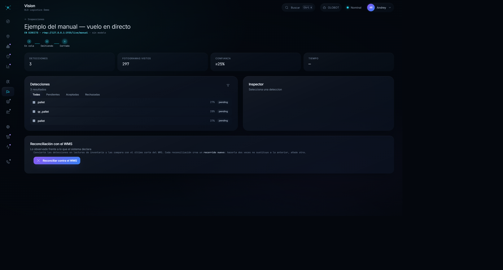

La misma pantalla, leyendo de una cámara en vez de un archivo. Se distingue en tres cosas:

| | Archivo | Directo |
|---|---|---|
| Cabecera | `pallet3.jpg` | **EN DIRECTO** · `rtmp://...` |
| Etapas | seis | **tres**: En cola → Emitiendo → Cerrado |
| Contador | `FRAMES 1/1` | **FOTOGRAMAS VISTOS 297** |

Las tres tienen motivo. En un directo no hay nada que subir, así que las etapas de subida
no existirían. **«Cerrado» no significa «terminó bien»**: significa que alguien lo cortó o
que el emisor dejó de emitir. Y no hay proporción porque no hay total — un directo no tiene
final.

> ⚠ **OLO_IA no es un servidor RTMP.** Nada en el sistema acepta una emisión. El drone o su
> mando publican en un servidor de medios —MediaMTX, nginx-rtmp, SRS— y aquí se registra la
> URL desde la que ese servidor sirve el stream. **Sin ese servidor montado, un directo no
> puede funcionar** aunque la sesión se cree.

Una decisión que parece un defecto y no lo es: en un directo el worker **descarta
fotogramas**. Si el modelo tarda 300 ms y la cámara entrega 25 por segundo, analizarlos
todos haría que la latencia creciera sin techo: al minuto estarías viendo imágenes de hace
un minuto. Se coge el más reciente y se tira el resto. Con un archivo es lo contrario: no se
pierde ninguno.

Para cortar un directo: `Ctrl-C` en el worker, o `--segundos 60` al lanzarlo.

---

## 6. OLOBOT

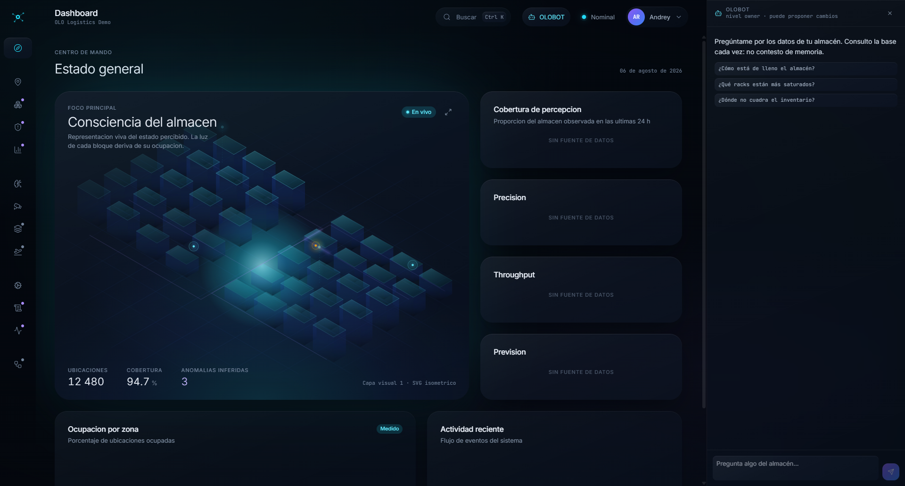

El asistente. Se abre con el botón de la barra superior y **no cierra la pantalla en la que
estás**: se ancla al lado, porque lo que mejor hace es llevarte a una pantalla y comentarla.

La cabecera dice tu nivel y qué implica: *«nivel owner · puede proponer cambios»*.

Tres reglas que gobiernan lo que hace:

1. **No contesta de memoria.** Consulta la base cada vez. Si le preguntas una cifra que no
   puede consultar, lo dice en lugar de inventarla.
2. **Solo habla de esta aplicación.** No responde preguntas generales aunque sepa la
   respuesta.
3. **Ningún cambio se aplica hasta que lo confirmes.** Cuando propone algo, aparece una
   tarjeta con la frase exacta de lo que va a pasar y dos botones. Mientras no pulses
   *Confirmar*, **no ha cambiado nada** — y la tarjeta lo dice.

Lo que **no** puede hacer, por diseño: dar permisos, cambiar roles, cambiar el nivel de
OLOBOT de nadie, ni borrar nada. Eso se hace en Configuración, con una persona mirando.

---

## 7. Temas

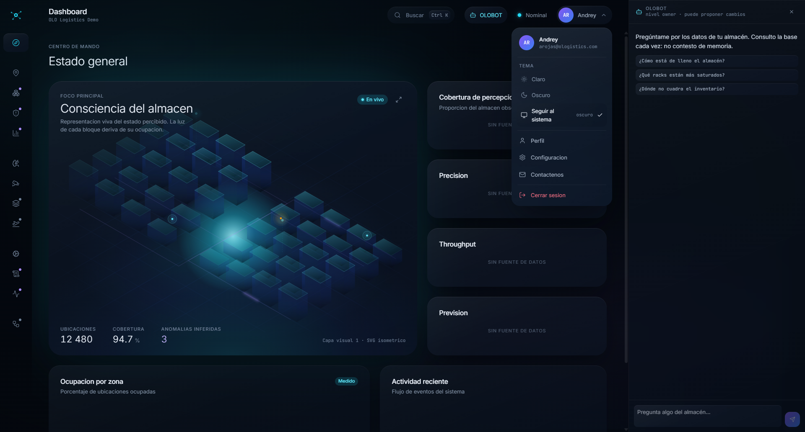

En el menú de usuario: **Claro**, **Oscuro** y **Seguir al sistema**. La tercera muestra
además a qué resuelve ahora mismo (*«oscuro»*), para que no tengas que adivinar por qué se
ve como se ve.

---

## 7 bis. En el teléfono

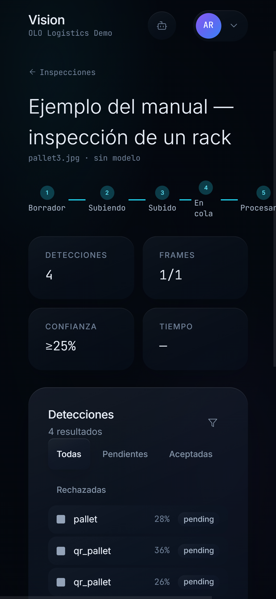

Sí funciona, y se midió en un iPhone 13 emulado (390×844) pantalla por pantalla:

- **ninguna pantalla se desborda de lado.** Es el defecto que más molesta en un móvil
  —arrastras para bajar y la página se va en diagonal, escondiendo contenido a la
  derecha— y no ocurre en ninguna de las ocho;
- **los botones crecen al tacto.** Con ratón miden 32 px, que sobra; con un dedo pasan a
  44, que es lo que piden Apple y Google. La densidad de escritorio no cambia: la regla
  solo se aplica cuando el dispositivo apunta con un dedo.

Antes de eso, las pestañas de revisión de detecciones —*Todas / Aceptadas / Pendientes /
Rechazadas*, las que más se tocan— medían 32 px, y los controles del mapa espacial 24×24.

**Lo que sigue siendo incómodo en un móvil** y no es un defecto sino una consecuencia:

- **la matriz de permisos** son 5 roles × 73 permisos con casillas de 14 px. Es una tabla
  de escritorio; en un teléfono no cabe de ninguna manera razonable;
- **el texto secundario está a 11 px** en toda la aplicación. Es un token del diseño, no un
  descuido, y se lee bien de cerca; a un brazo de distancia, justo.

En la práctica: el operario hace las lecturas y revisa detecciones desde el teléfono sin
problema. La configuración del sistema se hace sentado.

---

## 8. Módulos todavía no implementados

Tres entradas del menú lateral **no son módulos**: son páginas que describen lo que harán,
con su versión objetivo. Están así a propósito, y es mejor que una pantalla vacía.

| Módulo | Estado | Versión objetivo |
|---|---|---|
| **Analítica** (`/analytics`) | Planificado | v0.4 |

Qué permitirá hacer el módulo, a qué familia pertenece y qué permiso pedirá.

> **Inventario, Incidencias y Auditoría ya no están en esta lista.** Tienen sus propias
> secciones: [Inventario](#9-inventario), [Incidencias](#10-incidencias) y
> [Auditoría](#11-auditoría).

**Analítica sigue bloqueada por un dato, no por código.** Todo lo que promete —precisión de
inventario en el tiempo, evolución de los descuadres— exige **dos** importaciones del WMS
para poder comparar, y por ahora solo hay una. Con una sola foto no hay serie temporal que
dibujar.

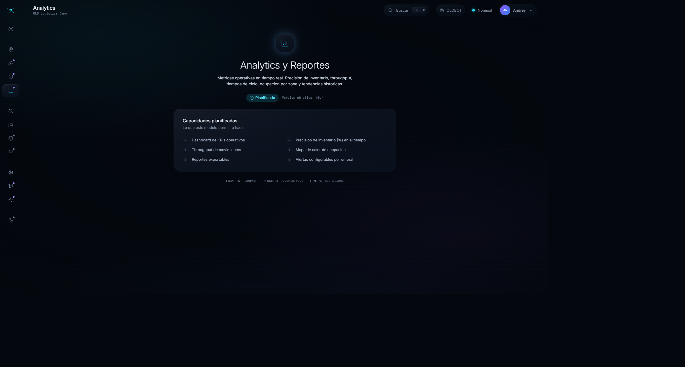

Analítica promete indicadores operativos: precisión de inventario en el tiempo, throughput,
mapa de calor de ocupación y alertas por umbral.


---

## 9. Inventario

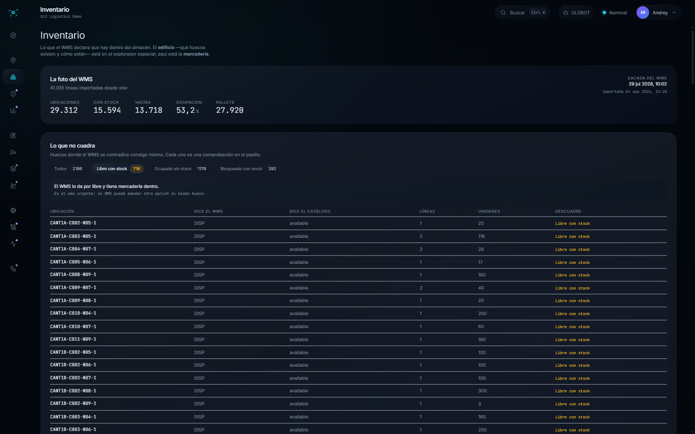

Lo que el WMS declara que hay dentro del almacén. La separación con el explorador
espacial es deliberada y conviene tenerla clara:

- **espacial = el edificio.** Qué huecos existen, cómo están estructurados, si están
  disponibles o bloqueados. Es una propiedad del inmueble.
- **inventario = la mercadería.** Qué hay dentro de cada hueco, cuánto, y qué no cuadra.

### Todo esto es una foto, no un directo

Arriba del todo salen **dos fechas y la antigüedad**: cuándo se sacó del WMS, cuándo se
importó aquí, y cuántos días tiene. Las dos primeras se separan por días con frecuencia, y
la que manda para decidir es cuándo se sacó.

La antigüedad va **en palabras y en ámbar a partir de una semana** —hoy dice *«hace 8
días»*— porque «29 jul» obliga a restar mentalmente y eso nadie lo hace. Es el dato que
decide si fiarse de todo lo demás de esta pantalla: un almacén que mueve mercadería a
diario ya no se parece a una foto de hace ocho días.

Los datos actuales vienen de un Excel del **29 de julio**: 41.055 líneas, 29.312
ubicaciones, 15.594 con stock, 27.920 pallets.

### Lo que no cuadra: la parte que da trabajo

El bloque principal no es la ocupación, es la lista de **2.186 huecos donde el WMS se
contradice consigo mismo**. Cada uno es una comprobación en el pasillo, y cada clase
significa un trabajo distinto:

| Clase | Cuántos | Qué significa |
|---|---|---|
| **Libre con stock** | 716 | El WMS lo da por libre y tiene mercadería. **Es el urgente:** el WMS puede mandar otro pallet al mismo hueco. |
| **Ocupado sin stock** | 1178 | Figura ocupado y no hay nada. Suele ser mercadería que salió y nadie descargó: el hueco está libre y el sistema no deja usarlo. |
| **Bloqueado con stock** | 292 | Bloqueado con carga dentro. Puede haber mercadería inmovilizada sin que su dueño lo sepa. |

Al pulsar una clase, la pantalla explica qué significa y qué hacer.

### Zonas: agrupar el almacén

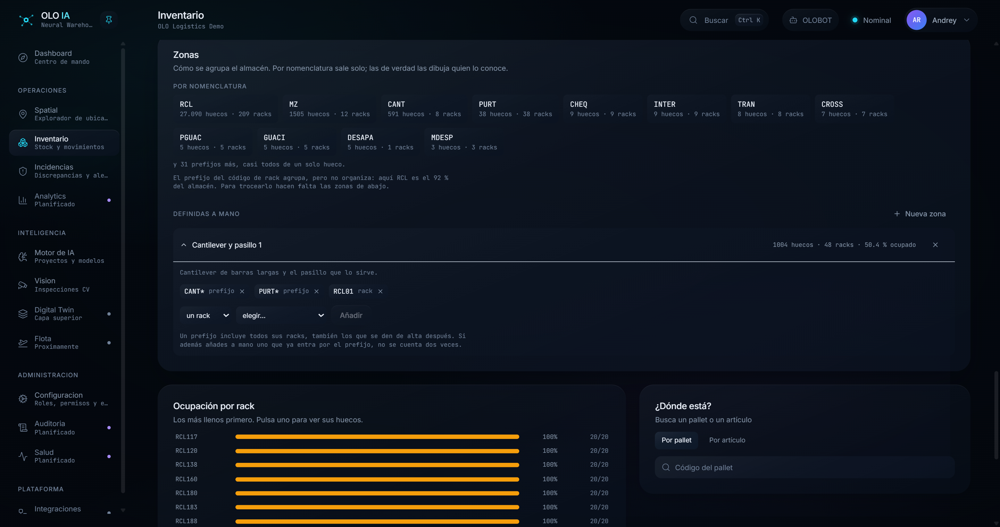

Hay **dos** maneras de agrupar, y hacen falta las dos.

**Por nomenclatura** es el prefijo alfabético del código de rack. Sale solo y no hay que
mantenerlo, pero medido aquí **no describe el almacén**:

| Prefijo | Huecos | % del almacén |
|---|---|---|
| `RCL` | 27.090 | 92 % |
| `MZ` | 1.505 | 5 % |
| `CANT` | 591 | 2 % |
| los otros 40 | 126 | menos del 1 % entre todos; 25 de ellos tienen **un** hueco |

Son 43 grupos: 42 prefijos y uno más, **sin rack**, con los 2 huecos que no cuelgan de
ninguna estantería (`ALM-01-01` y `ALM-01-02`, cuyo *bay* no tiene rack padre). Salen
aparte a propósito: si se cayeran, la suma de las zonas no cuadraría con los 29.312 del
almacén y nadie sabría por qué faltan dos. No se pueden filtrar —no hay prefijo con el que
acotarlos—, así que no aparecen en el desplegable.

Sirve para **acotar la lista de descuadres** —hay un desplegable *Zona* encima de la
tabla— y para nada más: como resumen dice que el almacén es un sitio grande llamado RCL.

**Definidas a mano** son las que dibuja quien conoce el edificio: «Picking planta baja»,
«Cámara de frío», «Cantilever y pasillo 1». Se crea con **Nueva zona** —un nombre y, si
se quiere, para qué es— y nace **vacía**. Después se le añade contenido, de dos formas:

- **un prefijo entero** — incluye todos sus racks, también los que se den de alta más
  adelante. Un `CANT9` que aparezca mañana entra solo.
- **un rack suelto** — es lo único que permite trocear `RCL`, donde el prefijo no
  distingue nada.

La zona muestra su ocupación ya sumada: *1.004 huecos · 48 racks · 50,4 % ocupado*. Si un
rack entra por su prefijo **y** además se añade a mano, **no se cuenta dos veces**.

> **Una zona es una etiqueta encima del almacén.** Borrarla no toca el catálogo espacial:
> el edificio, los racks y los huecos quedan exactamente como estaban. Lo que sí se pierde
> es el trabajo de haberla dibujado — nadie puede reconstruir «esto es la zona de picking»
> desde los datos, porque esa agrupación no está en ninguna otra parte.

Crear, cambiar y borrar zonas pide el permiso **`inventory:zones`**, que tienen el
administrador del tenant y el jefe de almacén. Quien solo tenga `inventory:read` las ve,
con sus cifras, pero sin los botones.

### ¿Qué hay en ese hueco?

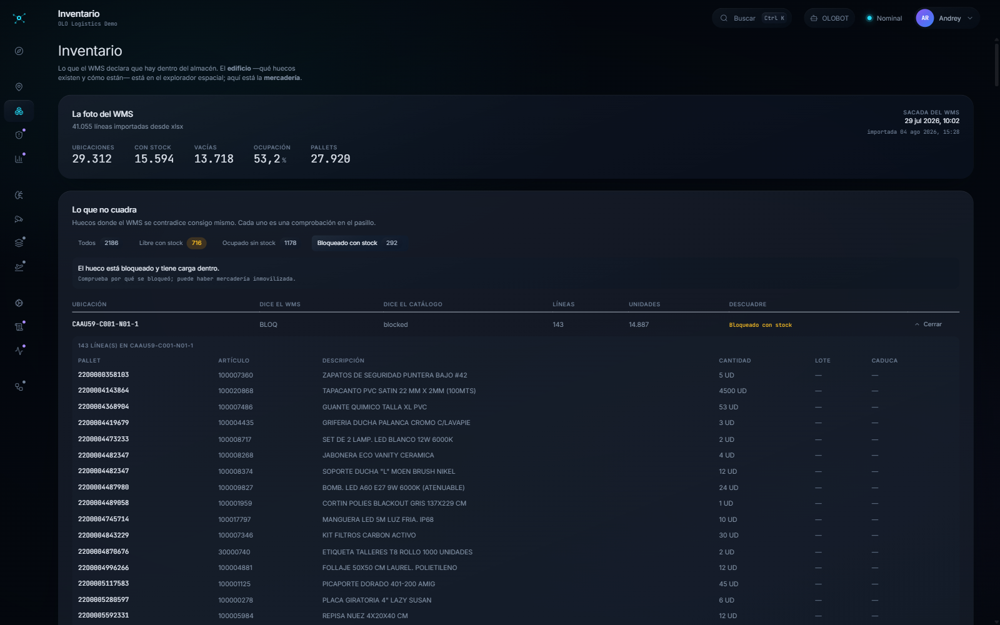

Cada fila se abre con **«¿Qué hay?»** y muestra la mercadería que el WMS declara dentro:
pallet, artículo, descripción, cantidad, lote y caducidad.

Lo que dice el panel **depende de la clase**, porque la respuesta útil es distinta:

- **Ocupado sin stock** → *«Confirmado: el WMS da CANT1A-C002-N04-1 por ocupado y no tiene
  ninguna línea de stock.»* El vacío no es «sin datos»: **es la confirmación**. Si en el
  pasillo está vacío, el hueco se puede liberar en el WMS.
- **Libre con stock** → sale la lista de lo que hay dentro, con el aviso de que el WMS lo da
  por libre. Ejemplo real: `CANT1A-C002-N05-1` figura disponible y contiene un pallet de
  *Tubo PVC 4" x 6m*, 25 unidades.
- **Bloqueado con stock** → puede haber mucho. `CAAU59-C001-N01-1` tiene **143 líneas**; se
  muestran las 15 primeras y un botón despliega el resto.

En el teléfono la tabla se desplaza dentro de su propio panel, así que la página nunca se
va de lado.

### Moverse por los 2.186: paginación

La lista va de **50 en 50**, con el rango y el total debajo de la tabla —`1–50 de 2186`— y
los controles *Anterior · 1 / 44 · Siguiente*, más un salto al principio y al final.

Dos detalles que evitan malentendidos:

- **Cambiar un filtro vuelve a la página 1.** Sin eso, quien esté en la página 20 y filtre
  por una clase con 30 descuadres se queda mirando una tabla vacía sobre un recuento que
  dice 30, y lo lógico es concluir que la aplicación miente.
- **El pie recuerda el total del almacén.** Filtrando por la zona `CANT` pone
  `1–50 de 113 · 2186 en todo el almacén`. Enseñar solo el 113 haría que acotar la vista
  pareciera haber resuelto el problema.

Aparte salen las **773 líneas de stock en ubicaciones que no existen en el catálogo**. No
es un descuadre entre columnas: el WMS ubica mercadería en huecos que el edificio no
tiene. O falta catálogo, o el código está mal escrito — y hasta saber cuál, esa mercadería
no se puede ir a buscar.

### Ocupación por rack, y el alzado

Los racks salen **ordenados por ocupación, los más llenos primero**: es donde no va a caber
lo siguiente. Ordenar por código dejaría eso enterrado en la fila 200.

> **No se listan las 124 ubicaciones sueltas** —ascensores, búferes, zonas de chequeo— que
> tienen un solo hueco. Aparecen siempre al 100 % en cuanto tienen algo dentro y copaban
> las primeras filas, respondiendo a una pregunta que nadie hace. La pantalla dice cuántas
> se dejaron fuera.

**Pulsa un rack y se abre su alzado**: el rack visto de frente, con los niveles en filas y
las posiciones en columnas.

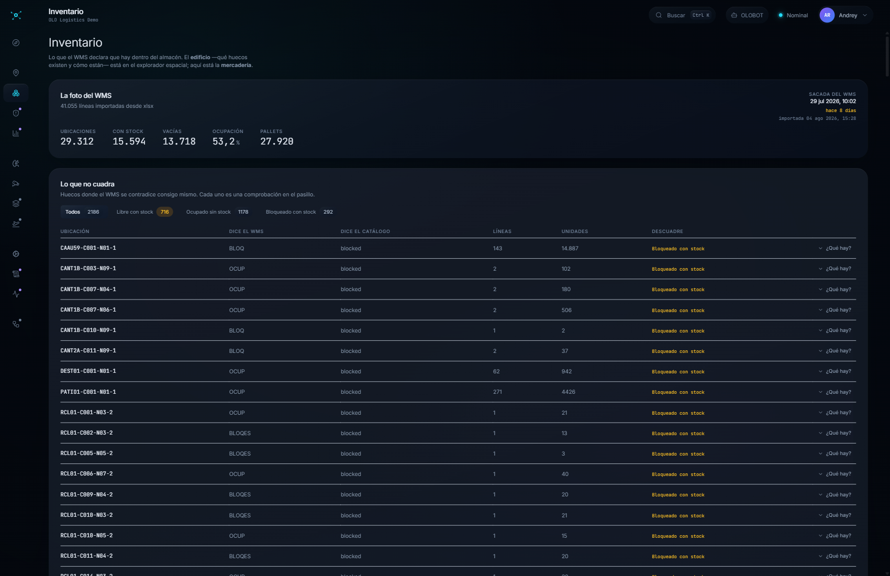

Cada cuadrito es un hueco: **turquesa** con stock, **oscuro** libre, **ámbar** bloqueado. El
nivel 1 va abajo, como en la estantería real — pintarlo al revés obliga a traducir
mentalmente cada vez que comparas la pantalla con lo que tienes delante.

Es la respuesta visual a *«¿dónde queda sitio?»*, que una lista de 272 filas no da nunca.
Al pulsar un hueco, abajo sale qué hay dentro y qué dicen de él el WMS y el catálogo.

En `RCL46`, por ejemplo: 272 huecos, 248 con stock, 12 bloqueados y 12 libres.

El buscador responde a «¿dónde está esto?», por pallet o por artículo. Si no aparece nada,
recuerda que busca en la última foto importada: lo que entró después todavía no está.

### Importaciones: de dónde salen estos datos

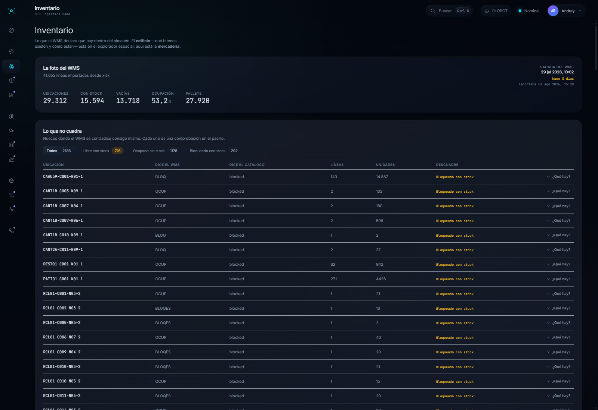

Al pie de la pantalla, el historial: cuándo se sacó cada foto, cuándo se importó, su
antigüedad, el origen del archivo, cuántas líneas trajo y en qué estado quedó. La que se
está usando va marcada.

**Las importaciones que fallaron también salen**, y es deliberado: alguien lo intentó y no
salió. Esconderlas haría que repitiera el intento a ciegas, sin saber que ya había fallado
antes.

> **Hoy solo hay una importación**, así que no hay nada que comparar y la pantalla lo dice
> en lugar de fingir un panel vacío. Cuando haya una segunda, aquí se verá qué descuadres
> son nuevos, cuáles se resolvieron y cuáles llevan semanas sin tocarse — que es lo que
> responde si el trabajo del pasillo está sirviendo de algo.

### Lo que este módulo NO hace

**No se puede corregir nada desde aquí, y es deliberado.** El WMS es el sistema de origen y
esto es su espejo. Un botón para «arreglar» una cantidad crearía una segunda verdad, y la
de este lado sería la equivocada. El operario que va al pasillo y cuenta no está
corrigiendo el inventario: está **observando**, y eso tiene su propio sitio en las
inspecciones.

Importar una foto nueva se hace con `tools/import_inventory_snapshot.py`, fuera de la
aplicación.

---

## 10. Incidencias

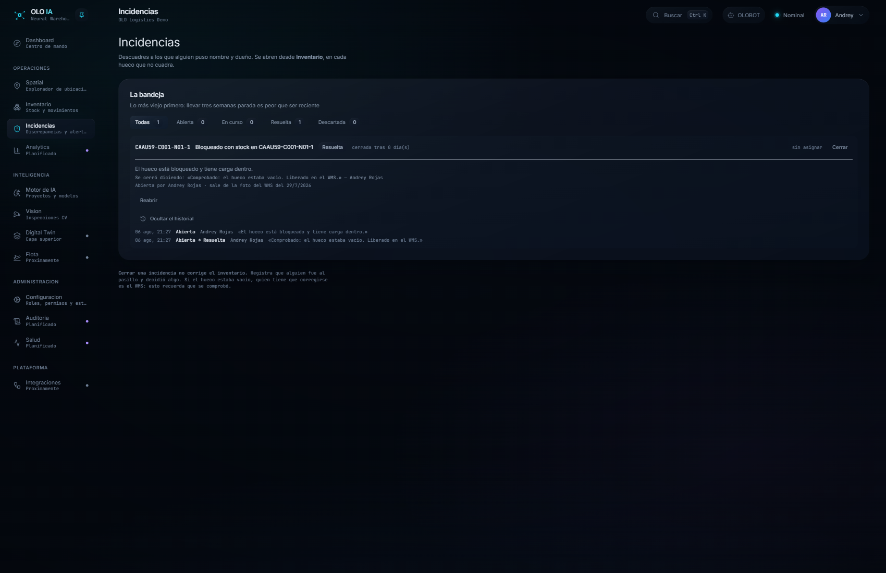

El sistema ya sabía lo que no cuadra: 2.186 huecos donde el WMS se contradice consigo
mismo. Lo que no tenía era **memoria de qué se hizo con eso**. Quien abría Inventario veía
la misma lista que vio ayer, sin saber cuáles ya se comprobaron en el pasillo, cuáles
resultaron ser un error del WMS y cuáles nadie ha tocado en tres semanas.

Una incidencia es un descuadre con **nombre, dueño y estado**.

### Cómo se abre una

En Inventario, cada fila de «lo que no cuadra» tiene un botón **Incidencia**. Al pulsarlo,
ese hueco pasa a decir **«ya tiene incidencia»** y un enlace lleva a la bandeja: el sistema
no deja abrir dos del mismo problema, porque eso convertiría la bandeja en una lista de
clics.

El botón solo aparece si tienes `incidents:write` — `viewer` y `auditor` no lo ven. Un botón
que siempre responde «no autorizado» es peor que su ausencia.

### La bandeja

**Lo más viejo primero**, al revés que todas las demás listas del producto. Una incidencia
de hace tres semanas es peor que una de esta mañana: lleva tres semanas sin que nadie la
toque, y ordenar por «más reciente» la entierra justo cuando más urge. Los días abiertos van
delante, y en ámbar a partir de una semana.

Los cuatro estados dicen cosas distintas:

| Estado | Qué significa |
|---|---|
| **Abierta** | Nadie la ha cogido todavía |
| **En curso** | Alguien está comprobándola |
| **Resuelta** | Se comprobó y se hizo algo |
| **Descartada** | Se miró y no había nada que hacer — **no es lo mismo que resuelta** |

### Cerrar exige decir qué pasó

El botón de confirmar está **bloqueado** hasta que escribas la explicación, y la pantalla
dice por qué: dentro de un mes nadie podrá saber si el trabajo se hizo. Lo impone también el
motor, no solo la interfaz.

Y **de «resuelta» no se puede pasar a «en curso»**: una incidencia cerrada que vuelve a dar
problemas se **reabre**, y esa reapertura queda en el historial. Es lo que delata algo que
se está arreglando mal una y otra vez.

### El historial

Cada paso queda con su autor, su hora y lo que se dijo. **No se puede editar ni borrar** —no
hay endpoint, y tampoco permiso en la base—: un registro de quién cerró qué que se pueda
reescribir no es un registro.

> ### ⚠ Cerrar una incidencia NO corrige el inventario
>
> Registra que una persona fue al pasillo y decidió algo. El stock sigue siendo lo que diga
> el WMS, que es el sistema de origen. Si el hueco estaba vacío, **quien tiene que corregirse
> es el WMS**: esto recuerda que se comprobó, no sustituye la corrección.
>
> Es la distinción que evita que alguien cierre veinte incidencias creyendo que con eso
> arregló el inventario.

### De dónde nacerán

Hoy salen de los descuadres del WMS, que están disponibles y no dependen de la visión por
computador. El esquema admite otros dos orígenes: la **reconciliación** de una inspección del
drone —bloqueada mientras el modelo no lea los códigos de hueco— y la anotación **manual** de
algo visto en el pasillo.

---

## 11. Auditoría

**Quién cambió qué, y cuándo.** Está en *Administración → Auditoría*, y pide el permiso
`audit:read`.

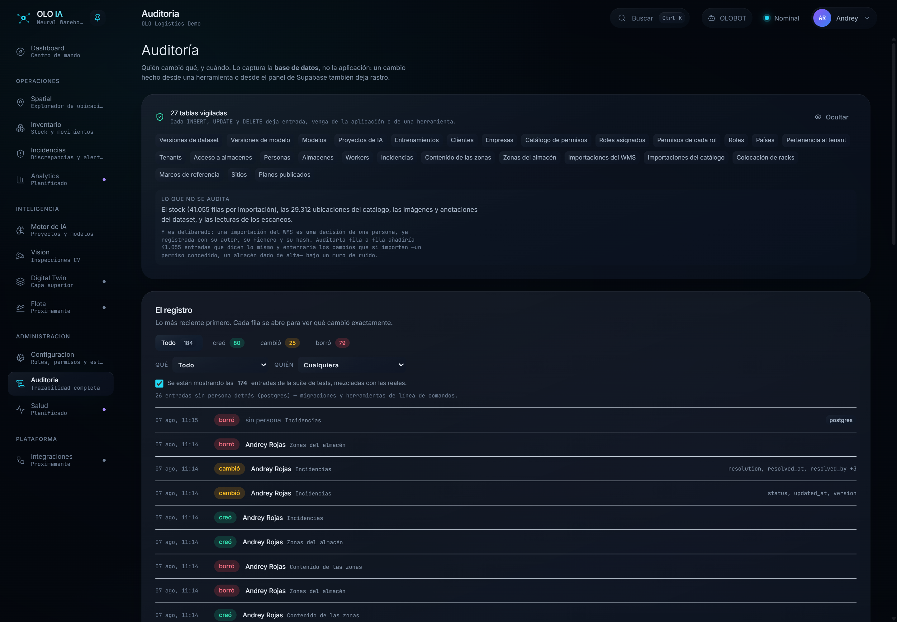

### Lo captura la base de datos, no la aplicación

Es la decisión que hace que este módulo sirva de algo. Un registro que escribe la
aplicación solo ve lo que pasa por la aplicación, y por esta base se escribe además desde
`tools/admin_sql.py`, desde las migraciones y desde el panel de Supabase. Un cambio de
permisos hecho por ahí no aparecería — y el silencio de un registro de auditoría se lee
como «no pasó nada».

Con triggers en el motor, la única forma de cambiar algo sin dejar rastro es tener
permiso para desactivar el trigger, que es exactamente el privilegio que se quiere
vigilar. Y si alguien lo desactiva, **la pantalla lo dice**: la cabecera saca de
`pg_trigger` cuántas tablas están vigiladas de verdad, no de una lista escrita en el
código.

### El registro no se puede editar ni borrar desde la aplicación

`olo_app` —el usuario con el que se conecta la API— tiene **SELECT y nada más** sobre
`audit.entries`. No hay endpoint de escritura porque fallaría en la base. Quien escribe
es el trigger, mediante `SECURITY DEFINER`.

Dicho de otra forma: la aplicación puede leer su propio rastro y no puede tocarlo.

### Lo que NO se audita, y por qué

Está escrito en la propia pantalla, desplegando **«Ver qué se audita»**, porque es la
mitad importante:

| Fuera del registro | Cuánto |
|---|---|
| `inventory.wms_stock` | 41.055 filas por importación |
| `spatial.locations` | 29.312 filas |
| `spatial.nodes` | miles |
| imágenes, anotaciones e ítems del dataset | crecen con cada foto |
| lecturas y escaneos | crecen con cada pasada |

Una importación del WMS es **una** decisión de una persona, y ya está registrada en
`inventory.wms_snapshots` con su autor, su fichero y su hash. Auditarla fila a fila
añadiría 41.055 entradas que dicen lo mismo, multiplicaría el tamaño de la base en cada
importación y enterraría los cambios que sí importan —un permiso concedido, un almacén
dado de alta— bajo un muro de ruido.

Lo que **sí** se audita son las 27 tablas donde vive una decisión: quién puede hacer qué,
qué estructura existe, qué se publicó, qué se resolvió.

### Cómo se lee

Cada fila es una frase: *cuándo · qué se hizo · quién · sobre qué*. La tabla sale con
nombre en castellano —«Permisos de cada rol», no `core.role_permissions`—; el nombre real
del esquema aparece al abrir la fila, porque es el que sirve para volver a consultar.

- **creó** en verde, **cambió** en ámbar, **borró** en rojo. El borrado es la única
  operación de la que no se vuelve, y el color es lo que hace que la vista se pare en ella
  al recorrer 50 filas.
- Al abrir un **cambio** sale una tabla *campo · antes · después*. Los campos de
  contabilidad (`updated_at`, `version`) van al final: no se esconden —un registro que
  oculta campos es peor que uno farragoso— pero se apartan, para que el resumen de la fila
  cerrada muestre lo que de verdad cambió.
- Al abrir un **borrado** sale la fila entera tal como estaba. En ese caso es lo **único**
  que queda de ella en el sistema.
- Un valor vacío se pinta «—» y no `null`: en un diff, «de vacío a Andrey» se entiende y
  «de null a Andrey» hace pensar en una avería.

Se filtra por operación, por tabla y por autor. El desplegable de tablas solo ofrece las
que **tienen** entradas: con las 27 siempre listadas habría que probarlas una a una.

### Las escrituras de las pruebas se apartan, pero se cuentan

La suite de tests corre contra **esta misma base** —hay una sola instancia de Supabase— y
escribe de verdad. Medido en la primera pasada completa después de instalar la captura: el
registro pasó de 22 a **174 entradas**, o sea ~150 por ejecución, con cosas como *«María
Rojas borró una colocación de racks»*, que es un usuario de prueba.

Así que la suite marca sus escrituras (`app.is_test`) y el registro las **deja fuera por
defecto**. Debajo de los filtros hay una casilla que dice cuántas oculta y las trae; cada
fila de prueba lleva además su distintivo cuando se muestran, para que nadie cite una como
un hecho de operación.

La marca se pone con un oyente del evento `begin` de SQLAlchemy registrado en el
`conftest.py` de las pruebas, que la aplica a **toda transacción del proceso de pytest**.
Hizo falta llegar ahí: el primer intento envolvía la sesión de la aplicación y solo
cubría 24 de las 152 entradas, porque las pruebas que conducen la aplicación por HTTP
usan la sesión de verdad. Con el oyente son las 152.

> **La marca es una pista, no un candado.** Cualquiera que pueda ejecutar SQL en la sesión
> de la aplicación puede marcar sus escrituras, y hay que decirlo en lugar de fingir que es
> una garantía. Lo que lo hace aceptable es que **marcar no es esconder**: la entrada se
> guarda completa, nunca se borra —`olo_app` sigue sin poder hacer DELETE— y la pantalla
> cuenta cuántas deja fuera. Una marca que hiciera desaparecer filas en silencio sí sería
> un agujero.

La marca la pone la suite, no el código de producción. Si la aplicación tuviera una forma
cómoda de marcar sus propias escrituras, antes o después alguien la usaría para bajar el
ruido de algo que no es una prueba.

### «Sin persona detrás» no es lo mismo que «desconocido»

Las entradas escritas por una migración o por una herramienta de línea de comandos no
tienen usuario, y se cuentan aparte con el rol del motor que las hizo (`postgres`).
Esconderlas daría la impresión de que todo cambio del sistema tiene una persona detrás.

> ### ⚠ El registro EMPIEZA con la migración 0085
>
> Lo que pasó antes no está, y no se puede reconstruir: las tablas guardan quién las tocó
> por última vez, no su historia. Un registro corto al principio no significa que no haya
> pasado nada — significa que la captura es nueva.

### Aislamiento entre tenants

`audit.entries` tiene una política RESTRICTIVE que exige que el `tenant_id` de la entrada
sea el de quien consulta. Un administrador del tenant A no ve las entradas del tenant B.
Las entradas **sin tenant** —las de las migraciones y las herramientas— solo las ve el
dueño de la plataforma: no son eventos de ningún tenant.

---

## Qué no hace el sistema todavía

Límites **medidos**, no sospechas. Esto es lo que hay que saber antes de confiar en el
sistema para operar.

### 1. El modelo NO lee los códigos de hueco. Cero.

Se entrenó con **15 imágenes**. El detalle por clase, medido en la validación, es lo que
hay que mirar y no el promedio:

| Clase | AP |
|---|---|
| `pallet` | **0,72** |
| `qr_pallet` | 0,28 |
| `qr_ubicacion` | **0,00** |

El promedio (mAP@50 = 0,52) suena aceptable y **engaña**: el modelo ve los pallets bien,
las etiquetas de pallet a medias, y **el código de la ubicación no lo detecta nunca**.

Eso no es «lee mal», es que no lee. Y es justo el dato del que depende todo: la
reconciliación compara *«en el hueco X hay un pallet»* contra lo que declara el WMS. Sin
saber de qué hueco se trata, cada lectura sale como «hueco no identificado» y no hay nada
que comparar.

**Qué hace falta:** más imágenes anotadas, con los códigos de hueco bien marcados. Con
150–200 el modelo empieza a leerlos, y un solo vuelo del drone da cientos de fotogramas.
**Esto es lo que desbloquea todo lo demás** — no la interfaz, ni el worker, ni el
despliegue.

### 2. ~~Los pesos del modelo no se pueden publicar~~ · Resuelto

El punto de control de RF-DETR Nano son **121 MB** y el tope de subida del proyecto estaba
en **50 MiB**, así que ninguna versión podía registrarse: `weights_asset_id` es obligatorio.
Tampoco se arreglaba recortando el archivo — no es estado del optimizador, son 30,2 M de
parámetros reales, y en media precisión seguirían siendo 60 MB.

**Ya está resuelto:** el tope se subió a 210 MB y el modelo está publicado con sus pesos en
Storage, así que el worker los descarga por su cuenta y las detecciones quedan atribuidas a
una versión concreta del registro. Ya no hace falta `--pesos` apuntando a un disco.

### 3. Un directo solo se abre por API

El formulario de *Nueva inspección* pide un archivo y no ofrece una URL. Hoy una sesión en
directo se abre con `POST /v1/perception/live`; desde ahí ya se ve bien en la aplicación.

Y hace falta un **servidor de medios** que no está montado en el entorno local. Lo que se ha
probado es el transporte RTMP, **no un drone emitiendo**.

### 4. ~~El panel de inicio muestra cifras inventadas~~ · Resuelto

Decía «Ubicaciones 12 480» y «Cobertura 94,7 %»: literales escritos en el código y
marcados como *medidos*, que es la peor combinación posible —la etiqueta afirmaba que
estaban comprobados—. El catálogo real tiene **29.312** ubicaciones, así que la primera
cifra que veía alguien al entrar era falsa y se presentaba como un hecho.

Ahora salen del catálogo: **29.312** ubicaciones, **347** racks y **2.701** cuerpos. Sin
fuente de datos va un guion, que es la regla que ese mismo panel ya declaraba y no
cumplía.

### 5. Las escrituras de Configuración no tienen control de concurrencia

Dos personas editando la misma fila se sobrescriben **en silencio**: no se envía `If-Match`,
así que la segunda en guardar gana sin avisar de que había un cambio anterior.

### 6. El registro de auditoría empieza el 7 de agosto de 2026

La captura se instaló con la migración 0085. **Lo anterior no está y no se puede
reconstruir**: las tablas guardan quién las tocó por última vez, no su historia.

O sea que hoy el registro sirve para lo que pase de ahora en adelante, no para revisar
cómo se llegó al estado actual. Y tampoco hay exportación ni política de retención: crece
sin techo, y en algún momento habrá que decidir cuánto se guarda.

Las **174 entradas** del día de construcción están marcadas como de prueba y no se ven por
defecto: salieron todas de la suite de tests y de los guiones de verificación de ese día,
sin ningún usuario real en medio. Es la única vez que el registro se ha escrito a mano, y
la justificación está en la cabecera de la migración 0086 — porque un registro de auditoría
corregido sin explicación es exactamente lo que no debe pasar.

### 7. El catálogo espacial no tiene medidas

Tiene la estructura lógica (rack, cuerpo, nivel) pero no metros ni pasillos. Por eso no se
dibujan rutas a escala sobre el plano, aunque las observaciones de rack sí se registren.

---

## Apéndice: las inspecciones de ejemplo

Las dos inspecciones que aparecen en las capturas se llaman **«Ejemplo del manual»** y son
reales: una imagen del propio almacén analizada con el modelo entrenado, y un directo por
RTMP de 297 fotogramas. Se pueden dar de baja sin consecuencias.
