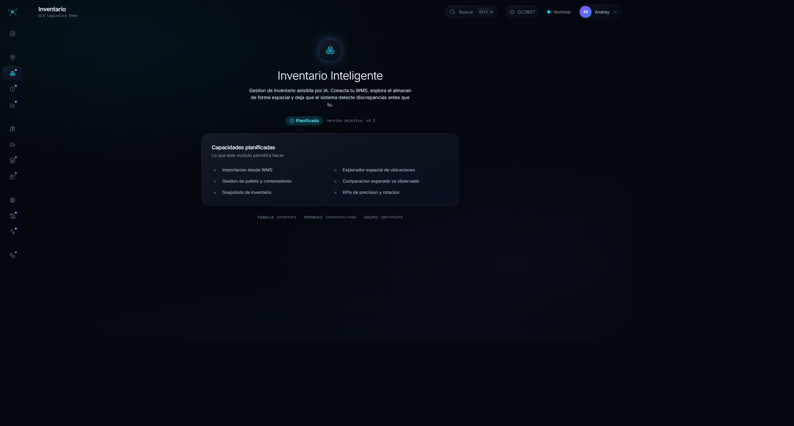

# Manual de OLO_IA

Guía de uso del sistema, pantalla por pantalla, con capturas tomadas de la aplicación
funcionando contra la base de datos real.

**Fecha:** 6 de agosto de 2026 · **Operador:** OLO Logistics Demo · **Almacén:** OLO-CR —
Centro de Distribución San José (29.312 ubicaciones importadas)

> Todas las cifras de este manual salen de la pantalla o de una consulta a la base. Donde
> el sistema no hace algo, se dice. El apartado final —[Qué no hace el sistema
> todavía](#qué-no-hace-el-sistema-todavía)— es tan importante como el resto: describe
> límites medidos, no sospechas.

---

## Índice

1. [Entrar](#1-entrar)
2. [Panel de inicio](#2-panel-de-inicio)
3. [Configuración del sistema](#3-configuración-del-sistema)
4. [Catálogo espacial](#4-catálogo-espacial)
5. [Percepción: el flujo del drone](#5-percepción-el-flujo-del-drone)
   - [5.1 Nueva inspección](#51-nueva-inspección)
   - [5.2 Analizar: el worker](#52-analizar-el-worker)
   - [5.3 Revisar las detecciones](#53-revisar-las-detecciones)
   - [5.4 Reconciliar con el WMS](#54-reconciliar-con-el-wms)
   - [5.5 Un análisis en directo](#55-un-análisis-en-directo)
6. [OLOBOT](#6-olobot)
7. [Temas](#7-temas)
8. [Módulos todavía no implementados](#8-módulos-todavía-no-implementados)
9. [Qué no hace el sistema todavía](#qué-no-hace-el-sistema-todavía)

---

## 1. Entrar


Identidad y clave. El sistema resuelve a qué operador (*tenant*) perteneces y qué
almacenes puedes ver: **todo lo que aparece después está filtrado por eso**, no por un
menú de preferencias.

Eso tiene una consecuencia práctica que conviene entender desde el principio: dos personas
del mismo operador pueden ver cifras distintas en la misma pantalla, y ninguna está mal.
Cada una ve sus almacenes.

---

## 2. Panel de inicio


Vista de conjunto con la representación isométrica del almacén.

> ⚠ **Las tres cifras de arriba no son reales.** «Ubicaciones 12 480» y «Cobertura 94,7 %»
> están escritas a mano en el código (`OverviewPage.tsx`) y marcadas como *medidas*. El
> catálogo real de OLO-CR tiene **29.312 ubicaciones**, no 12.480. No uses esta pantalla
> para tomar decisiones: los datos de verdad están en [Catálogo
> espacial](#4-catálogo-espacial).

Cuatro paneles inferiores —Cobertura de percepción, Precisión, Throughput, Previsión— dicen
**SIN FUENTE DE DATOS**. Eso sí es honesto: esas métricas no están conectadas todavía.

---

## 3. Configuración del sistema


La estructura del operador y quién puede hacer qué. Seis bloques desplegables.

### El vocabulario, que es donde más se confunde la gente

| Término | Qué es |
|---|---|
| **Operador** (*tenant*) | Tu empresa de logística. Es «nosotros». |
| **Entidad legal** | Una sociedad del operador en un país. Un almacén le pertenece. |
| **Cliente** | El **dueño de la mercancía**. NO es un usuario de la aplicación. |
| **Usuario** | Una persona con acceso. Tiene roles, y los roles dan permisos. |
| **Almacén** | El edificio. Tiene un catálogo espacial. |

La confusión más común es *cliente*: en este sistema Cofersa y EPA son clientes —dueños de
pallets—, no gente que entra a la aplicación.

### Qué se puede hacer

Cada fila de países, entidades legales, clientes, almacenes y usuarios tiene **editar** y
**dar de baja**. Se edita en la propia fila, sin salir de la tabla, para poder comparar con
las vecinas mientras corriges.

Dos comportamientos deliberados:

- **Dar de baja pide confirmación con el nombre delante.** El segundo clic cae a dos
  centímetros del primero y dice qué se va a perder.
- **Una baja imposible se explica con cifras.** Al intentar dar de baja una entidad legal
  que tiene almacenes dentro, responde: *«No se puede dar de baja: la entidad legal todavía
  tiene 2 almacen(es) y 2 cliente(s). Reasígnalos o dalos de baja primero.»* La cifra es la
  mitad de la información.

Los **usuarios no tienen papelera**, y es a propósito: un usuario no se borra, se
**suspende**, y eso es el campo `estado` de su propia fila. El correo no se edita porque es
la llave con su identidad de acceso.

### La matriz de permisos

Al final del todo, roles en columnas y permisos en filas. Dos cosas que sorprenden:

- **Las casillas con un guion son imposibles, no vacías.** Son permisos de plataforma, y un
  rol del operador no los puede tener nunca. Se pintan así para que no gastes 135 clics
  descubriéndolo.
- **La matriz es de solo lectura hasta que crees un rol propio.** Los cinco roles del
  sistema los comparten todos los operadores, así que sus permisos no se pueden cambiar
  desde aquí. La salida es crear un rol del tenant, que puede heredar de uno del sistema.

### OLOBOT: el nivel de cada usuario

Un bloque propio con una tabla de usuario → nivel (`Usuario`, `Supervisor`,
`Administrador`, `Owner`).

> **El nivel NO concede permisos.** Recorta lo que el asistente puede hacer, y OLOBOT actúa
> siempre con los permisos del usuario. Alguien con nivel «Owner» y un rol de solo lectura
> sigue sin poder cambiar nada.

Y **nadie puede cambiar su propio nivel**: su fila dice «tu propio nivel» en lugar del
desplegable. Así el registro de quién lo concedió significa algo.

---

## 4. Catálogo espacial


**Aquí están los datos reales del almacén.** Del catálogo importado el 30 de julio:

| | |
|---|---|
| Ubicaciones | **29.312** |
| Disponibles | 18.075 (61,7 %) |
| Bloqueadas | 11.237 (38,3 %) |
| Racks | 347 |
| Cuerpos | 2.701 |

La pantalla declara además tres cosas que no esconde:

- **2.365 ubicaciones con estado y situación contradictorios.** El catálogo espacial dice
  una cosa y el WMS otra. Es un dato valioso, no un error: significa que uno de los dos
  está desactualizado, y saber cuál es trabajo de la reconciliación.
- **2 con código opaco** — no se pueden interpretar.
- **Sin levantamiento métrico** y **sin pasillos**: el catálogo tiene la estructura lógica
  (rack, cuerpo, nivel) pero no las medidas en metros. Por eso todavía no se dibujan rutas
  sobre un plano a escala.

El almacén **WH-002 — Bodega Alajuela** aparece marcado *(sin catálogo)*: existe como
almacén y no tiene ubicaciones importadas.

---

## 5. Percepción: el flujo del drone


El módulo que analiza vídeo o imágenes del almacén con un modelo de visión. La lista
muestra las inspecciones con su estado y cuántas detecciones produjo cada una.

Fíjate en que las dos entradas se identifican distinto: la de archivo por su nombre
(`pallet3.jpg`) y la de directo por su URL (`rtmp://...`). No es decoración — en un directo
no hay archivo que nombrar.

### 5.1 Nueva inspección


Cuatro decisiones:

1. **El archivo.** JPG, PNG, WebP, MP4 o WebM, hasta 500 MB. Se sube directo al
   almacenamiento, no a través del servidor.
2. **El almacén.** Importa más de lo que parece: *«las detecciones se guardan contra este
   almacén, y los códigos de rack que se lean se resolverán contra SU catálogo»*. Elegir el
   equivocado hace que ningún código case.
3. **El pipeline:**
   - *Detección de objetos* — encuentra y clasifica, con sus cajas.
   - *OCR* — lee texto.
   - *Detección + OCR* — las dos. **Es el que hace falta** si quieres identificar huecos o
     pallets por su etiqueta.
4. **El umbral de confianza y el muestreo.** El muestreo (fotogramas por segundo) solo
   aplica a vídeo: analizar los 25 fps de un vídeo de diez minutos son 15.000 fotogramas
   para ver lo mismo que en 600.

Al guardar, la inspección queda en **Subido**. No se encola sola: encolar consume máquina y
es una decisión aparte, para que puedas revisar el modelo y el umbral antes.

### 5.2 Analizar: el worker

Lo que analiza **no es un botón de la aplicación**: es un proceso que corre donde haya
máquina. Decodificar un vídeo de 1 GB y pasarlo por un modelo tarda minutos y quiere GPU;
dentro del servidor web sería un proceso bloqueado sin forma de repartir el trabajo.

```bash
# Qué hay en cola y quién está vivo
python backend/tools/inferir.py --listar

# Coger el siguiente trabajo, o quedarse esperando
python backend/tools/inferir.py
python backend/tools/inferir.py --bucle
```

**Con el modelo entrenado que hay hoy, las dos opciones siguientes son obligatorias:**

```bash
python backend/tools/inferir.py --bucle \
  --pesos "C:/Users/arojast/olo-entrenamientos/<ejecución>/salida/checkpoint_best_ema.pth" \
  --clases "qr_ubicacion,qr_pallet,pallet,hueco_vacio,etiqueta_ilegible"
```

- **`--pesos`** — los pesos del modelo no se pueden publicar (ver [límites](#qué-no-hace-el-sistema-todavía)),
  así que el worker los lee del disco. Sin esto usa un detector genérico y **lo avisa**: lo
  que salga no es de tu modelo.
- **`--clases`** — sin el vocabulario, las detecciones salen como `clase_3` y **la
  reconciliación las rechaza**, porque no puede saber si lo que vio es un hueco vacío o un
  pallet.

> **El intérprete es `C:\OLO_IA\.venv-train\Scripts\python.exe`** (Python 3.13), no el del
> backend. Una de las dependencias de entrenamiento no tiene versión compilada para 3.14.
> Es el fallo que más tiempo hace perder.

Si no hay ningún worker vivo, la pantalla de percepción **lo avisa**: los trabajos se
quedan en cola y no avanzan solos. Eso no es un fallo, es información — y el aviso es real,
sale de un latido que el worker manda cada 30 segundos.

### 5.3 Revisar las detecciones


La inspección de ejemplo: **4 detecciones**, umbral ≥25 %, un fotograma (`FRAMES 1/1`).

Arriba, la línea de estados: `Borrador → Subiendo → Subido → En cola → Procesando →
Completado`. Si algo falla, marca **en qué etapa** se rompió — y si el historial no lo
registra, lo dice en vez de culpar a una etapa al azar.

Cada detección trae su clase y su confianza (`pallet 28 %`, `qr_pallet 36 %`). Se pueden
aceptar o rechazar; el filtro de arriba las separa en Todas / Pendientes / Aceptadas /
Rechazadas.

### 5.4 Reconciliar con el WMS


**Esta es la pantalla que convierte un análisis en trabajo.** Las detecciones dicen «vi un
pallet con confianza 0,86»; esto dice:

> «hay un pallet en A-01-02 y el WMS declara ese hueco vacío»

Se pulsa *Reconciliar contra el WMS* y el sistema convierte las detecciones en lecturas de
inventario, comparándolas con el último corte importado del WMS.

Los nueve estados posibles se agrupan en **tres**, que son las tres preguntas reales:

| | Significa | Qué haces |
|---|---|---|
| **Cuadra** | El WMS y lo observado coinciden | Nada |
| **No cuadra** | Se contradicen | Aquí hay trabajo |
| **No se pudo ver** | QR ilegible, hueco tapado | Repetir la captura |

> **«No se pudo ver» no dice que el almacén esté bien.** Dice que hay que volver a
> capturar. Si el 60 % de un vuelo cae en ese grupo, el resultado no vale — y esa es la
> lectura que se pierde si se agrupa con «Cuadra».

Cada recuento **es un filtro**: se pulsa y la tabla se acota a ese grupo.

En el ejemplo, la única lectura sale como **«hueco no identificado»**: se detectó el pallet
y se leyó su código (`22C0005993390`), pero **no se leyó el código del hueco**. Sin saber de
qué ubicación es, el sistema no afirma nada sobre ninguna — y eso es correcto. Aproximar
«RCL104» a «RCL1O4» convertiría un error de lectura en un dato del inventario.

La columna del WMS distingue dos cosas que parecen la misma:

- **«sin corte del WMS»** — no hay ningún corte importado con el que comparar.
- **«nada que comparar»** — sí lo hay, pero esta lectura no se pudo atribuir a un hueco.

Dos avisos sobre el botón:

- Está **apagado hasta que la inspección esté completada**: antes, sus detecciones todavía
  pueden cambiar.
- **Cada reconciliación crea un recorrido nuevo**, no sustituye al anterior. Es
  deliberado —quizá con otro corte del WMS de por medio— pero significa que pulsar dos veces
  no es inocuo.

### 5.5 Un análisis en directo


La misma pantalla, leyendo de una cámara en vez de un archivo. Se distingue en tres cosas:

| | Archivo | Directo |
|---|---|---|
| Cabecera | `pallet3.jpg` | **EN DIRECTO** · `rtmp://...` |
| Etapas | seis | **tres**: En cola → Emitiendo → Cerrado |
| Contador | `FRAMES 1/1` | **FOTOGRAMAS VISTOS 297** |

Las tres tienen motivo. En un directo no hay nada que subir, así que las etapas de subida
no existirían. **«Cerrado» no significa «terminó bien»**: significa que alguien lo cortó o
que el emisor dejó de emitir. Y no hay proporción porque no hay total — un directo no tiene
final.

> ⚠ **OLO_IA no es un servidor RTMP.** Nada en el sistema acepta una emisión. El drone o su
> mando publican en un servidor de medios —MediaMTX, nginx-rtmp, SRS— y aquí se registra la
> URL desde la que ese servidor sirve el stream. **Sin ese servidor montado, un directo no
> puede funcionar** aunque la sesión se cree.

Una decisión que parece un defecto y no lo es: en un directo el worker **descarta
fotogramas**. Si el modelo tarda 300 ms y la cámara entrega 25 por segundo, analizarlos
todos haría que la latencia creciera sin techo: al minuto estarías viendo imágenes de hace
un minuto. Se coge el más reciente y se tira el resto. Con un archivo es lo contrario: no se
pierde ninguno.

Para cortar un directo: `Ctrl-C` en el worker, o `--segundos 60` al lanzarlo.

---

## 6. OLOBOT


El asistente. Se abre con el botón de la barra superior y **no cierra la pantalla en la que
estás**: se ancla al lado, porque lo que mejor hace es llevarte a una pantalla y comentarla.

La cabecera dice tu nivel y qué implica: *«nivel owner · puede proponer cambios»*.

Tres reglas que gobiernan lo que hace:

1. **No contesta de memoria.** Consulta la base cada vez. Si le preguntas una cifra que no
   puede consultar, lo dice en lugar de inventarla.
2. **Solo habla de esta aplicación.** No responde preguntas generales aunque sepa la
   respuesta.
3. **Ningún cambio se aplica hasta que lo confirmes.** Cuando propone algo, aparece una
   tarjeta con la frase exacta de lo que va a pasar y dos botones. Mientras no pulses
   *Confirmar*, **no ha cambiado nada** — y la tarjeta lo dice.

Lo que **no** puede hacer, por diseño: dar permisos, cambiar roles, cambiar el nivel de
OLOBOT de nadie, ni borrar nada. Eso se hace en Configuración, con una persona mirando.

---

## 7. Temas


En el menú de usuario: **Claro**, **Oscuro** y **Seguir al sistema**. La tercera muestra
además a qué resuelve ahora mismo (*«oscuro»*), para que no tengas que adivinar por qué se
ve como se ve.

---

## 8. Módulos todavía no implementados

Tres entradas del menú lateral **no son módulos**: son páginas que describen lo que harán,
con su versión objetivo. Están así a propósito, y es mejor que una pantalla vacía.

| Módulo | Estado | Versión objetivo |
|---|---|---|
| **Inventario** (`/inventory`) | Planificado | v0.3 |
| **Analítica** (`/analytics`) | Planificado | v0.4 |
| **Incidencias** (`/incidents`) | Planificado | v0.4 |

Las tres tienen la misma forma: qué permitirá hacer el módulo, a qué familia pertenece y
qué permiso pedirá.



Ojo con esto, porque induce a error: **«Inventario» no es donde están los datos de
inventario.** La ocupación real, las ubicaciones y las contradicciones con el WMS están en
[Catálogo espacial](#4-catálogo-espacial) y en la reconciliación de cada inspección.


Analítica promete indicadores operativos: precisión de inventario en el tiempo, throughput,
mapa de calor de ocupación y alertas por umbral.


Incidencias es la que cierra el círculo del drone: cuando la reconciliación encuentra una
discrepancia, abrirá una incidencia con la evidencia fotográfica enlazada y su flujo de
resolución. Hoy la discrepancia se ve —en la pantalla de reconciliación— pero **no genera
nada**: anotarla y repartirla es todavía trabajo manual.

---

## Qué no hace el sistema todavía

Límites **medidos**, no sospechas. Esto es lo que hay que saber antes de confiar en el
sistema para operar.

### 1. El modelo lee mal los códigos de hueco

Se entrenó con **15 imágenes** y da un mAP de **0,172**. Detecta pallets y sus etiquetas
razonablemente, pero **no lee de forma fiable el código de la ubicación**.

La consecuencia se ve en la reconciliación: casi todo sale como «hueco no identificado», y
sin saber de qué hueco es una lectura no se puede comparar con nada.

**Qué hace falta:** más imágenes anotadas. Con 150–200 el modelo empieza a leer códigos, y
un solo vuelo del drone da cientos de fotogramas para anotar. **Esto es lo que desbloquea
todo lo demás.**

### 2. Los pesos del modelo no se pueden publicar

El punto de control de RF-DETR Nano son **120 MB** y el plan de almacenamiento corta la
subida en **50 MB** (medido: 40 MB pasa, 60 no). Ni reduciéndolo a media precisión bajaría
del tope.

**Consecuencia:** el worker se ejecuta siempre con `--pesos` apuntando al disco, y las
detecciones no quedan atribuidas a ninguna versión del registro — el worker lo avisa.

**Qué hace falta:** subir el plan de almacenamiento.

### 3. Un directo solo se abre por API

El formulario de *Nueva inspección* pide un archivo y no ofrece una URL. Hoy una sesión en
directo se abre con `POST /v1/perception/live`; desde ahí ya se ve bien en la aplicación.

Y hace falta un **servidor de medios** que no está montado en el entorno local. Lo que se ha
probado es el transporte RTMP, **no un drone emitiendo**.

### 4. El panel de inicio muestra cifras inventadas

«Ubicaciones 12 480» y «Cobertura 94,7 %» son literales escritos en el código y marcados
como *medidos*. El catálogo real tiene **29.312** ubicaciones. Cuatro paneles más dicen
honestamente *SIN FUENTE DE DATOS*, pero esos dos no.

**Mientras no se arregle: no uses el panel de inicio para nada.** Los datos están en
Catálogo espacial.

### 5. Las escrituras de Configuración no tienen control de concurrencia

Dos personas editando la misma fila se sobrescriben **en silencio**: no se envía `If-Match`,
así que la segunda en guardar gana sin avisar de que había un cambio anterior.

### 6. El catálogo espacial no tiene medidas

Tiene la estructura lógica (rack, cuerpo, nivel) pero no metros ni pasillos. Por eso no se
dibujan rutas a escala sobre el plano, aunque las observaciones de rack sí se registren.

---

## Apéndice: las inspecciones de ejemplo

Las dos inspecciones que aparecen en las capturas se llaman **«Ejemplo del manual»** y son
reales: una imagen del propio almacén analizada con el modelo entrenado, y un directo por
RTMP de 297 fotogramas. Se pueden dar de baja sin consecuencias.
