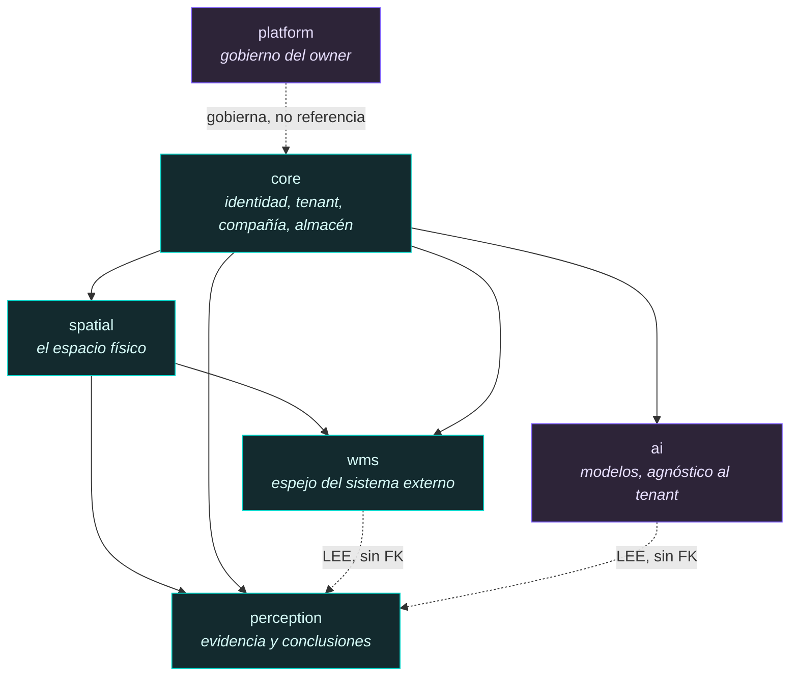

# ADR-009 · Descomposición de dominios: `wms` frente a `inventory`

| | |
|---|---|
| **Estado** | **Propuesto.** Requiere aprobación antes del Bloque 3. |
| **Fecha** | 2026-07-29 |
| **Contexto de ejecución** | 46 migraciones aplicadas. Bloque 2 cerrado. Excel del WMS medido (41.055 filas). |
| **Decide** | El nombre y la frontera del dominio operativo; en qué schema vive cada entidad; la dirección permitida de las dependencias |
| **No decide** | Tablas, columnas, tipos, índices ni RLS. Nada de eso pertenece a un ADR |
| **Sustituye** | La propuesta de un schema `inventory` que hice en el diagnóstico del Excel |

---

## 1. Un hallazgo que reordena la pregunta

Antes de comparar `inventory` con `wms` hay que registrar algo que descubrí al
consultar la base, y que la pregunta original no contemplaba:

```
core.warehouses    16 filas   ← referenciada por role_assignments y user_warehouse_access
core.areas          1 fila    ← nada la referencia
core.locations      2 filas   ← nada la referencia
```

**`core.locations` ya existe** desde la migración 0012, con esta forma:

```
core.locations(id, tenant_id, warehouse_id, area_id, code, type, level int,
               max_weight_kg, max_volume_m3, max_units, status, metadata jsonb)
```

Es decir: **la jerarquía espacial ya está decidida en la base como una cadena fija
de tres niveles** —`warehouse → area → location`— y mi propuesta de
`spatial.locations` habría creado una segunda tabla de ubicaciones sin decir nada
sobre la primera.

Dos tablas que describen el mismo estante son la peor de las opciones
disponibles: no hay forma de saber cuál miente, y la que se quede sin usar seguirá
apareciendo en el esquema durante años invitando a que alguien la use.

Esto convierte la discusión de nombres en algo secundario. **La decisión urgente es
qué hacer con `core.areas` y `core.locations`, y la ventana para hacerlo es
ahora**: tres filas de prueba y ninguna FK entrante. Cuando existan 15.599
ubicaciones y un historial de snapshots, moverlas será una migración de datos con
parada de servicio. Está en §6.

---

## 2. El criterio real de descomposición en este proyecto

Los cuatro schemas existentes **no están nombrados por tema**. Están nombrados por
**régimen de aislamiento**, y eso no es una observación estética: es lo que hace
que sus políticas RLS sean expresables en una línea.

| Schema | Régimen | Predicado RLS |
|---|---|---|
| `core` | Dato del tenant, OLO es el sistema de registro | `tenant_id = core.current_tenant_id()` |
| `platform` | Gobierno por encima de los tenants | `core.is_platform_owner()` |
| `ai` | Autoría del owner, agnóstico al tenant | `core.is_platform_owner()` |
| `perception` | Evidencia del tenant, solo-añadir | `tenant_id = core.current_tenant_id()` |

Un schema nuevo se justifica cuando aporta un **régimen nuevo**, no cuando aporta
un tema nuevo. Es la misma regla que rechazó cinco buckets de Storage a favor de
uno con prefijos: la separación tiene que corresponder a una diferencia real de
acceso o de ciclo de vida.

Así que la pregunta correcta no es «¿inventario u operaciones?» sino:

> **¿Qué régimen tienen los datos que van a llegar del WMS, y es distinto de los
> cuatro que ya existen?**

La respuesta, medida contra la lista que se propone importar —órdenes,
recepciones, despachos, movimientos, conteos, ajustes, reservas, consolidaciones,
transferencias, auditorías, snapshots, tareas— es que **todos comparten el mismo
régimen, y ese régimen es nuevo**:

1. **OLO no es el sistema de registro.** La verdad vive en el WMS. OLO tiene una
   copia.
2. **Es de solo lectura para el usuario.** Nadie edita una recepción en OLO. Si lo
   hiciera, la siguiente sincronización lo borraría.
3. **Está versionado por origen.** Cada fila procede de una sincronización
   concreta y es reproducible desde ella.
4. **Es dato del tenant**, con el mismo aislamiento que `core`.
5. **Es reemplazable en bloque.** Un snapshot nuevo sustituye al anterior sin que
   nada se rompa, porque nada de OLO depende de la identidad de una fila
   importada.

Los puntos 1, 2, 3 y 5 no se cumplen en `core`, donde OLO **sí** es la autoridad y
donde borrar en bloque sería catastrófico. El régimen es genuinamente distinto y
justifica un schema.

---

## 3. El espacio de opciones

La consulta plantea dos opciones. Un ADR honesto evalúa las que existen.

| | Opción | Descripción |
|---|---|---|
| **A** | `inventory` | Un schema para las existencias |
| **B** | `wms` | Un schema para todo lo que provenga del WMS |
| **C** | `operations` | Nombrado por dominio, agnóstico al origen |
| **D** | `wms` + `operations` | El espejo separado de los hechos originados por OLO |
| **E** | Sin schema nuevo: todo en `core` | |

### 3.1 Opción A · `inventory`

**Cohesión: alta pero estrecha.** Todo lo que contiene habla de existencias, y
nada más. Es el problema: la cohesión se consigue excluyendo.

**El defecto es de cobertura, y es fatal.** Una orden de expedición no es
inventario. Una tarea de ubicación no es inventario. Un movimiento no es
inventario: es *lo que cambia* el inventario. Cuando lleguen —y van a llegar,
porque están en la lista— habrá tres salidas y las tres son malas:

- meterlas en `inventory` y aceptar que el nombre miente;
- crear `orders`, `movements`, `tasks` y acabar con doce schemas que comparten
  régimen, política RLS y mecanismo de sincronización, duplicados doce veces;
- meterlas en `core`, donde el régimen es el equivocado.

**Veredicto: A queda descartada.** La objeción planteada es correcta y el dato la
respalda: `inventory` nombra un subconjunto y presenta el subconjunto como el todo.

### 3.2 Opción C · `operations`

**Es la opción que la ortodoxia DDD recomendaría**, y merece más atención de la que
suele recibir: los *bounded contexts* se nombran en el lenguaje del dominio, no en
el del punto de integración. `wms` es el nombre de una **capa de anticorrupción**;
`operations` es el nombre de un dominio.

**Y sin embargo falla aquí, por una razón concreta.** `operations` no distingue lo
que hay que distinguir todos los días: si un hecho es **verdad ajena reflejada** o
**verdad propia afirmada**. Un conteo importado del WMS y un conteo que OLO ejecutó
con YOLO son ambos «operations», y tienen regímenes opuestos: el primero se
sobrescribe en la siguiente sincronización, el segundo es evidencia que no se
puede perder.

Un nombre que no permite distinguir eso obliga a distinguirlo con una columna
`is_imported`, y una columna así siempre acaba consultada a medias. **El régimen
tiene que estar en la frontera, no en un booleano.**

### 3.3 Opción E · todo en `core`

Descartada por §2: `core` es el régimen donde OLO es la autoridad. Un
`TRUNCATE` de un snapshot conviviendo con la tabla de usuarios es una invitación a
un accidente irreversible. Además `core` ya tiene 13 tablas y añadir doce más de
otro régimen lo vuelve ilegible.

### 3.4 Opción B · `wms`

**Cohesión: alta y bien delimitada**, si —y solo si— se define con precisión.
`wms` no significa «el dominio de la gestión de almacenes». Significa:

> **`wms` = el espejo del sistema externo de registro de la ejecución del almacén.**

Con esa definición, el nombre **es** el régimen, exactamente igual que
`platform` nombra el suyo. Y responde la pregunta que un desarrollador se hace al
abrir el esquema: «¿puedo escribir aquí?» — No. «¿Puedo confiar en que esto es la
verdad?» — Es la verdad *de otro sistema*, a fecha de la última sincronización.

**Acoplamiento: bajo, y en la dirección correcta.** `wms` depende de `core`
(tenant, compañía) y de `spatial` (dónde está cada cosa). No depende de
`perception` ni de `ai`, y eso importa (§5).

**Escalabilidad del nombre: buena, con un límite conocido.** Soporta varios WMS
simultáneos porque el origen es una columna, no el schema. El límite es un feed que
no sea de un WMS —un maestro de artículos que venga directamente del ERP—. Ese caso
justificaría un `erp` hermano con el mismo régimen, no renombrar `wms`.

El Excel ya adelanta que ese caso puede no llegar nunca: trae `Referencia ERP` y
`Código Ean` **dentro** del reporte del WMS. El WMS ya actúa de pasarela del ERP.

**El defecto real de B**, y hay que nombrarlo: `wms` no tiene sitio para los
hechos que **OLO origina**. Un conteo dirigido por YOLO no es una importación. Una
conciliación —«contamos 47, el WMS dice 50»— es una afirmación de OLO.

### 3.5 Opción D · `wms` + un hogar para lo propio

La objeción a B es correcta y tiene solución sin un schema nuevo:

**Los hechos que OLO origina son todos derivados de observación, y la observación
ya tiene un hogar: `perception`.** Un conteo con cámara *es* una sesión de
percepción. Una conciliación es una conclusión sobre evidencia. `perception` ya
está en régimen tenant y solo-añadir, que es exactamente lo que esos hechos
necesitan.

Lo único que D añadiría sobre B es un schema para el día en que OLO **escriba
hacia el WMS** —proponer un ajuste, cerrar una tarea—. Ese día llegará, pero
todavía no hay ni un requisito escrito al respecto, y crear el schema hoy sería
adivinar su forma.

---

## 4. Decisión

**Se adopta la Opción B con la definición estricta de §3.4, más dos fronteras
explícitas.**

```
wms         el espejo del sistema externo de registro. Solo lectura para el usuario.
            Cada fila declara de qué sincronización proviene.

spatial     el mundo físico. OLO es el sistema de registro en cuanto se importa el
            CAD. Sobrevive a cualquier snapshot.

perception  lo que OLO observó y lo que concluyó de ello. Solo-añadir.

inventory   NO es un schema. Es un READ MODEL: la unión de lo esperado (wms) con
            lo observado (perception), proyectada sobre el espacio (spatial).
```

Que «inventario» no sea un schema es la parte menos intuitiva y la más útil. El
inventario, en un producto que compara expectativa con observación, **no es un
lugar donde se guardan filas: es una pregunta que se hace a dos fuentes**. Darle un
schema obligaría a elegir cuál de las dos vive dentro, y las dos tienen igual
derecho.

### 4.1 Cuándo esta decisión se revisa

Un ADR que no dice cómo se falsa no sirve. Este se revisa si:

- aparece un feed que no sea de un WMS → nace un hermano con el mismo régimen;
- OLO empieza a ser el sistema de registro de alguna operación → esa operación sale
  de `wms`, porque el régimen dejó de aplicar;
- OLO escribe hacia el WMS → hace falta un dominio de salida, que hoy no se diseña.

---

## 5. Dirección de las dependencias

Es la parte del ADR con más valor a largo plazo. Un nombre se puede cambiar; un
grafo de dependencias con un ciclo, no.



Las flechas continuas son FK reales. Las punteadas son lecturas sin integridad
referencial declarada. **Y esas cuatro reglas son el contenido de este ADR:**

### R1 · `ai` nunca referencia dato de tenant

`ai` está en régimen Platform Owner y es deliberadamente agnóstico al tenant: un
modelo entrenado sirve a todos los clientes. Una FK de `ai.classes` a `wms.items`
rompería eso de dos maneras: ataría el catálogo del owner al inventario de un
cliente, y ningún usuario de tenant podría leer la clase de su propio artículo.

**Consecuencia práctica:** el puente artículo ↔ clase de IA vive en el lado del
**tenant**, y referencia `ai.classes` en un solo sentido. Es la misma dirección que
`core.role_permissions → core.permissions`.

### R2 · `wms` nunca referencia `perception`

Lo esperado no puede depender de lo observado. Si `wms.stock_positions` tuviera una
FK a una detección, el snapshot dejaría de ser reproducible desde su origen: para
recargarlo habría que conservar las observaciones, y una expectativa que depende de
lo que vimos ya no es una expectativa.

### R3 · `spatial` nunca referencia `wms`

**Esta regla la impuso el dato.** El Excel contiene **solo las 15.599 ubicaciones
ocupadas**: no trae ninguna vacía. Si `spatial.locations` se poblara desde
snapshots, un estante **desaparecería del gemelo digital al vaciarse**, que es
justo cuando hace falta saber que existe y está libre.

Un rack existe porque está construido, no porque hoy tenga algo encima.

### R4 · `perception` lee de todos y nadie lee de ella

Es el sumidero terminal del grafo. Eso es lo que hace seguro añadirle filas sin
límite: ninguna otra tabla pierde integridad si una observación se archiva o se
reparticiona. Es la propiedad que ya se documentó al crear el schema y sigue
vigente.

---

## 6. `core.areas` y `core.locations`: el traslado

La cadena actual es `core.warehouses → core.areas → core.locations`, fija en tres
niveles. **No puede expresar lo que mide el Excel**, y el detalle está en ADR-010.
En resumen: el código de ubicación real tiene cuatro segmentos, el primero es un
área de almacenamiento (254 valores, correspondencia 1:1 exacta con
`IdAlmacenamiento`) y los otros tres son columna, nivel y posición. Además la
profundidad **varía según el tipo de área**: un rack cantilever tiene columna y
nivel; un patio no.

**Decisión propuesta:**

| Tabla | Destino | Razón |
|---|---|---|
| `core.warehouses` | **se queda en `core`** | Es la frontera de permisos, no una descripción del espacio. `core.user_warehouse_access`, `core.role_assignments`, `can_access_warehouse()` y la cabecera `X-Warehouse-Id` dependen de ella. Mover esto rompería la autorización |
| `core.areas` | **→ `spatial`** | Nada la referencia. 1 fila |
| `core.locations` | **→ `spatial`** | Nada la referencia. 2 filas |

`spatial` extiende `core.warehouses` con geometría; **no crea un segundo almacén.**

**El coste hoy y el coste después.** Hoy: dos tablas, tres filas de prueba, una FK
interna y una a `core.warehouses` que se queda. La migración 0033 ya demostró la
técnica —siete tablas movidas de `platform` a `ai` con huella digital idéntica
antes y después—. Después: 15.599 ubicaciones, un historial de snapshots
apuntándolas y geometría cargada desde CAD.

**Es la decisión más urgente de este ADR**, y es urgente por el calendario, no por
la arquitectura.

---

## 7. Dónde vive cada entidad

Se pidió que ninguna entidad quede en el dominio equivocado. Esta es la
asignación, con la razón de cada una.

### 7.1 Espacio — `spatial`

| Entidad | Dominio | Nota |
|---|---|---|
| **Site** | `spatial` | Los 17 `IdSucursal`. Ver §7.6: el dato dice que es el **sitio del operador**, no la sucursal del cliente |
| **Warehouse** | **`core`** (existente) + geometría en `spatial` | No se duplica. Es la frontera de permisos |
| **Storage Area** | `spatial` | Los 254 prefijos ↔ `IdAlmacenamiento` |
| **Ubicación** | `spatial` | Hoja del árbol. Con coordenadas, volumen y capacidad |
| **Zona** | `spatial`, como **etiqueta de la ubicación** | **No como padre del área.** Medido: 9 de 254 áreas abarcan dos zonas. Una FK crearía 9 contradicciones |

### 7.2 Espejo del WMS — `wms`

| Entidad | Dominio | Nota |
|---|---|---|
| **Artículo** | `wms.items` | El maestro es del ERP/WMS. Clave `(compañía, código)`: ver ADR-011 |
| **Container** | `wms.containers` | El WMS asigna la matrícula y gobierna su ciclo de vida |
| **Pallet** | **no es una entidad** | Es un **tipo** de container. Ver ADR-011 |
| **QR** | **no es una entidad** | Es un **atributo** del container (`qr_value`). Su *lectura* sí es una entidad, y vive en `perception` |
| **Snapshot** | `wms` | El estado congelado de un corte |
| **Existencia** | `wms` | `(snapshot, ubicación, container, artículo, cantidad)`. Medido: clave única en 41.055 filas |
| **Movimiento** | `wms` | **Solo-añadir, no versionado por snapshot.** Un movimiento es un evento; forzarlo al modelo de snapshot perdería el orden |
| **Orden, Recepción, Expedición, Tarea** | `wms` | Documentos del sistema externo |
| **Conteo del WMS** | `wms` | Un conteo que el WMS ejecutó y OLO importa |

### 7.3 Percepción — `perception`

| Entidad | Dominio | Nota |
|---|---|---|
| **Captura** | `perception` | La evidencia: imagen, vídeo o frame, con su ubicación y su instante |
| **Detección** | `perception` | Salida cruda del modelo. **Específica del modelo**: bbox, máscara, texto |
| **Lectura de QR** | `perception` | Es una detección con una decodificación. No es el container |
| **Observación** | `perception` | **La afirmación en lenguaje de dominio.** Es el contrato que desacopla los modelos. ADR-012 |
| **Conteo originado por OLO** | `perception` | No es una importación: es una sesión de observación |
| **Conciliación** | `perception` | Conclusión sobre evidencia, no verdad externa |
| **Resultado YOLO** | **se parte en dos** | Lo crudo en `detections`; lo que significa en `observations`. Es la distinción que permite añadir SAM sin tocar `wms` |

### 7.4 Modelos — `ai`

Sin cambios. `ai.models`, `ai.model_versions`, `ai.classes`, `ai.assets` ya existen
y siguen siendo del owner. **`ai` no aprende nada nuevo de este ADR salvo una
prohibición:** no referenciar `wms` ni `spatial` (R1).

### 7.5 Gobierno — `platform`

Sin cambios. Nada de inventario es del owner.

### 7.6 La entidad cuya asignación es una inferencia, no una medida

**`IdSucursal`.** El dato es inequívoco: `IdSucursal='0001'` agrupa **12 compañías
distintas**, y cada `Nombre Sucursal` pertenece a un solo `IdSucursal`. La lectura
coherente es que `IdSucursal` identifica el **sitio físico del operador** (17
sitios) y que `Nombre Compañía`/`Nombre Sucursal` identifican al **dueño de la
mercancía**. Es la estructura de un operador logístico 3PL.

**Esa lectura no está confirmada por el WMS, y es la raíz del árbol espacial.** Si
resulta falsa, la jerarquía queda mal enraizada y se corrige con una migración de
datos, no de esquema. Es el riesgo R3 del diagnóstico del Excel y sigue abierto.

---

## 8. Lo que este ADR deja explícitamente sin decidir

- El nombre definitivo de la entidad genérica de contenedor (`container`,
  `handling_unit`, `logistic_unit`): ADR-011.
- Si el árbol espacial se materializa con `ltree`, con `parent_id` o con los dos:
  ADR-010 razona la forma, no la implementación.
- El dominio de **salida** hacia el WMS, para cuando OLO proponga ajustes.
- Dónde viven los embeddings de artículo. `pgvector 0.8.2` está disponible, pero un
  embedding de un artículo del cliente es dato de tenant derivado por un modelo del
  owner, y ese cruce merece su propia discusión.

---

## 9. Resumen de la decisión

1. El schema se llama **`wms`**, definido como *el espejo del sistema externo de
   registro*, no como *el dominio de la gestión de almacenes*.
2. **`inventory` no es un schema**: es un read model sobre `wms` + `perception` +
   `spatial`.
3. **`spatial` se crea moviendo `core.areas` y `core.locations`**, no duplicándolas.
   `core.warehouses` se queda donde está.
4. Cuatro reglas de dependencia, con R3 impuesta por el dato: el espacio no depende
   del inventario.
5. Ninguna entidad nueva en `ai` ni en `platform`.
