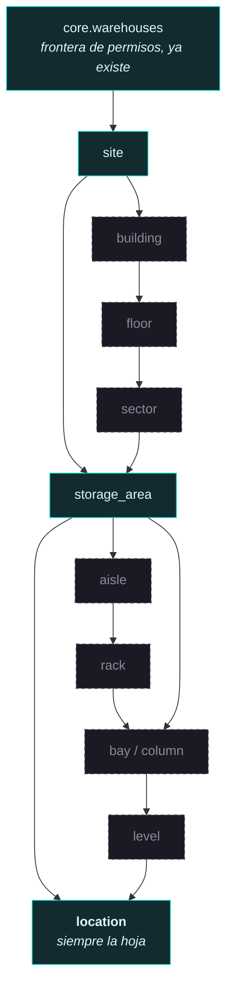

# ADR-010 · El dominio espacial y el gemelo digital

| | |
|---|---|
| **Estado** | **Propuesto.** Requiere aprobación antes del Bloque 3. |
| **Fecha** | 2026-07-29 |
| **Decide** | La forma de la jerarquía espacial y qué debe poder describir una ubicación |
| **No decide** | Tablas ni columnas. El importador CAD. La visualización |
| **Depende de** | ADR-008 (reserva del dominio), ADR-009 (traslado de `core.areas`/`core.locations`) |

---

## 1. Qué mide el Excel, y qué no

Todo lo de esta sección es medición sobre las 41.055 filas, no inferencia.

```
IdSucursal          17 valores      → sitio
IdAlmacenamiento   254 valores      → área de almacenamiento
Ubicación       15.599 valores      → siempre 4 segmentos, 8 formas distintas
Zona Almacenaje     27 valores      → NO es padre del área
```

El código se descompone así, y **la correspondencia entre el primer segmento y
`IdAlmacenamiento` es 1:1 exacta: 254 ↔ 254, cero violaciones en ambos sentidos**.

```
   ASCEN1   -   C001   -   N01   -   1
   ───┬──       ──┬─       ─┬─      ─┬─
      │           │         │        │
   área         columna    nivel   posición
 (254 valores) (28 vals) (9 vals) (2 vals)
```

**Cuatro hechos que restringen el diseño:**

1. **La ubicación determina por sí sola todos sus atributos físicos** —área, zona,
   tipo, estado, situación, dimensión—: cero contradicciones en 15.599
   ubicaciones. Compañía y sucursal **no**: 42 códigos aparecen bajo dos pares
   (compañía, sucursal).
2. Esos 42 son racks `CANT1A/1B/2A/2B` compartidos entre `COFERSA` y
   `FERRETERIA EPA`, con atributos físicos idénticos. **Es un estante real con
   mercancía de dos clientes**, no una colisión de códigos.
3. **`Zona Almacenaje` no es padre del área**: 9 de los 254 `IdAlmacenamiento`
   abarcan dos zonas. Ejemplo: el 1070 cubre `ZA28 INTERCAMBIO` y
   `ZA30 DAÑADOS`.
4. **El primer segmento es polimórfico.** No siempre denota lo mismo:

   | Prefijo | Qué parece ser | Pallets en la ubicación |
   |---|---|---|
   | `CANT1A`, `RCL57` | un rack (cantilever, racking) | 1–6 |
   | `ASCEN1`, `ASCN01` | zona de ascensor | 1–6 |
   | `GUACI5` | **área de suelo** | **2.135** |
   | `SERV01` | área de servicio | 1.774 |
   | `PATIO1` | patio exterior | 170 |
   | `RETIRA`, `CHEQ02` | zona de proceso | 560 / — |

   87,1 % de las ubicaciones contiene exactamente **1** pallet; el 99,5 % contiene
   ≤10. Y luego hay una con **2.135**.

**Lo que el Excel no dice:** no hay edificio, no hay planta, no hay sector, no hay
pasillo ni rack como entidades identificadas. `ASCEN` sugiere ascensor —y un
ascensor sugiere plantas— pero eso es lectura de un nombre, no un dato.

---

## 2. Por qué la jerarquía no puede ser una cadena fija

Se plantea evaluar esta cadena:

```
Warehouse → Building → Floor → Sector → Storage Area → Aisle → Rack
          → Column → Level → Position → Location
```

**Diez niveles fijos son la respuesta equivocada, y el hecho 4 explica por qué.**

`GUACI5-C001-N01-1` tiene 2.135 pallets. Sus segmentos `C001-N01-1` son
**relleno**: no existe una columna 1 ni un nivel 1 en un área de suelo, y la prueba
es que todos los pallets comparten los mismos. Una cadena fija obligaría a inventar
un `Rack`, un `Aisle`, una `Column` y un `Level` para un patio de cemento.

Al revés también falla: un rack cantilever **sí** tiene columna y nivel reales, y
una cadena que los declare opcionales para acomodar al patio pierde la garantía
justo donde sirve.

Esto es la clase de error que este proyecto ya evitó dos veces —quitar
`models.framework_code` y `models.current_version_id` porque un valor derivado
duplicado acaba contradiciéndose—. Aquí el valor duplicado sería un nivel de
jerarquía que no existe.

### 2.1 La forma que sí soporta ambos casos

**Un árbol de contención recursivo con tipo de nodo de vocabulario cerrado, más una
matriz de aristas legales.**



En sólido lo que el Excel puebla hoy. En punteado lo que el vocabulario **admite**
sin que exista ninguna fila todavía.

El Excel se importa como el camino corto:

```
warehouse → site → storage_area → location
```

y las columnas/niveles/posiciones se guardan como **componentes de dirección de la
propia ubicación**, no como nodos, porque el dato demuestra que no siempre denotan
un objeto físico.

Un rack real, cuando llegue el CAD y se sepa que `RCL57` es una estantería con
geometría propia, se **inserta** en el camino sin migrar nada: los descendientes
recuelgan del nodo nuevo. Eso es lo que una cadena fija no permite.

### 2.2 Lo que evita que el árbol degenere

Un árbol libre es una invitación a que alguien cuelgue un `floor` de un `rack`. Dos
guardas:

1. **Vocabulario cerrado de `node_type`.** Once valores, ni uno más sin migración.
2. **Matriz de aristas legales `(tipo_padre, tipo_hijo)`.** Una tabla de datos, no
   un CHECK gigante: añadir un nivel es insertar una fila. Es el mismo patrón que
   la migración 0040 usó para las seis clases de anotación.

Y una invariante estructural: **`location` es siempre la hoja.** Nada cuelga de una
ubicación. Es lo que permite que una existencia referencie `location_id` sin
preguntarse si esa ubicación tiene hijos.

### 2.3 Sobre `ltree`

`ltree 1.3` está disponible y verificado. Es la herramienta correcta para consultar
subárboles («todo lo que hay bajo el edificio 2»), pero **como camino
materializado derivado de `parent_id`, no como fuente de verdad.** La verdad es la
FK; el camino es un índice. Es la misma razón por la que se eliminó
`current_version_id`: un derivado que se puede contradecir con su origen acabará
contradiciéndolo.

---

## 3. Qué debe poder describir una ubicación

Se pidió que una ubicación pueda llegar a tener coordenadas, orientación, volumen,
dimensiones, bounding box, polígono, modelo 3D, estado, ocupación, capacidad y
restricciones. Todo eso es alcanzable, y las extensiones necesarias están
disponibles en el proyecto —lo verifiqué contra la base:

```
postgis 3.3.7          geometría 2D/3D
postgis_sfcgal 3.3.7   sólidos 3D reales: volumen, intersección volumétrica
pgrouting 3.4.1        rutas de picking sobre el grafo de pasillos
vector 0.8.2           embeddings
ltree 1.3              caminos de jerarquía
btree_gist 1.7         restricciones de exclusión (un container por hueco y periodo)
```

Ninguna está instalada. **Instalarlas es una decisión del Bloque 3, no de este ADR**,
y `postgis_sfcgal` merece pensarse: da volumen real pero pesa.

### 3.1 El marco de coordenadas es la decisión difícil

`core.warehouses` ya tiene `latitude`/`longitude`. **No sirven para el gemelo
digital**, y decirlo ahora evita un error costoso: WGS84 es útil para situar el
edificio en un mapa y **pésimo** para «el hueco 3 del rack 57 está a 12,4 m de la
puerta». Los grados no son metros, la precisión varía con la latitud y toda
consulta métrica requiere proyección.

**Un gemelo digital necesita un marco local**: origen en un punto del edificio,
ejes en metros, Z vertical. Y necesita ser **explícito**, porque un almacén puede
tener más de uno —una nave levantada después con su propio replanteo— y porque un
plano DWG trae el suyo.

De ahí: **`spatial.reference_frames`**, con la transformación al marco geográfico
para georreferenciar cuando haga falta. Las coordenadas de una ubicación siempre
dicen *en qué marco* están. Guardar un `x=12.4` sin marco es guardar un número sin
unidad.

### 3.2 Tres clases de atributo que no deben mezclarse

Éste es el contenido más importante de la sección, porque las tres tienen ciclos de
vida distintos y mezclarlas obliga a versionar todo al ritmo de lo más volátil.

| Clase | Ejemplos | Cambia | Origen |
|---|---|---|---|
| **Identidad y dirección** | código, tipo, componentes de dirección, padre | Casi nunca | WMS o replanteo |
| **Geometría** | coordenadas, orientación, footprint, bounding box, volumen | Con una reforma | CAD, escaneo, medición |
| **Capacidad y restricciones** | peso máx., volumen máx., unidades máx., tipos de container admitidos, temperatura, mercancía peligrosa | Con una decisión operativa | Configuración |

Y una cuarta que **no es un atributo de la ubicación en absoluto**:

| **Ocupación** | qué hay dentro ahora | Cada movimiento | `wms` / `perception` |

**La ocupación no se guarda en la ubicación.** Es la regla R3 de ADR-009 vista de
cerca: `Situación Ubicación = OCUP` viene en el Excel, pero es un valor *del
snapshot*, no del estante. Escribirlo en `spatial.locations` obligaría a actualizar
15.599 filas del gemelo digital en cada importación, y dejaría el gemelo
mintiendo entre importaciones.

El estado que **sí** es de la ubicación es distinto: `BLOQ` (bloqueada por
decisión operativa) es una propiedad del hueco. `OCUP` no lo es.

Nota medida sobre eso: los vocabularios del Excel **se solapan**.
`Estado Ubicación` toma el valor `OCUP` en 96 filas, y `OCUP` pertenece al
vocabulario de *Situación*. Y 496 filas dicen `Situación = DISP` conteniendo un
pallet, casi todas en ubicaciones `PROCES`. **Conclusión: no cerrar estos
vocabularios con CHECK en la v1.** Guardar el valor recibido, validar con avisos y
cerrar el vocabulario cuando el WMS lo confirme.

### 3.3 `is_bulk_area`: la distinción que salva la visualización

El hecho 4 exige una marca que separe el hueco del área de suelo. Sin ella, la
primera pantalla espacial intentará dibujar 2.135 pallets dentro de un hueco de
rack y el mapa será inservible.

**No debe derivarse contando pallets** —eso lo haría depender del snapshot, contra
R3—. Es una propiedad del espacio: un patio es un patio aunque hoy esté vacío. Se
declara al importar, con `Tipo Ubicación` y el recuento como pista inicial, y se
corrige a mano.

Consecuencia para el gemelo: un hueco tiene **posición**; un área de suelo tiene
**polígono** y los pallets de dentro tienen posición propia o ninguna. Son dos
modos de representación y el mapa necesita saber cuál aplica.

---

## 4. Preparado para DWG, IFC y Revit

El objetivo declarado es importar CAD y asignar coordenadas reales. Lo que este
ADR fija para que eso sea posible después sin rehacer nada:

1. **La ubicación tiene identidad propia y estable** (UUID), independiente de su
   código y de su geometría. Un replanteo cambia coordenadas sin romper el
   historial de snapshots que la referencian.
2. **La geometría es opcional y llega después.** Todo el modelo funciona con
   geometría nula: la importación del Excel no espera al CAD.
3. **La geometría tiene procedencia y versión.** Un plano se **revisa** —revisión
   B del arquitecto— y eso es linaje, no deduplicación por hash. Es exactamente lo
   que ADR-008 argumentó para no meter un `.dwg` en `ai.assets`, y sigue siendo
   válido: `spatial` necesita sus propios assets geométricos.
4. **El marco de referencia es explícito** (§3.1), porque cada archivo CAD trae el
   suyo y la importación consiste en alinearlos.
5. **El árbol admite niveles nuevos sin migrar los existentes** (§2.1), que es
   justo lo que pasa cuando un IFC revela edificios y plantas que el WMS nunca
   nombró.

**Lo que este ADR NO decide:** el formato de almacenamiento de las mallas, si se
teselan para el navegador, ni cómo se resuelve el emparejamiento entre un bloque de
un DWG y una ubicación del WMS. Ese emparejamiento será el problema difícil del
importador CAD y merece su propio ADR con datos reales delante.

---

## 5. La ubicación compartida entre clientes

El hecho 2 —42 racks con mercancía de dos compañías— tiene una consecuencia que
atraviesa el producto y que conviene dejar escrita aquí:

**La ubicación no pertenece a un cliente.** Pertenece al operador. La mercancía
pertenece al cliente.

Eso significa que el aislamiento por tenant en `spatial` es por **operador**, y que
una pantalla espacial mostrando un rack compartido está mostrando un objeto sobre
el que dos clientes tienen mercancía. Si OLO llegara a dar acceso directo a los
clientes finales, **el filtrado tendría que ocurrir sobre la existencia, no sobre
la ubicación**, o un cliente vería que hay algo ajeno en «su» estante.

No es un problema hoy —el usuario es el operador— pero es una restricción que la
elección de clave natural ya deja resuelta: `location_code` sin compañía.

---

## 6. El vocabulario de `node_type`

> Añadido en la revisión del 2026-07-30, a petición de revisar que el vocabulario
> soporte: `warehouse, site, building, floor, zone, aisle, rack, storage_area, dock,
> buffer, bulk_area, inspection, staging`.

**Los soporta los trece, pero no los trece como `node_type`.** La lista mezcla tres
naturalezas distintas, y meterlas en una sola columna tiene un coste medible.

### 6.1 El criterio: comportamiento estructural, no significado

Un `node_type` existe para que la matriz de aristas legales pueda decir qué cuelga de
qué. Por tanto:

> **Si dos valores tienen exactamente el mismo comportamiento estructural, no son
> tipos estructurales distintos.**

Aplicando el criterio a la lista propuesta:

| Valor | Qué puede contener | Comportamiento |
|---|---|---|
| `building` | floor, zone, storage_area | distinto |
| `floor` | zone, aisle, storage_area | distinto |
| `zone` | aisle, storage_area | distinto |
| `aisle` | rack, storage_area | distinto |
| `rack` | bay, location | distinto |
| `storage_area` | location | **contenedor de hojas** |
| `dock` | location | **contenedor de hojas** ← igual que storage_area |
| `buffer` | location | **contenedor de hojas** ← igual |
| `bulk_area` | location | **contenedor de hojas** ← igual |
| `inspection` | location | **contenedor de hojas** ← igual |
| `staging` | location | **contenedor de hojas** ← igual |

Cinco de los trece colapsan estructuralmente en `storage_area`. No dicen **qué es**
el nodo en el árbol: dicen **para qué sirve**.

### 6.2 El coste concreto de no separarlos

La matriz de aristas crece **multiplicativamente** si las funciones son tipos.

Un muelle puede estar en un edificio, en una planta o en una zona. Si `dock` es un
`node_type`, hacen falta `building→dock`, `floor→dock`, `zone→dock`… y lo mismo para
`buffer`, `bulk_area`, `inspection`, `staging`:

```
vocabulario plano       6 estructurales × 5 funcionales  = 30 aristas extra
vocabulario separado    6 estructurales + 1 atributo     =  0 aristas extra
```

Y crece cada vez que se añade una función. Con el vocabulario separado, añadir
`quarantine` o `returns` es **una fila en un catálogo**, no seis aristas.

### 6.3 `warehouse` y `site` no son nodos

Los dos son **tablas**: `core.warehouses` (frontera de permisos, ADR-009 §6) y
`spatial.sites` (D3). Ponerlos también en el vocabulario de nodos reintroduciría
exactamente el problema de los dos modelos parciales: ¿el almacén X es una fila de
`core.warehouses`, un nodo, o las dos?

La raíz del árbol es un nodo con `parent_id IS NULL` cuyo `site_id` apunta al sitio.

### 6.4 `bulk_area` frente a `is_bulk_area`

§3.3 ya decidió que `is_bulk_area` es un atributo de la **ubicación**, porque cambia
el algoritmo de comparación. Si además `bulk_area` fuera un `node_type`, habría dos
formas de afirmar lo mismo y podrían discrepar.

Y la medición decide cuál sobra: `GUACI5-C001-N01-1` es **una ubicación** con 2.135
contenedores. La condición de granel se manifiesta en la ubicación, y su área es un
área de almacenamiento **que además** es de granel. Forzar a elegir entre
`storage_area` y `bulk_area` para GUACI5 sería obligar a mentir en un caso o en otro.

**`bulk_area` no entra como `node_type`.** Se expresa con la función del nodo y con
`is_bulk_area` en la ubicación.

### 6.5 El esquema existente ya valida esta separación

No es una preferencia teórica: **la base ya lo hace, mal y a medias.** Verificado
sobre los CHECK vigentes de la migración 0012:

```
core.areas.type      receiving, storage, picking, shipping, staging, quarantine, returns
                     → SON FUNCIONES, las siete

core.locations.type  rack, shelf, bin, floor, dock, pallet, bulk
                     → MEZCLA estructura (rack, shelf, bin), función (dock, bulk)
                       y tipo de contenedor (pallet)
```

`core.areas.type` es un vocabulario **funcional** llamado «type», y
`core.locations.type` mezcla tres ejes en una columna. Es la confusión que este ADR
propone no heredar.

**Y un hallazgo adicional que hay que corregir:** `core.locations.status` admite
`available, occupied, blocked, reserved, maintenance`. **`occupied` contradice §3.2**
—la ocupación es del snapshot, no del estante— y `reserved` también lo es. El
vocabulario de estado de la ubicación debe quedarse con lo que sí es propiedad del
espacio: disponible, bloqueado, en mantenimiento. Con 3 filas de prueba, corregirlo
ahora es gratis.

### 6.6 Propuesta

```
node_type (estructural, cerrado, 6)
    building · floor · zone · aisle · rack · storage_area

node_function (funcional, catálogo ampliable)
    storage · picking · receiving · shipping · dock · buffer
    staging · inspection · quarantine · returns · bulk

tablas, no vocabulario
    warehouse → core.warehouses      site → spatial.sites

atributo de la ubicación
    is_bulk_area                     location_status (sin `occupied` ni `reserved`)
```

Los trece conceptos pedidos quedan soportados. Ninguno se pierde; cada uno está en el
eje que le corresponde.

`Tipo Ubicación` del WMS —`ALMREP`, `PICKIN`, `PROCES`, `TEMPOR`, `COMPAC`— mapea
contra `node_function`, no contra `node_type`, porque también es funcional.

---

## 7. `spatial.devices` · dominio reservado

> Aprobado en la revisión del 2026-07-30. **Nada se implementa.**

`spatial.devices` queda reservado para los elementos físicos que **observan, miden o
se mueven** por el almacén:

```
cámaras · sensores · AGV · robots · escáneres · gateways
antenas · lectores RFID · dispositivos IoT
```

**Por qué no se llama `spatial.assets`.** `ai.assets` ya existe y guarda **archivos**
—imágenes, vídeos, pesos, artefactos—. Dos tablas `assets` con significados
incompatibles en el mismo esquema serían una trampa, y hay un agravante: **este ADR
tiene un hermano, ADR-008, cuya única razón de existir es impedir que alguien
confunda `ai.assets` con cosas del espacio físico.** Crear `spatial.assets` habría
puesto esa confusión en el nombre.

### 7.1 Lo que define un device y lo distingue de un nodo

| | Nodo | Device |
|---|---|---|
| Naturaleza | un **lugar** | una **cosa** |
| Se mueve | no | sí, o se reubica |
| Tiene hijos | sí | no |
| Tiene estado operativo | no (tiene estado del espacio) | sí: en línea, averiado, en mantenimiento |
| Produce datos | no | **sí** |

Ese último punto es el importante: **un device es una fuente de datos situada en el
espacio.** Es lo que lo hace pertenecer a `spatial` y no a `core`.

### 7.2 Cómo se integrará con `perception`

Es la razón de reservarlo ahora aunque no se implemente:

```
spatial.devices        una cámara, con su nodo y su pose
       │
       ↓  produce
perception.captures    la evidencia: instante, ubicación, device_id
       │
       ↓
perception.detections  salida del modelo
       │
       ↓
perception.observations  la afirmación de dominio
```

**Sin este concepto, `perception.captures` acabaría con un `camera_id` de texto
libre.** Y con texto libre se pierde justo lo que hace auditable un conteo: qué
cámara vio esto, desde qué posición, con qué calibración, y si estaba averiada ese
día.

Tres relaciones que el diseño futuro necesitará, anotadas para que nadie las
improvise:

1. **`device → node`**: dónde está instalada. Una cámara fija cuelga de un nodo; un
   AGV tiene posición cambiante y su nodo es el último conocido.
2. **`device → reference_frame`**: la pose de la cámara —posición y orientación— en
   el marco del sitio. Es lo que permite pasar de un píxel a una coordenada del
   almacén, y sin marco explícito (§3.1) no es expresable.
3. **`device → model_version`**: qué versión de modelo corre en el borde, si el
   dispositivo infiere por su cuenta. Cruza a `ai`, así que la referencia va en un
   solo sentido (regla R1 de ADR-009).

### 7.3 Lo que NO es un device

**Los muelles no.** Un muelle es un lugar: tiene ubicación, capacidad y estado como
un área, y cosas ocurren *dentro* de él. Entra en el árbol como `node_function =
'dock'` (§6.6). Modelarlo como device obligaría a darle padre, coordenadas y
capacidad, que es exactamente lo que el árbol ya hace.

---

## 8. Objetos físicos genéricos: **esperar**

> Pregunta de la revisión del 2026-07-30: ¿conviene reservar hoy una entidad genérica
> para puertas, columnas, extintores, estaciones de carga, conveyors, básculas,
> elevadores, señalización, PLC, puntos de energía, marcadores y estructuras?

**Recomendación: no reservarla. Esperar a que exista un caso real.** Y no por
prudencia genérica, sino por cuatro razones concretas.

### 8.1 La lista no es homogénea: son cuatro regímenes

| Régimen | Elementos | Qué necesita |
|---|---|---|
| **Obstáculo / estructura** | columnas, puertas, estructuras | geometría; identidad casi irrelevante |
| **Equipo con estado** | conveyors, básculas, elevadores, estaciones de carga, PLC, puntos de energía | telemetría, mantenimiento, estado operativo |
| **Cumplimiento** | extintores, señalización | fechas de inspección, requisitos regulatorios |
| **Infraestructura de percepción** | marcadores | una **transformación de calibración** |

Una tabla genérica para los cuatro sería una bolsa de columnas anulables donde cada
fila usa un cuarto de ellas. **Es el patrón que este proyecto ya eliminó dos veces**
—`models.framework_code` y `models.current_version_id`— y por la misma razón: un
esquema que permite estados incoherentes acabará conteniéndolos.

### 8.2 Dos de los elementos probablemente no van ahí

- **Los marcadores son infraestructura de percepción, no inventario de objetos.** La
  razón de existir de un marcador fiducial es relacionar un píxel con una coordenada
  conocida. Pertenece al lado de la calibración, junto a `reference_frames` y a la
  pose de los devices — no a un catálogo de mobiliario.
- **Las puertas y aperturas son topología.** Si algún día hay que enrutar un AGV
  —`pgrouting` está disponible—, una puerta es una **arista** del grafo de
  circulación, no un objeto en una lista. Modelarla como objeto y luego necesitarla
  como arista obligaría a duplicarla.

Reservar una entidad genérica hoy invitaría a meter las dos donde no van.

### 8.3 El precedente de este proyecto argumenta en contra

`ai.assets` se hizo deliberadamente genérica —`kind` con seis valores— y **ADR-008
existe porque esa genericidad se convirtió en una tentación**: un `.dwg` parece «un
fichero con su hash en un bucket». Una `spatial.objects` genérica atraería
exactamente el mismo mal uso, y esta vez el ADR que lo previene tendría que escribirse
antes de que la tabla tuviera una sola fila.

### 8.4 El coste de esperar es casi nulo

Es la asimetría que decide. Comparado con lo que **sí** hubo que decidir hoy:

| Decisión | Coste de posponerla |
|---|---|
| Instalar `postgis` | **Alto**: no es reubicable, y hacerlo sobre una base grande es una operación caduca |
| Forma del árbol espacial | **Alto**: cambiarla exige reasignar padres de todas las ubicaciones |
| Marco de coordenadas explícito | **Alto**: sin él, las coordenadas cargadas no significan nada |
| **Tabla nueva de objetos** | **Bajo**: `CREATE TABLE` sin migrar datos existentes |

Una tabla hermana que nada referencia todavía no tiene coste de aplazamiento. Las tres
primeras sí lo tenían, y por eso se decidieron.

### 8.5 Qué sí se reserva, entonces

**El dominio, no la estructura** — la misma forma en que ADR-008 reservó el espacio
físico sin diseñar una tabla:

- `spatial` es el hogar de los objetos físicos inmóviles del almacén cuando lleguen.
- **No van en `spatial.devices`**: un extintor no observa ni mide ni se mueve.
- **No van en `ai.assets`**: ADR-008 sigue aplicando.
- Los cuatro regímenes de §8.1 quedan nombrados **para que el primer implementador no
  construya la bolsa de anulables**, sino la tabla del régimen que le pidieron.
- **El criterio para crearla:** el primer requisito real, que dirá de qué régimen es.
  «Qué extintores toca inspeccionar» pide una tabla de cumplimiento. «Esquivar
  columnas con un AGV» pide geometría de obstáculos, probablemente en el árbol.

---

## 9. `node_function`: catálogo, no CHECK ni ENUM

> Análisis pedido en la revisión del 2026-07-30. La preocupación planteada —las
> funciones del almacén evolucionan mucho más rápido que la estructura física— es
> correcta, y el dato la respalda: `node_type` tiene 6 valores estructurales frente a
> las 5 funciones que ya trae el WMS más las 7 que trae `core.areas.type`, con
> solapamientos.

### 9.1 ENUM queda descartado por medición, no por gusto

Probado contra esta base (PostgreSQL 17.6):

```sql
ALTER TYPE tmp ADD VALUE 'c';        -- dentro de transacción: OK
INSERT INTO t (v) VALUES ('c');      -- misma transacción:
                                     -- ERROR 55P04 unsafe use of new value "c"
```

**`admin_sql.py` envuelve cada migración en una sola transacción**, y eso hace el
ENUM inviable aquí: una migración que añada `quarantine` y luego reclasifique las
filas afectadas **fallaría**. Habría que partirla en dos migraciones, o renunciar a
la atomicidad entre el DDL y el registro en `schema_migrations` —que es justo la
propiedad que `--record` existe para garantizar—.

A eso se añade lo conocido: un valor de ENUM no se elimina ni se renombra sin
recrear el tipo y reescribir cada columna que lo use.

**ENUM fuera.** Quedan CHECK y catálogo.

### 9.2 Comparación

| Dimensión | CHECK con lista literal | Catálogo `spatial.node_functions` |
|---|---|---|
| **Flexibilidad** | Añadir un valor es `DROP CONSTRAINT` + `ADD CONSTRAINT`: **una migración de esquema para un cambio de negocio** | `INSERT`. Un valor nuevo no toca el esquema |
| **Complejidad** | **Menor**: una columna, cero tablas. El vocabulario se ve en `\d` | Una tabla más, con su FK y su política |
| **Rendimiento** | Comparación de texto en cada `INSERT` | Un `JOIN` a una tabla de ~12 filas, que el planificador resuelve con hash. **Sobre 347 nodos es irrelevante** |
| **RLS** | Ninguna: no hay tabla | Una política más. **Catálogo global sin `tenant_id`**, legible por `authenticated`, escribible solo por migración u owner — exactamente el patrón de `ai.frameworks` |
| **Mantenibilidad** | La revalidación del CHECK sobre 347 filas es trivial, pero **el cambio necesita despliegue** | Un cambio de vocabulario es una operación de datos, auditable en `platform.privileged_operation_log` |
| **Integraciones futuras** | **Aquí está la diferencia real** (§9.3) | |

### 9.3 El argumento que decide: el catálogo tiene algo que guardar

No es flexibilidad abstracta. Es una necesidad concreta y ya medida.

`Tipo Ubicación` del WMS trae **5 valores** —`ALMREP`, `PICKIN`, `PROCES`, `TEMPOR`,
`COMPAC`— y `core.areas.type` trae **7** —`receiving`, `storage`, `picking`,
`shipping`, `staging`, `quarantine`, `returns`—. **Ambos hay que mapear** contra
`node_function`.

- Con **CHECK**, ese mapeo vive en código Python: un diccionario en el importador. Y
  cuando el WMS añada un sexto valor de `Tipo Ubicación`, el importador tendrá que
  desplegarse.
- Con **catálogo**, es una columna —`wms_type_code`— y el importador **hace un JOIN
  en lugar de una rama**. Un valor nuevo del WMS es una fila.

Y hay más que el mapeo tiene que llevar, todo ello medido o decidido en este ADR:

```
wms_type_code       ALMREP, PICKIN, PROCES…      ← el mapeo del importador
implies_bulk        para GUACI5 y compañía       ← §6.4 e is_bulk_area
default_status      qué estado toma una ubicación nueva de esta función
is_active           retirar una función sin borrar el histórico que la usa
display_name        la interfaz no debe mostrar 'ALMREP'
sort_order          orden en la interfaz
```

Un CHECK no puede llevar nada de eso. Todos esos atributos existirían igualmente,
repartidos entre código, constantes del frontend y comentarios.

### 9.4 Dos argumentos secundarios que apuntan igual

**Consistencia.** `spatial.node_types` **ya es una tabla** en el plan, porque
`spatial.node_edges` necesita referenciar pares de tipos. Tener el vocabulario
estructural como tabla y el funcional como CHECK, en la misma entidad, obligaría a
quien lea el esquema a recordar dos convenciones sin una razón visible.

**El futuro muchos-a-muchos.** Un lugar puede ser a la vez de *staging* y de
*inspección*. Hoy el dato es de valor único —`Tipo Ubicación` lo es— y una columna
basta. Pero si algún día hace falta un conjunto de funciones: con catálogo solo falta
la tabla de unión; con CHECK hay que crear **primero** el catálogo y **luego** la
unión. El catálogo es el paso que se necesita en ambos casos.

### 9.5 El riesgo del catálogo, y su mitigación

**Si cada tenant pudiera añadir funciones, dos tenants inventarían nombres distintos
para lo mismo y el informe agregado se rompería.** Es el riesgo real de un catálogo
y hay que cerrarlo por diseño:

- **Sin `tenant_id`.** Es un catálogo **global**, como `ai.frameworks` y
  `ai.architectures`.
- **Escritura restringida al Platform Owner**, no a `inventory:manage`. Un
  administrador de tenant clasifica sus nodos; no define el vocabulario.
- Toda alta o baja se registra en `platform.privileged_operation_log`.

Así se conserva lo que el CHECK garantizaba —un vocabulario común— sin necesitar un
despliegue para cambiarlo.

### 9.6 Recomendación

**Catálogo `spatial.node_functions`**, global, gobernado por el owner, con el mapeo
del WMS como columna.

**`node_type` se queda como catálogo cerrado por migración**: 6 valores estructurales
que solo cambian si cambia la física del edificio, y con `node_edges` dependiendo de
ellos. La asimetría es deliberada y refleja exactamente la observación de partida:
**la estructura cambia con obra; la función cambia con una decisión operativa.**

---

## 10. `spatial.reference_frames`: no es una reserva, es una dependencia

> Análisis pedido en la revisión del 2026-07-30: ¿conviene reservar la tabla ahora o
> crearla dentro de un año?

### 10.1 La pregunta se responde sola en cuanto se mira qué ya está aprobado

El ajuste A2 —aprobado— añade a `spatial.locations`:

```
world_position   geometry(PointZ)     NULL
world_footprint  geometry(PolygonZ)   NULL
world_bbox       geometry(PolygonZ)   NULL
```

Y §3.1 de este ADR ya lo dejó escrito: **«guardar un `x=12.4` sin marco es guardar un
número sin unidad»**. Un `world_position` sin `world_frame_id` es exactamente eso.

Y D3 aprobó: **«un site puede tener uno o varios marcos de coordenadas»**. Con varios
marcos posibles, el marco **no** puede quedar implícito.

Por tanto: si `world_position` entra en la migración 0052, `world_frame_id` entra con
ella, y su tabla destino tiene que existir. **No es una reserva opcional: es la FK de
una columna ya decidida.**

### 10.2 El contraste con los objetos físicos (§8), que sí conviene esperar

Las dos preguntas parecen la misma y tienen respuestas opuestas. La diferencia es
precisa:

| | Objetos físicos (§8) | `reference_frames` |
|---|---|---|
| ¿Algo la referencia hoy? | **No.** Ninguna columna la necesita | **Sí.** `world_frame_id`, ya decidida |
| ¿El significado de otro dato depende de ella? | No. Un extintor no cambia lo que significa nada | **Sí.** Sin marco, una coordenada no significa nada |
| Coste de crearla después | `CREATE TABLE`, sin migrar datos | **Alto**: hay que averiguar en qué marco se cargaron las coordenadas ya existentes, y nadie lo anotó |
| Recomendación | **Esperar** | **Reservar** |

El criterio general que se deduce, y que conviene aplicar a la siguiente pregunta de
este tipo: **se reserva lo que otro dato necesita para significar algo; se espera lo
que solo se necesita a sí mismo.**

### 10.3 Las tres columnas cuya ausencia corrompe datos en silencio

Reservar la tabla no significa diseñarla entera. Significa incluir lo que, si falta,
convierte un dato cargado en un dato ambiguo **e irrecuperable**:

**`unit`** — metros o milímetros. Un CAD puede venir en cualquiera de los dos. Sin
esta columna, un `12.4` cargado hoy es indistinguible mañana entre 12,4 m y 12,4 mm.
No hay forma de deducirlo después: el error no se detecta, se hereda.

**`axis_convention`** — Z arriba o Y arriba. DWG e IFC son Z-up; varios formatos 3D
son Y-up. Confundirlos **rota el almacén 90°**, y el resultado es un modelo
geométricamente consistente y completamente equivocado. Es el peor tipo de error:
plausible.

**`parent_frame_id` + transformación** — es lo que hace posible LiDAR, SLAM y robots,
y lo verdaderamente caro de añadir después. Un SLAM produce poses en **su** marco de
mapa; la pose de una cámara es relativa al marco del sitio; un AGV publica en el
marco del robot. Sin composición de marcos, cada integración tendría que hacer sus
transformaciones fuera de la base, y dos integraciones distintas las harían de forma
distinta.

```
site_frame  (metros, Z-up, origen en una esquina medida)
   ├── cad_frame_revB      transform: el replanteo del plano
   ├── lidar_map_frame     transform: el registro de la nube
   │      └── slam_frame   transform: la pose del robot en el mapa
   └── camera_07_frame     transform: la pose de la cámara
```

**Ese árbol es la estructura que hay que reservar**, no la tabla en sí. Añadir
`parent_frame_id` cuando ya existan marcos planos exigiría decidir retroactivamente
de quién cuelga cada uno.

Lo demás —`srid` para georreferenciar, procedencia del archivo, fecha del
levantamiento— puede llegar con el importador CAD sin ambigüedad, porque su ausencia
no hace que un dato existente signifique otra cosa.

### 10.4 Recomendación: reservar, **y vacía**

Se reserva la tabla en el Bloque 3, con `site_id`, `code`, `kind`, `unit`,
`axis_convention`, `parent_frame_id` y `transform`.

**Con cero filas**, y esto es una corrección menor a la propuesta de «una fila por
sitio». Una fila que declare un marco con origen `(0,0,0)`, unidad metro y Z arriba
**cuando nadie ha medido nada** es una afirmación falsa, y alguien cargará
coordenadas contra ella. Una tabla vacía con `world_frame_id IS NULL` dice la verdad:
*no hay marco todavía*.

El primer marco lo crea el primer importador CAD, tomando `unit` y
`axis_convention` **del propio archivo**, que es donde esa información existe de
verdad.

### 10.5 El coste, dicho con precisión

| Reservar ahora | Crear en un año |
|---|---|
| 1 tabla, ~8 columnas, 0 filas | `CREATE TABLE`: igual de barato |
| 1 política RLS (tenant vía `site_id`) | 1 política RLS: igual |
| Aparece vacía en el esquema | — |
| — | **`ALTER TABLE spatial.locations ADD COLUMN world_frame_id` + backfill imposible**: nadie anotó en qué marco se cargó cada coordenada |
| — | **Riesgo de que ya existan coordenadas en unidades mezcladas**, sin forma de distinguirlas |

El coste de reservar es una tabla vacía. El coste de esperar es un backfill que no se
puede hacer. **No es una decisión difícil.**

---

## 11. Resumen

1. **Árbol recursivo con tipo de nodo cerrado y matriz de aristas legales**, no
   cadena fija de diez niveles. Lo exige el hecho 4: el primer segmento del código
   es polimórfico.
2. **`location` es siempre la hoja.** Nada cuelga de ella.
3. **Columna, nivel y posición son componentes de dirección de la ubicación**, no
   nodos del árbol, porque en un área de suelo son relleno.
4. **Zona es etiqueta de la ubicación, no padre del área** (9 áreas abarcan dos).
5. **Marco de coordenadas local y explícito.** `latitude`/`longitude` de
   `core.warehouses` no sirven para el gemelo.
6. **La ocupación no vive en `spatial`.** El estado operativo sí — y el vocabulario
   heredado de `core.locations.status` hay que corregirlo: `occupied` y `reserved` no
   son propiedades del estante (§6.5).
7. **`is_bulk_area` desde el primer día**, declarado y no derivado.
8. **No cerrar los vocabularios de estado con CHECK en la v1**: se solapan en el
   dato de origen.
9. **`node_type` es estructural (6 valores) y `node_function` es funcional
   (catálogo).** Un vocabulario plano haría crecer la matriz de aristas
   multiplicativamente (§6.2). `warehouse` y `site` son tablas, no tipos.
10. **`spatial.devices` reservado** para lo que observa, mide o se mueve. Es el
    puente hacia `perception.captures`, y sin él ese `camera_id` sería texto libre
    (§7.2).
11. **Objetos físicos genéricos: esperar.** Cuatro regímenes distintos, coste de
    aplazamiento casi nulo, y el precedente de `ai.assets` en contra (§8).
12. **`node_function` es un catálogo global gobernado por el owner**, no un CHECK ni
    un ENUM. El ENUM está descartado por medición: `55P04 unsafe use of new value`
    impide añadir y usar un valor en la misma transacción, y aquí cada migración es
    una transacción (§9.1). El catálogo se elige porque **tiene algo que guardar**:
    el mapeo de `Tipo Ubicación` del WMS, `implies_bulk`, `is_active` (§9.3).
13. **`spatial.reference_frames` se reserva, y vacía.** No es una reserva sino la FK
    de `world_frame_id`, columna implicada por A2 y por D3 («un site puede tener
    varios marcos»). Tres columnas son obligatorias desde el día uno porque su
    ausencia corrompe datos en silencio: **`unit`** (12,4 m frente a 12,4 mm),
    **`axis_convention`** (Z-up frente a Y-up rota el almacén 90°) y
    **`parent_frame_id`** (sin composición de marcos no hay LiDAR, SLAM ni robots).
    Cero filas: un marco declarado sin levantamiento es una afirmación falsa (§10).

**Criterio general que se deduce de §8 frente a §10, para la próxima pregunta de este
tipo:** se reserva lo que otro dato necesita para significar algo; se espera lo que
solo se necesita a sí mismo.
