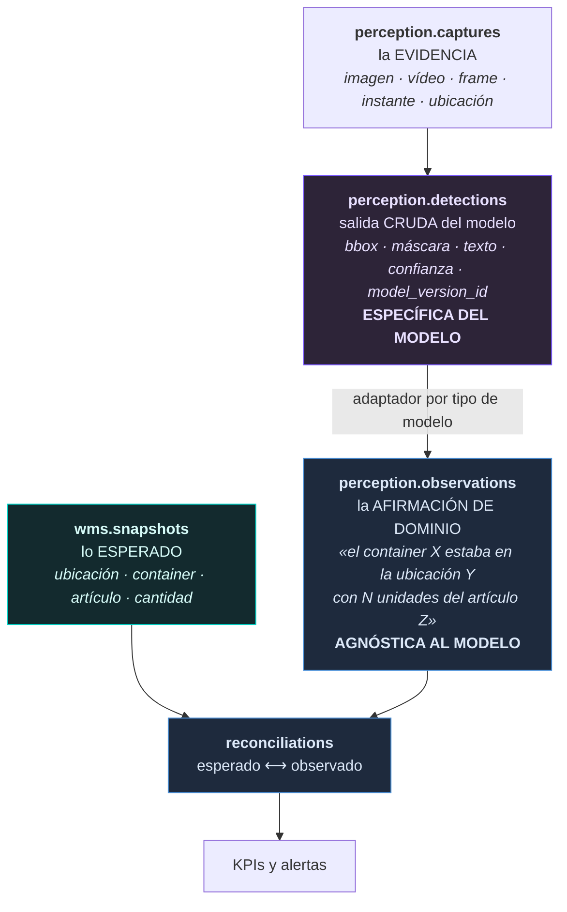

# ADR-012 · Sincronización, snapshots y el contrato de percepción

| | |
|---|---|
| **Estado** | **Propuesto.** Requiere aprobación antes del Bloque 3. |
| **Fecha** | 2026-07-29 |
| **Decide** | El modelo conceptual de fuente, sincronización, snapshot, versión, publicación y estado actual; y el contrato que permite añadir modelos de visión sin tocar `wms` |
| **No decide** | El importador. Tablas. YOLO |
| **Depende de** | ADR-009 (reglas R2 y R4) |

---

## PARTE I · SINCRONIZACIÓN

## 1. Siete conceptos que suelen confundirse en uno

Se pide definir qué es una importación, un snapshot, una fuente, una
sincronización, una versión, una publicación y un estado actual. Suelen tratarse
como sinónimos y no lo son: cada uno tiene distinta duración y distinto dueño.

### 1.1 Fuente

> Un **sistema externo concreto** del que OLO recibe datos, con su configuración de
> acceso y su contrato de formato.

Es **duradera**: existe antes de la primera sincronización y sobrevive a todas. No
es «el WMS» en abstracto: es *este* WMS, para *este* tenant, alimentando *estos*
sitios.

Que exista como entidad es lo que permite dos WMS simultáneos sin renombrar el
schema (ADR-009 §3.4). Cada fila importada dice de qué fuente vino.

### 1.2 Sincronización

> Una **ejecución** de traer datos de una fuente: cuándo empezó, cuándo acabó, qué
> pidió, qué obtuvo, qué falló.

Es el concepto general. **Una importación de archivo es una sincronización cuyo
transporte es un archivo**, y ahí está el valor de la distinción: hoy es un Excel
que alguien sube, mañana es una llamada a la API del WMS, y **el concepto no
cambia**. Solo cambia el transporte.

Si se modelara «importación» como concepto raíz, el día que llegue la API habría que
elegir entre llamar «importación» a algo que nadie sube, o crear un concepto
paralelo con las mismas cinco columnas.

Atributos que la definen: modo (**completo** o **incremental**), ventana temporal,
transporte (archivo, API, cola), y el resultado.

Para el archivo medido, la idempotencia sale gratis: `sha256` =
`6ff243fc…36172d23`. Reimportar el mismo archivo se detecta **antes de leer una
fila**.

### 1.3 Snapshot

> El **resultado inmutable y coherente** de una sincronización: la fotografía de una
> porción del dominio en un instante.

Tres propiedades que lo definen y que hay que respetar:

- **Inmutable.** No se corrige un snapshot; se crea otro. Corregirlo destruiría la
  base de una comparación ya hecha.
- **Coherente.** Todas sus filas son del mismo corte. Un snapshot mezclando dos
  momentos no es una fotografía.
- **Completo dentro de su alcance**, y el alcance debe declararse. El archivo
  medido cubre 17 sitios, pero **solo las 15.599 ubicaciones ocupadas**. Un
  snapshot que no declare eso invita a leer «no aparece» como «está vacío», cuando
  significa «no lo sé».

### 1.4 Versión

> La **secuencia monótona** de snapshots de un mismo `(fuente, dominio, alcance)`.

La versión no es un número decorativo: es lo que permite decir «entre la v11 y la
v12 desaparecieron 40 pallets» sin recalcular nada.

### 1.5 Publicación

> El **acto** de designar una versión como la vigente.

Es un acto separado de la creación a propósito. Una sincronización puede terminar
con 300 filas rechazadas, y quien opera tiene que poder **mirar antes de publicar**.
Es reversible: volver a la versión anterior es publicar otra vez.

### 1.6 Estado actual

> **Un predicado, no una copia.**

Aquí este proyecto ya aprendió la lección y conviene aplicarla sin volver a
tropezar: la migración 0043 **eliminó `models.current_version_id`** porque un
puntero al valor vigente es un derivado duplicado que acaba contradiciendo su
origen. Se sustituyó por un índice único parcial sobre el estado.

**El estado actual del inventario se resuelve igual**: la versión publicada es
aquella cuyo estado lo dice, con un índice único parcial que garantiza que hay
exactamente una. **No** una tabla `stock_actual` mantenida en paralelo, que sería
la misma verdad en dos sitios.

Si el rendimiento lo exige —41.055 filas por snapshot no lo exigen— la salida es
una vista materializada, que es explícitamente un caché y se refresca, no una
segunda fuente de verdad.

---

## 2. Snapshot no vale para todo

La instrucción es clara —snapshot versionado, estado actual consultable, historial—
y es correcta para el inventario. Pero **no todo lo que va a llegar del WMS es un
estado**.

| Naturaleza | Ejemplos | Modelo | Por qué |
|---|---|---|---|
| **Estado** | existencias, ocupación de ubicaciones, maestro de artículos | Snapshot versionado | Se responde «cómo está ahora». Un corte completo es la representación natural |
| **Evento** | movimientos, ajustes, conteos ejecutados, transacciones | **Solo-añadir, sin snapshot** | Se responde «qué pasó». Tienen orden y no se sobrescriben |
| **Documento** | órdenes, recepciones, expediciones, tareas | **Ciclo de vida propio** | Tienen estado que progresa. No son ni foto ni evento: son objetos con historia |

**Forzar los tres al modelo de snapshot sería un error grave.** Un movimiento
capturado en snapshots pierde su orden: dos snapshots consecutivos no dicen en qué
secuencia ocurrieron los movimientos intermedios, ni cuáles se perdieron entre
cortes.

Y al revés: una orden no es un evento. Progresa de creada a asignada a completada, y
lo que interesa es su estado actual junto con su historia.

**Este ADR fija que `wms` alberga los tres modelos**, no uno. El régimen que
comparten —origen externo, solo lectura, trazable a una sincronización— es lo que
los pone en el mismo schema; su forma interna difiere.

Para el Bloque 3 solo hace falta el primero. Lo demás queda nombrado para que nadie
intente meter movimientos en `stock_positions`.

---

## 3. Filas rechazadas

Una fila inválida no puede tumbar una importación de 41.055. Y una fila rechazada en
silencio es peor que una importación fallida: produce un inventario que parece
completo.

El modelo: **la sincronización guarda cada rechazo con su número de fila, su
contenido crudo y su motivo**, y el resumen es un recuento por motivo. La
publicación es una decisión informada por ese resumen, no automática.

Del archivo medido: **cero filas rechazables** por las reglas obvias —sin
ubicación, sin pallet, sin artículo, cantidad nula o negativa, duplicados—. Todas
dan cero. Los rechazos reales vendrán de la resolución de referencias: una compañía
que no está en `core.companies`, un sitio desconocido. Es decir, **de la integración,
no del archivo.**

---

## PARTE II · PERCEPCIÓN

## 4. El requisito

> Que se pueda incorporar YOLO, SAM, GroundingDINO, OCR y OpenCV **sin modificar el
> dominio WMS.**

Es un requisito de acoplamiento y tiene una respuesta precisa: **una capa de
traducción entre lo que dice un modelo y lo que significa para el negocio.**

La arquitectura ya usa este patrón una vez: `ai.frameworks.adapter` existe para que
el worker despache por adaptador y añadir un framework sea insertar una fila. Aquí
hace falta lo mismo, un nivel más arriba.

## 5. Las cuatro capas

**La frontera está entre `detections` y `observations`, y ahí está toda la
respuesta al requisito.**

| Capa | Qué guarda | Cambia al añadir un modelo |
|---|---|---|
| `captures` | La evidencia. Un frame es un frame | **No** |
| `detections` | Lo que el modelo dijo, en sus términos | **Sí**: aquí viven las diferencias |
| `observations` | Lo que eso significa en lenguaje de almacén | **No** |
| `reconciliations` | La comparación | **No** |

Añadir **SAM** aporta máscaras en vez de cajas: cambia `detections` y su adaptador.
Añadir **GroundingDINO** aporta detección por texto libre: cambia el adaptador.
Añadir **OCR** aporta una lectura de etiqueta: cambia el adaptador. **En los tres
casos `observations` recibe lo mismo:** «este container estaba aquí».

**`wms` no aparece en esa columna en ninguna fila.** Es la prueba de que el
requisito se cumple: `wms` solo se relaciona con `reconciliations`, y
`reconciliations` no sabe qué modelo produjo la observación.

### 5.1 Por qué `detections` y `observations` no pueden ser una sola tabla

Es la decisión central de esta parte, y la tentación de unificarlas es fuerte:
parece una tabla con columnas de más.

Cuatro razones por las que no:

1. **Cardinalidad distinta.** Una observación puede nacer de varias detecciones
   —una caja detectada, un QR leído, un texto reconocido, tres modelos— y una
   detección puede no producir ninguna observación (un falso positivo descartado).
2. **Vida distinta.** Las detecciones crecen sin límite y se archivan por retención.
   Las observaciones son el registro de negocio y se conservan.
3. **Corregibilidad distinta.** Una persona puede corregir una observación —«no, ese
   pallet no estaba ahí»—. Nadie corrige una detección: es lo que el modelo dijo, y
   es evidencia de cómo se comportó el modelo. Sobrescribirla destruiría la
   trazabilidad que permite evaluarlo.
4. **Confianza distinta.** La del modelo es una probabilidad de su salida. La de la
   observación es una conclusión que combina varias señales y puede ser mayor que
   cualquiera de ellas: un QR legible más una caja detectada dan más certeza que
   ambos por separado.

### 5.2 El QR es lo que hace viable la comparación

Sin lectura de identificador, comparar sería estadístico: «vi unas 12 cajas donde
esperaba 15». Con QR es determinista: «vi el container `22O0014028883`, y el
snapshot dice que debería estar en `ASCEN1-C001-N01-1`».

Los identificadores estables que unen los dos mundos —y **ninguno requiere una FK de
`wms` hacia `perception`**, respetando R2:

| Esperado | Observado | Se une por |
|---|---|---|
| `stock_positions.location_id` | ubicación de la captura | **`spatial.locations.id`** |
| `containers.qr_value` | lectura de QR | **el texto de 13 caracteres, sin transformar** |
| `items.id` | artículo detectado | puente item ↔ class del lado tenant (ADR-011 §3) |
| `quantity_units` | cantidad estimada | comparación numérica con tolerancia |

---

## 6. Las discrepancias son una consulta, no un modelo

Los siete tipos de discrepancia son el resultado de un `FULL OUTER JOIN` entre un
snapshot y una sesión de observación:

| Discrepancia | Se deriva de |
|---|---|
| Esperado y encontrado | coincidencia en ambos lados |
| Esperado y no encontrado | lado izquierdo sin pareja |
| Encontrado y no esperado | lado derecho sin pareja |
| Container en ubicación incorrecta | mismo container, ubicación distinta |
| Artículo en container incorrecto | mismo container, artículo distinto |
| Diferencia de cantidad | coincidencia con delta > tolerancia |
| Ubicación vacía u ocupada inesperadamente | agregado por ubicación |

**No hacen falta siete tablas.** Hace falta **una** tabla de resultado con el tipo
de discrepancia como vocabulario cerrado, porque el conjunto va a crecer —«pallet
sin etiqueta legible», «container en ubicación bloqueada»— y añadir un valor no debe
requerir una tabla.

### 6.1 Dos advertencias que el dato ya justifica

**Sobre «esperado y no encontrado»:** el snapshot **no contiene ubicaciones
vacías**. Así que «no encontrado» solo es afirmable si la captura cubrió esa
ubicación. **Una sesión de observación tiene que declarar su cobertura** —qué
ubicaciones se inspeccionaron— o el sistema informará de faltantes que nadie miró.
Es el mismo error que §1.3 previene en el snapshot, un nivel más abajo.

**Sobre las áreas de suelo:** `GUACI5-C001-N01-1` tiene **2.135 containers**
(ADR-010 §1). Una comparación por ubicación que trate ese caso igual que un hueco de
un pallet producirá una discrepancia gigante e inútil. La marca `is_bulk_area` no
es solo para el mapa: **cambia el algoritmo de comparación.**

---

## 7. Quién origina el conteo

Distinción que ADR-009 §3.4 dejó planteada y que aquí se cierra:

| Conteo | Origen | Dónde vive |
|---|---|---|
| El WMS ejecutó un conteo y OLO lo importa | externo | `wms` |
| OLO recorrió el almacén con cámaras | **OLO** | `perception` |

Los dos son «conteos» y tienen regímenes opuestos: el primero se sobrescribe en la
siguiente sincronización; el segundo es evidencia que no se puede perder. Es el
argumento que descartó nombrar el schema `operations` (ADR-009 §3.2), visto en su
caso concreto.

**Lo que OLO todavía no hace, y hay que decirlo:** proponer un ajuste al WMS. Ese
día hará falta un dominio de salida —documentos que OLO emite hacia fuera— y no se
diseña aquí porque no hay ni un requisito escrito. Lo que este ADR garantiza es que
`reconciliations` ya tendrá todo lo necesario para generarlo.

---

## 8. Resumen

**Sincronización**

1. **Fuente** es duradera; **sincronización** es una ejecución; **importación de
   archivo** es una sincronización cuyo transporte es un archivo.
2. **Snapshot** inmutable, coherente y con **alcance declarado**. El archivo medido
   solo trae ubicaciones ocupadas y eso tiene que constar.
3. **Estado actual = predicado**, con índice único parcial. **No** un puntero ni una
   tabla paralela: la lección de `models.current_version_id`.
4. **Publicación separada de creación**, informada por el resumen de rechazos y
   reversible.
5. **`wms` alberga tres modelos**: estado (snapshot), evento (solo-añadir) y
   documento (ciclo de vida). Forzar los tres a snapshot perdería el orden de los
   movimientos.
6. **Los rechazos se guardan uno a uno**; una fila mala no tumba el lote y ninguna
   desaparece en silencio.

**Percepción**

7. **`perception.observations` es el contrato** que desacopla los modelos del
   dominio. Es la respuesta al requisito de añadir SAM u OCR sin tocar `wms`.
8. **`detections` y `observations` son tablas distintas** por cardinalidad, vida,
   corregibilidad y semántica de la confianza.
9. La unión con el mundo esperado es por **`spatial.locations.id`** y por el
   **texto del QR**, sin ninguna FK de `wms` hacia `perception`.
10. **Una** tabla de discrepancias con tipo de vocabulario cerrado, no siete.
11. **Una sesión de observación declara su cobertura**, o «faltante» no es
    afirmable.
12. **`is_bulk_area` cambia el algoritmo de comparación**, no solo el dibujo.
